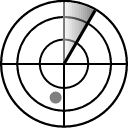

cursus Wim Dejonghe docent VIVES Technology Kortrijk

::: tip Hello World
Dit is een tip
:::

Dit is een blockQuote

> ```shell
> Dit is een blockquote. 
> We kunnen dit gebruiken om zaken te accentueren.
> ```

::: warning Een nota
Dit is een warning
:::

<div style="background-color:rgba(0, 0, 0, 0.0470588); text-align:center; vertical-align: middle; padding:40px 0;">
<a href="/donate">DONATE</a>
</div>

<div style="background-color:rgba(0, 0, 0, 0.0470588); text-align:center; vertical-align: middle; padding:40px 0; margin-top:30px">
<a href="/blog">VIEW THE BLOG</a>
</div>

> **Blockquote**
> Deze blockquote kunnen we gebruiken om zaken te accentueren.
> einde blockquote.

<div style="background-color:powderblue; text-align:left; vertical-align:top; padding:0px;">
<p style="color:red; margin:0">This is a paragraph.</p>
</div>


Veel succes,
Wim Dejonghe.
