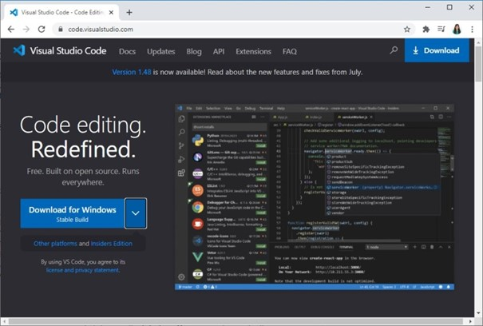
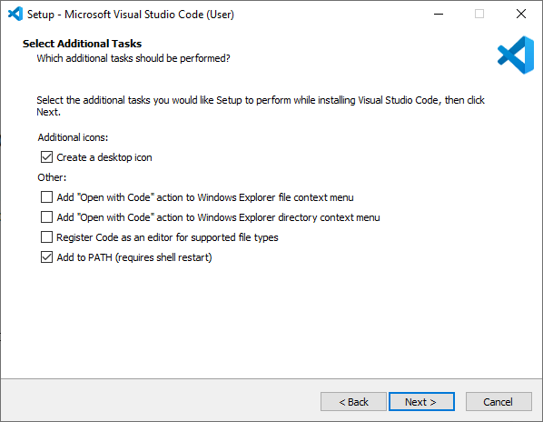
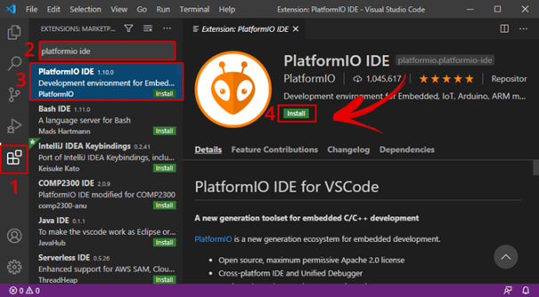
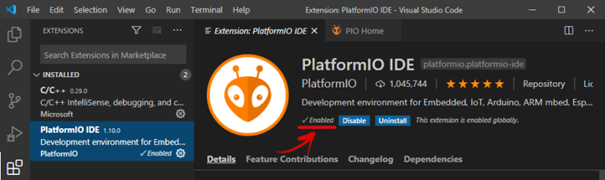
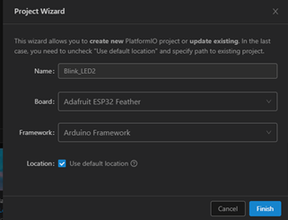
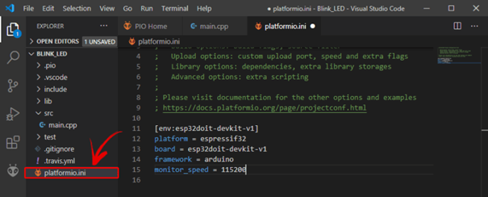

# esp32

---

## Introductie

### Hardware

Er zijn verschillende versies van de esp32 op de markt te verkrijgen. Verschillende fabrikanten hebben hun eigen versie op de markt gebracht. Het nadeel van dit aanbod is dat er naar pincompatibiliteit geen afspraken zijn gemaakt en er dus afwijkingen kunnen zijn op dat vlak tussen vershillende types esp32. 
In deze cursus wordt de focus gelegd op de Adafruit Feather HUZZAH32 ESP32 4Mb. 
Meer info is te vinden op : <https://www.adafruit.com/product/3405>

### Software

De esp32 kan via verschillende platformen worden geprogrammeerd. Het is heel populair om te doen via de Arduino IDE <https://www.arduino.cc/en/software>. Echter zullen we hier Visual Studio Code gebruiken. Visual Studio Code, vanaf nu VSC, is een IDE die voor verschillende ontwikkelingen kan worden gebruikt en wordt in de professionele wereld heel veel gebruikt. Je kan VSC gebruiken voor ontwikkelingen in verschillende talen zoals JAVA, Python, C, .... Dus hiermee ervaring krijgen heeft zeker zijn voordeel. De Arduino IDE is goed voor kleine, beperkte ontwikkelingen, voor gevorderde code (meer dan 200 lijnen code), meerdere bestanden, het gebruik van een intelisense, en andere functies biedt VSC een betere oplossing. VSC biedt voor de esp32 niet alleen de mogelijkheid om code te schrijven, maar ook om die te compileren en die te downloaden in de esp32 microcontroller zelf. Tevens bezit VSC een Serial Terminal scherm die het mogelijk maakt om tijdens de run van de esp32 serieëel te kunnen uitwisselen. Dit kan een ondersteuning zijn voor het debuggen van uw code. 

Een echte debug tool met breakpoints is zonder extra hardware echter niet mogelijk. <https://docs.espressif.com/projects/esp-idf/en/latest/esp32/api-guides/jtag-debugging/index.html>

## Installatie + preparatie Visual Studio Code

Installeer VSC via <https://code.visualstudio.com/download>.

Klik op de installatie wizard om de installatie te starten en volg de stappen om te vervolledigen.

Next ...

Install ...

Finish ...

Open VSC ...

Zo, VSC staat op uw computer en kan worde gebruikt.

Om binnen VSC softwarecode te kunnen werken met de esp32 (ook minder krachtige devices zoals esp8266 kunnen worden gebruikt) moet je VSC uitbreiden met een extra Extension. Hier wordt gebruik gemaakt van PlatformIO (PIO). Installatie via  <https://randomnerdtutorials.com/vs-code-platformio-ide-esp32-esp8266-arduino/>.

Open VSC en klik op het extension icoon of klik Ctrl+Shift+X om de Extension tab te openen. Zoek naar "PlatformIO IDE", selecteer en installeer (kan wel een tijdje duren).

Zorg dat na installatie de extensie is ge-enabled (bij Disable kan dit niet worden gebruikt).

Aan de linkerzijde van het scgerme van VSC moet het icoontje zichtbaar zijn, en in het midden moet een Home icoon aanwezig zijn waarmee naar de Home pagina van PlatformIO kan worden verwezen.

Voila, VSC is volledig klaar. Wil je andere hardware of software ontwikkelingen doen, dan zal daarvoor andere Extensions aan VSC moeten worden toegevoegd. Indien er icoontjes zouden ontbreken, herstart dan eens VSC (het is aangewezen om VSC sowieso te herstarten na installatie en toevoeging van Extensions).

### Quick overview VSC en PIO

Verduidelijking van icoontjes en shortcuts voor :

> * File explorer
> * Search, zoeken door bestanden
> * Source code management (using gist)
> * Start (Launch) en debug code
> *	Manage extensions

Daarenboven kan met Ctrl+Shift+P of door te klikken op View > Command Palette ... kunnen alle commando's worden weergegeven. Als een commando moet worden gezocht dan kan de shortcut worden gevonden in het Command Palette (zoek daarbinnen).

Onderaan VSC wordt een blauwe incoon bar weergegeven die belangrijk is in het gebruik met de esp32.

Met volgende mogelijkheden (van links naar rechts): PlatformIO Home | Build/Compile | 

> * PlatformIO Home
> * Build/Compile
> * Upload
> * Clean
> *	Serial Monitor
> *	New Terminal

Door te hoveren met de muis over deze iconen, wordt extra info weergegeven. Er kan ook geklikt worden op het PIO icoon om alle taken te zien van het PlatformIO.

Bij problemen bij de weergave, dan kan er geklikt worden op de 3-puntjes icoon om de PlatformIO Tasks te selecteren.

## Platform IDE Overview

Om nu met het geheel te werk te gaan (schrijven van code, compileren en uploaden naar de microcontroller) wordt nu vertrokken vanuit een klassiek voorbeeld om tot een knipperende LED te komen (blinking LED).

### Create a New Project

in VSC, klik op het icoon van PIO en klik op New Project om een nieuw project te starten:

Geef het project een goeie naam: Blink_LED en selecteer de juiste microcontroller board. Het Arduino Framework wordt gebruikt om de Arduino-code te compileren naar binaire code die in de esp32 microcontroller kan worden geprogrammeerd.

Let op de locatie van uw project binnen de mappenstructuur van uw computer. Gebruik hiervoor logische sructuren zodat je later uw projecten kan terug vinden!!

De standaard locatie staat nu ingesteld op het pad : Documents >PlatformIO >Projects 

Klik "Finish".

Er wordt een nieuw project toegevoegd aan de Workspace. Open platformio.ini en voeg toe:

VS Code en PlatformIO hebben een mappenstructuur die verschilt van het standaard .ino-project. Als u op het tabblad Verkenner klikt, ziet u alle bestanden die het heeft gemaakt in uw projectmap. Het lijkt misschien veel bestanden om mee te werken. Maar maak je geen zorgen, meestal hoef je alleen maar met een of twee van die bestanden om te gaan.

> **Warning**
> Let op, je verwijdert, wijzigt of verplaatst best die bestanden niet. Anders kunt u uw project niet meer compileren met PlatformIO.

**platformio.ini file**

Het platformio.ini-bestand is het PlatformIO-configuratiebestand voor uw project. Het toont het platform, het bord en het raamwerk (framework) voor uw project. U kunt ook andere configuraties toevoegen, zoals bibliotheken die moeten worden opgenomen, uploadopties, het wijzigen van de baudrate van de seriële monitor en andere configuraties.

Met volgende:

> * platform: welke gebruikte microcontroller (SoC).
> * board: het type ontwikkel-board
> * framework: het software ontwikkel platform die de code zal compileren

Voor de ESP32 en ESP8266, wordt de gebruikte datasnelheid voor de seriëele communicatie ingesteld op een baud rate van 115200. Dit doe je door de platformio.ini file (zoals volgnde figuur) aan te passen (Klik na aanpassen op Ctrl+S om wijziging op te slaan). In dit bestand kun je ook de identifier opnemen van bibliotheken die je in je project gaat gebruiken met behulp van de lib_deps-richtlijn.

**src folder**

De src-map is uw werkmap. Onder de src-map bevindt zich een main.cpp-bestand. Daar schrijf je je code. Klik op dat bestand. De structuur van een Arduino-programma zou moeten openen met de functies setup() en loop().

In PlatformIO moeten alle Arduino sketches (een project wordt in de Arduino een sketch genoemd) bovenaan in de code straten met het aanroepen van de Arduino bibliotheek door volgend statement ** #include <Arduino.h> **.

