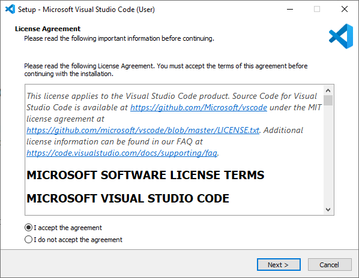

# esp32

---

## Introductie

### Hardware

Er zijn verschillende versies van de esp32 op de markt te verkrijgen. Verschillende fabrikanten hebben hun eigen versie op de markt gebracht. Het nadeel van dit aanbod is dat er naar pincompatibiliteit geen afspraken zijn gemaakt en er dus afwijkingen kunnen zijn op dat vlak tussen vershillende types esp32. 
In deze cursus wordt de focus gelegd op de Adafruit Feather HUZZAH32 ESP32 4Mb. 
Meer info is te vinden op : <https://www.adafruit.com/product/3405>

### Software

De esp32 kan via verschillende platformen worden geprogrammeerd. Het is heel populair om te doen via de Arduino IDE <https://www.arduino.cc/en/software>. Echter zullen we hier Visual Studio Code gebruiken. Visual Studio Code, vanaf nu VSC, is een IDE die voor verschillende ontwikkelingen kan worden gebruikt en wordt in de professionele wereld heel veel gebruikt. Je kan VSC gebruiken voor ontwikkelingen in verschillende talen zoals JAVA, Python, C, .... Dus hiermee ervaring krijgen heeft zeker zijn voordeel. De Arduino IDE is goed voor kleine, beperkte ontwikkelingen, voor gevorderde code (meer dan 200 lijnen code), meerdere bestanden, het gebruik van een intelisense, en andere functies biedt VSC een betere oplossing. VSC biedt voor de esp32 niet alleen de mogelijkheid om code te schrijven, maar ook om die te compileren en die te downloaden in de esp32 microcontroller zelf. Tevens bezit VSC een Serial Terminal scherm die het mogelijk maakt om tijdens de run van de esp32 serieëel te kunnen uitwisselen. Dit kan een ondersteuning zijn voor het debuggen van uw code. 

Een echte debug tool met breakpoints is zonder extra hardware echter niet mogelijk. <https://docs.espressif.com/projects/esp-idf/en/latest/esp32/api-guides/jtag-debugging/index.html>

## Installatie + preparatie Visual Studio Code

Installeer VSC via <https://code.visualstudio.com/download>.

Klik op de installatie wizard om de installatie te starten en volg de stappen om te vervolledigen.

Next ...

Install ...

Finish ...

Open VSC ...

Zo, VSC staat op uw computer en kan worde gebruikt.

Om binnen VSC softwarecode te kunnen werken met de esp32 (ook minder krachtige devices zoals esp8266 kunnen worden gebruikt) moet je VSC uitbreiden met een extra Extension. Hier wordt gebruik gemaakt van PlatformIO (PIO). Installatie via  <https://randomnerdtutorials.com/vs-code-platformio-ide-esp32-esp8266-arduino/>.

Open VSC en klik op het extension icoon of klik Ctrl+Shift+X om de Extension tab te openen. Zoek naar "PlatformIO IDE", selecteer en installeer (kan wel een tijdje duren).

Zorg dat na installatie de extensie is ge-enabled (bij Disable kan dit niet worden gebruikt).

Aan de linkerzijde van het scgerme van VSC moet het icoontje zichtbaar zijn, en in het midden moet een Home icoon aanwezig zijn waarmee naar de Home pagina van PlatformIO kan worden verwezen.

Voila, VSC is volledig klaar. Wil je andere hardware of software ontwikkelingen doen, dan zal daarvoor andere Extensions aan VSC moeten worden toegevoegd. Indien er icoontjes zouden ontbreken, herstart dan eens VSC (het is aangewezen om VSC sowieso te herstarten na installatie en toevoeging van Extensions).

### Quick overview VSC en PIO

Verduidelijking van icoontjes en shortcuts:

bla ......

