# Grotere vermogens aansturen  

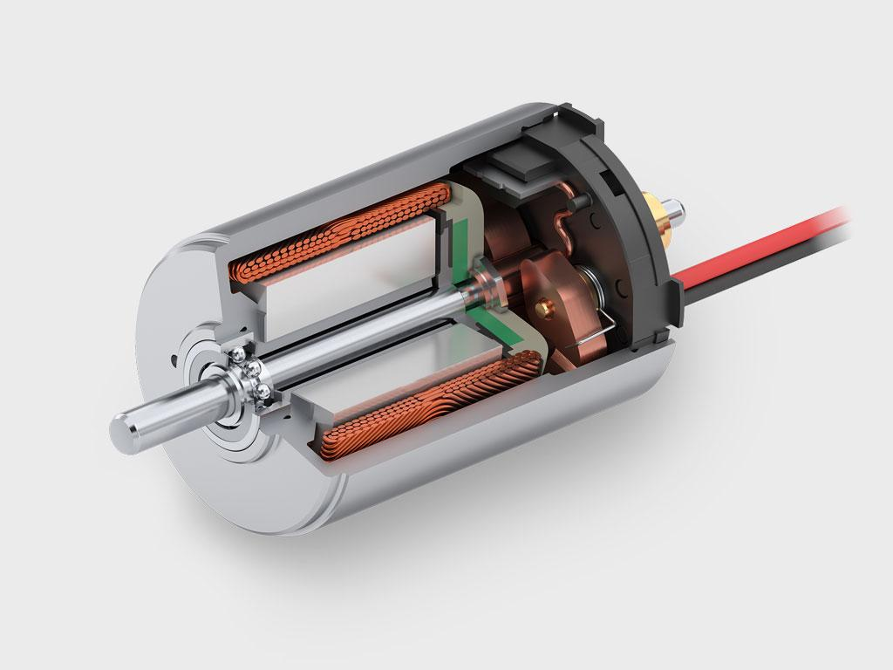

---

## Introductie

Uitgangen van digitale IC’s of microcontrollers zijn beperkt in stroom die ze zowel kunnen sturen als opnemen. Bij een output wordt er gesproken over SOURCE CURRENT en SINK CURRENT. Current betekent stroom.  

* Als de stroom aan de uitgang wordt geleverd, en dus naar buiten vloeit, dan wordt deze stroom als SOURCE current benoemd (uitgang van de poort staat als logisch 1 = high geschakeld). Dit is een uitgang met een actief hoge uitgang.
* Als de stroom aan de uitgang IN de poort vloeit, dan staat deze stroom beschreven als SINK current (uitgang van de poort staat als logisch 0 = low geschakeld). Dit is een uitgang met een actief lage uitgang.

Bij ICs en controllers (microprocessoren) is deze stroom per outputpin beperkt in waarde. Bijvoorbeeld bij een Arduino is deze stroom beperkt tot 40mA, bij de meeste microcontrollers zal dit ongeveer 20mA zijn. Bij IC’s wordt deze maximum toegelaten stroom in datasheets beschreven als IoLmax (voor sink) en IoHmax (voor source). Indien de stroom van een verbruiker groter is dan de stroom die maximaal kan worden geleverd, in source of in sink, door de output, dan kan gebruik gemaakt worden van een transistor om de stroom te versterken. Een andere reden tot gebruik van een transistor is dat de verbruiker op een hogere spanning werkt dan het IC, of controller. Voor de eenvoud wordt hier enkel de SOURCE werking behandeld met een NPN-transistor. Voor de SINK werking zou een PNP-transistor moeten worden gebruikt.

## Transistoren.

Als de maximale uitgangsstroom niet voldoende is om een verbruiker te laten werken (voorbeeld om een relais aan te sturen, of een andere verbruiker), dan wordt hier gebruik gemaakt van een transistor. De transistor bezit de functie om het vermogen te leveren aan de verbruiker wat de Output-pin van de microcontroller niet kan. Een andere reden waarom een transistor wordt gebruikt is dat de digitale uitgang van een microcontroller geen open-collector uitgang is, maar een actieve uitgangstrap. Zoals eerder vermeld kan bij dergelijke uitgangen geen andere voedingsbron worden gebruikt dan de VCC van het IC. En aangezien de meeste relais (of andere verbruikers) op een hogere spanning werken dan 5V, kan dit ook opgelost worden met een transistorschakeling.

Er zijn twee type transistoren: NPN en PNP. De symbolen van beide is terug te vinden in de figuur. Voor eenvoudige toepassingen zoals deze waarbij een relais moet worden aangestuurd vanuit een Output, volstaat een NPN transistor.  

De aansluitklemmen zijn:
**Basis**, **Emitter** en **Collector**.  

Let op de pijl op de emitter. De stroom kan enkel in die richting vloeien, vandaar dat een transistor enkel kan gebruikt worden in DC-toepassingen.

Er zijn twee stromen van toepassing bij de transistor. De basisstroom (*Ib*) en de collectorstroom (*Ic*). In de emitter vloeit de som van beide stromen.

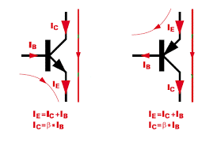

De stroom versterkingsfactor *hFE* (beta) is de verhouding van de collectorstroom op de basisstroom. Een transistor zal, indien mogelijk, er steeds voor zorgen dat de collectorstroom hFE keer groter is dan de basisstroom. Een transistor bezit een vaste hFE. Dit kan met bepaalde meettoestellen worden bemeten. Binnen een bepaald type kan volgens de datasheet de hFE veel veranderen (grote spreiding) in waarde van transistor tot transistor.  

De basis-emitter spanning UBE is zoals een diode in doorlaat een spanning van 0,6V.

### Transistor als schakelaar  

Een transistor is een stroomversterker. Het component zal altijd, in de mate van het mogelijke, de basis-stroom versterken met een factor hFE. En deze te laten vloeien als de collector-stroom. 

* Indien de basis-stroom wordt overgedimentioneerd (een te grote stroom), komt het heel regelmatig voor dat de transistor in saturatie komt. Dit wil zeggen dat de verhouding niet meer opgaat, omdat een zo'n grote collector-stroom er niet kan vloeien (stroom wordt dan beperkt door andere elementen in de collector-kring). Op dat moment kan de transistor beschouwt worden als een gesloten schakelaar (tussen collector en emitter). De spanning tussen collector - emitter is dan gedaald tot bijna nul (UCE = 0V).

* Indien er echter totaal geen stroom vloeit in de basis, dan kan er ook geen stroom vloeien in de collector. In zo'n situatie kan de transistor vergeleken worden met een open schakelaar (tussen collector en emitter). De volledige bronspanning staat dan over de collector - emitter (Uce = Ubron).

Een transistor wordt in zo'n situaties veel toegepast. Er kan gesteld worden dat de transistor nu functioneert als een elektronische schakelaar. De bediening gebeurt echter niet manueel, maar door al dan niet een basis-stroom te sturen. Geen basis-stroom = open schakelaar (er kan een IC vloeien), teveel basis-stroom = gesloten schakelaar (er kan geen IC vloeien).

Een elektronische schakelaar (transistor, thyristor, mosfet, ...) bezit veel voordelen t.o.v. een klassieke mechanische schakelaar.  Als belangrijkste voordelen kan vernoemd worden:

*  veel kortere schakeltijden.
*  veel hogere schakelfrequenties.
*  compacter voor eenzelfde schakelvermogen.
*  bedrijfszekerder en duurzamer door het ontbreken van bewegende delen.

Een ideale elektronische schakelaar bezit onderstaande eigenschappen:

*  Raan = 0 ohm, in gesloten toestand is er bijgevolg geen spanningsverschil over de contacten. Saturatie van de transistor door grote Ib.
*  Ruit = oneindig ohm, in open toestand vloeit er geen stroom. De volledige bronspanning staat over de contacten. Cutt-Off van de transistor door Ib = 0.
*  schakelt zonder vertraging.
*  bezit een klein stuurvermogen.
*  is compact.
*  is betrouwbaar en duurzaam.

De collector-emittor overgang simuleert het schakelcontact van een gewone mechanische schakelaar.  UCE is de spanning over de contacten van de schakelaar. Zie formule. 

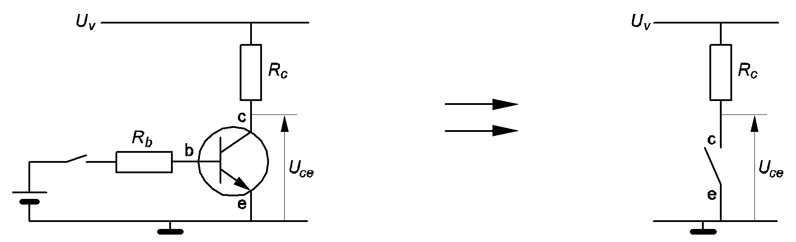

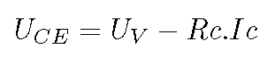

Zolang Ube kleiner is dan ongeveer 0,5 V wordt de transistor niet gestuurd en blijft hij bijgevolg gesperd. De basisstroom $ Ib $ is dan 0 en ook de collectorstroom $ Ic $ is 0. Zie formule \ref{eq:TR2}.

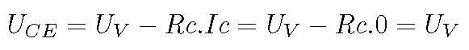

Door de schakelaar vloeit geen stroom en over zijn contacten staat de volle voedingsspanning.  Dit zijn de eigenschappen van een open schakelaar.

Als Ube groter wordt dan 0,6 V wordt de transistor gestuurd.  We zorgen ervoor dat hij volledig wordt uitgestuurd of gesatureerd is door Ib voldoende groot te kiezen.  In het ideale geval is UCE nu gelijk aan 0 V.  Over de contacten staat geen spanning en de stroom wordt enkel bepaald door de belastingsweerstand.  Dit zijn de eigenschappen van een gesloten schakelaar. Dit kan getekend worden in een XY-assenstelsel. (X = spanning over de transistor UCE, Y = collectorstroom Ic). Ideale schakelkarakteristiek van een bipolaire transistor. Zie figuur.

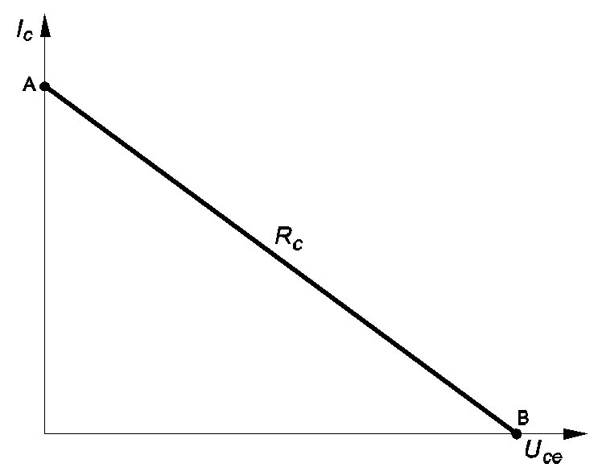

In punt A is: Ic = Uv/Rc en UCE =  0 V.  - Gesloten schakelaar - . Het opgenomen vermogen Pd = UCE. Ic = 0.Ic = 0 W .

In punt B is: UCE = Uv en Ic is 0A.  - Open schakelaar -. Het opgenomen vermogen Pd = UCE. Ic = Uv.0 = 0 W.

Het opgenomen vermogen in beide toestanden van de schakelaar is bijgevolg 0 W.  Tijdens het schakelen zelf neemt de transistor echter wel een zeker vermogen op omdat er bij de overgang van A naar B, of omgekeerd, wel stroom vloeit.

Als er rekening wordt gehouden met het niet-ideaal zijn van de transistor wil dit zeggen dat er in saturatie toch een kleine spanning over de collector-emitter staat en dus niet gelijk is aan 0V. Deze spanning is echter zeer klein en hangt af van type/soort transistor. Deze is weergegeven in de karakteristiek .

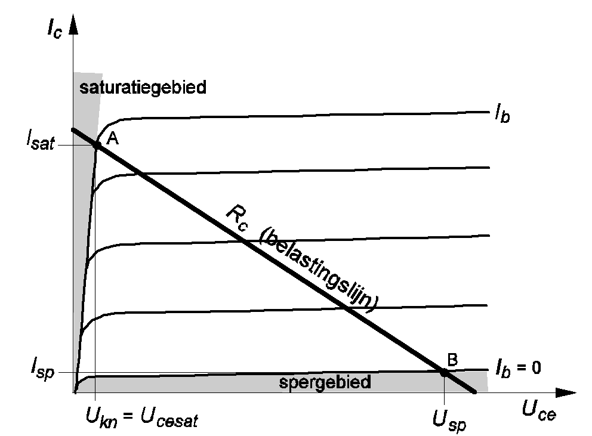

In punt A, bij gesloten schakelaar, is er wel een kleine spanning UCEsat over de transistor waardoor de collectorstroom kleiner is dan de waarde bepaald door de voedingsspanning en de collectorweerstand.
Bij bipolaire transistors houden we normaal rekening met een UCEsat van 0,3 V of lager; bij MOSFETS is deze spanning te verwaarlozen en rekenen we met 0 V.

In punt B, bij open schakelaar, vloeit er een kleine sperstroom I.  Het gevolg hiervan is dat de weerstand van de schakelaar geen oneindig is, maar een zekere waarde bezit.  Bij bipolaire transistors is de lekstroom in de orde van enkele µA, of nog kleiner, zodat de weerstand verschillende Mega ohm kan bedragen.  Bij MOSFETS is de lekstroom in de orde van nA zodat de weerstand kan oplopen tot miljoenen Mega ohm.

Er wordt hier eens een volledig ontwerp uitgewerkt waarbij de transistor werkt als elektronische schakelaar. Zie figuur .

We moeten een bepaalde waarde van collectorweerstand in serie met de led schakelen omdat de voedingsspanning te hoog is voor de led.  We moeten uiteraard de waarde van die weerstand kunnen berekenen.  Vervolgens moeten we de grootte van de basisweerstand berekenen die er zal voor zorgen dat de basisstroom en bijgevolg de collectorstroom voldoende groot is.

We kiezen voor een transistor van het type BC547.  In het vademecum vinden we voor UCEsat : 0,4 V en hFE = 200.  Bemerk dat we de minimale waarde van hFE kiezen zodat we zeker zijn dat de transistor in verzadiging komt.  Door de led wensen we een stroom van 10 mA en over de LED staat een spanning van 1,6 V.

De waarde van de collectorweerstand berekenen we uit :

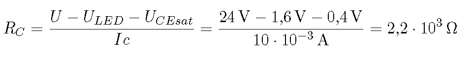  

De nodige basisstroom om deze collectorstroom te verkrijgen wordt gevonden met de formule \ref{eq:TR4}.

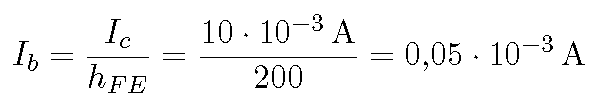  

We kunnen nu tenslotte de grootte van de basisweerstand berekenen met de formule \ref{eq:TR5}.

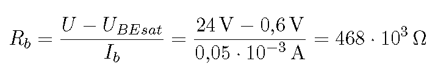  

Belangrijk is nog dat we bij het schakelen van een inductieve belasting, een relais bvb. (principewerking van een relais/contactor: zie figuur \ref{relais}), een diode moeten schakelen parallel over de belasting zoals getekend in figuur.

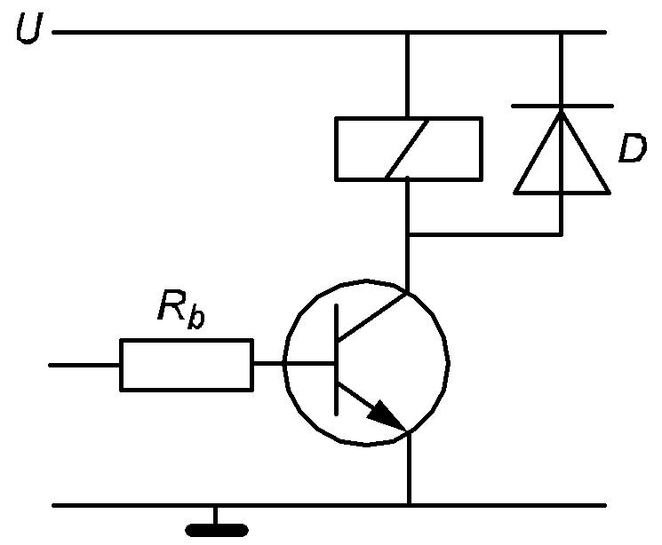  

Uit de wet van Lenz weten we dat bij het uitschakelen een zeer hoge inductiespanning kan ontstaan, die op de collector van de transistor terecht komt.  Deze inductiespanning zal de transistor in de meeste gevallen vernietigen.  Zo een diode noemen we een vrijloopdiode.

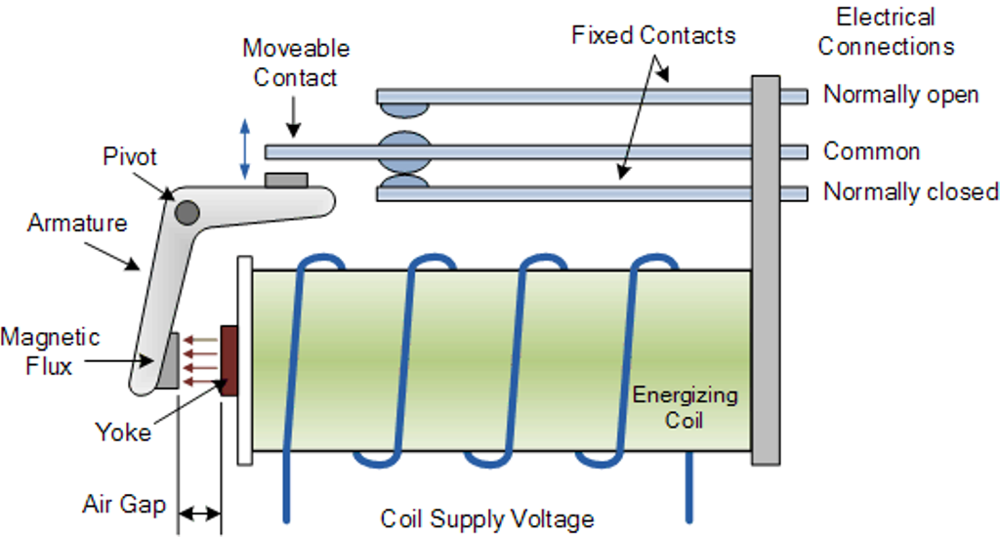  

Om het geheel nog duidelijker te maken en om een idee te hebben van de werkelijke waarden van de parameters berekenen we een volledige schakeling.  We werken met het basisschema van figuur met de LED.
De schakeling werkt op een voedingsspanning van 30 V en we wensen een collectorstroom van 150 mA.
Voor de parameters van de transistor kiezen we: Icsper = 0,1µA, hFEmin = 50, UBEsat =0,75 V en UCEsat =0,4 V.
We berekenen: Rc, Ib, Rb, Pdsat, Pdsper, Rcesat en Rcesper.

  

## Driver IC

Wanneer er nood is aan een reeks transistoren om bijvoorbeeld 8 vermogen uitgangen te maken kan gebruik gemaakt worden van een Driver-IC. In deze behuizing zitten dan bv. acht vermogentrappen om van gewone digitale uitgangen vermogen sturingen te maken. Ook hier is het zo dat de voedingsspanning zelf kan worden bepaald en hoeft geen beperking te zijn tot de voedingsspanning van de microcontroller zelf.  

Een veel gebruikte reeks van driver-IC's zijn de ULN-reeksen, gemaakt door verschillende fabrikanten. Een voorbeeld is de ULN2803 met acht darlingtontransistor uitgangstrappen. Een darlingtontransistor of kort darlington is een schakeling van twee in cascade gekoppelde transistors (zie figuur).

  

De stroomversterkingsfactor hFE van een darlingtontransistor is bij benadering het product van de stroomversterkingsfactoren van de twee afzonderlijke transistors, zodat een darlington een zeer grote stroomversterkingsfactor heeft.

Soms is het nodig om met een kleine stroom (uitgangspoort van een microcontroller) een veel grotere stroom te sturen. Laagvermogentransistors hebben een grote versterkingsfactor, maar kunnen geen grote stroom sturen. Hoogvermogentransistors hebben doorgaans een lage stroomversterkingsfactor, en moeten dientengevolge met een niet al te kleine stroom aangestuurd worden. Door twee zulke transistors in één schakeling te gebruiken, kunnen beide kenmerken samengevoegd worden en daarmee de goede eigenschappen gecombineerd.  

Een dergelijk IC kan, afhankelijk van type tot type, tot 50 V aan de uitgang schakelen en per kanaal (soms 8 kanalen) een stroom schakelen tot 500mA. Het principe schema van het IC is terug te vinden in de figuur: 

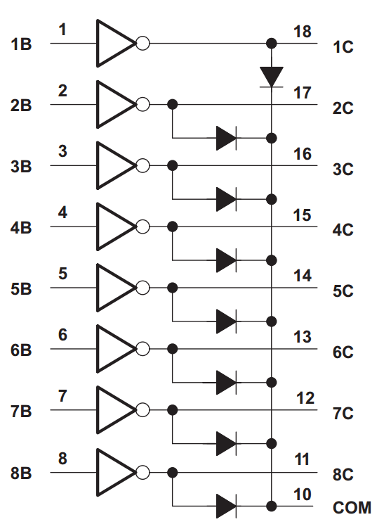  

De diodes in het schema zijn nuttig wanneer inductieve belastingen worden geschakeld. De oplopende EMKz spanning van die belasting wordt aan de hand van deze beveiligingsdioden kortgesloten. De layout van het IC is terug te vinden in de figuur. Een detail van een poort is terug te vinden in de figuur. In dit schema is duidelijk te zien dat de uitgangen enkel een SINK-stroom schakelen en geen SOURCE-stroom.

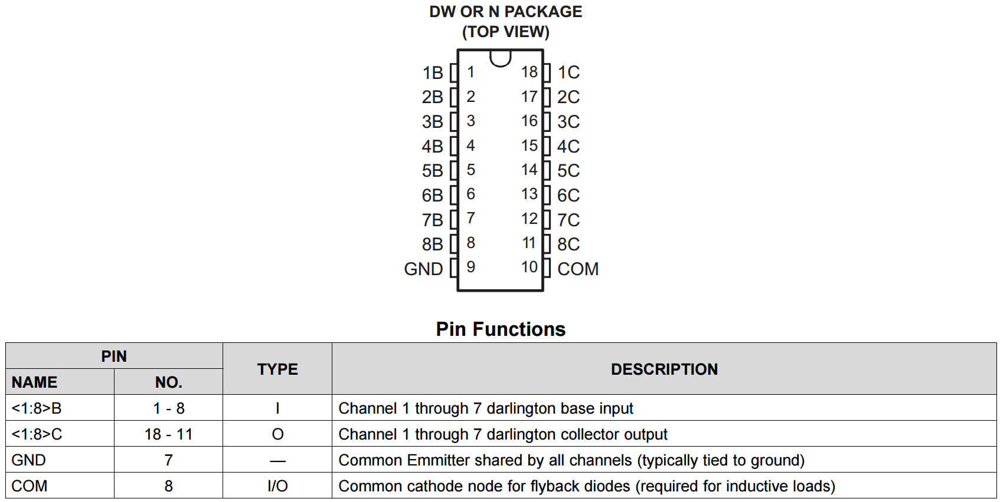

Een voorbeeld van een aansluitschema van een dergelijk IC op een microcontroller is terug te vinden in de figuur. Let wel dat de uitgang van de darlington stromen SINKEN en niet SOURCEN.

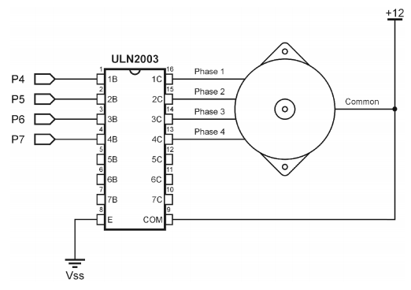

## MOSFET

Een MOSFET transistor is sterk te vergelijken met een gewone transitor met het verschil dat de basis bij een MOSFET niet wordt gestuurd door een stroom maar door een spanning erop aan te sluiten. Bij een MOSFET spreekt men bij de aansluitklemmen niet over basis, emitter en collector, maar over gate, source en drain. De MOSFET kan ook gezien worden als een schakelaar waarbij het bedienen nu niet gebeurt met een stroom, maar door een spanning over gate-source te plaatsen. Laat wel duidelijk zijn dat ook een FET transistor als versterker in klasse A kan worden ingesteld. De FET transistor doet zich dan voor als een soort regelbare weerstand.

Net zoals bij de bipolaire transitor, waar deze familie wordt ingedeeld in NPN en PNP types, zijn er bij de FET transistoren ook verschillende types te onderscheiden. Volgende figuur voorziet een overzicht van deze groep transistoren. Zie figuur.

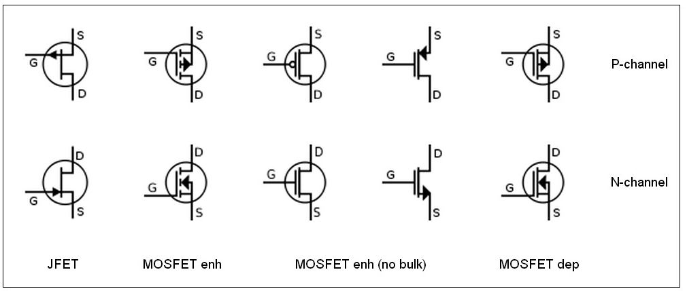

Het zou ons te ver leiden om hier alle types te bespreken. Net zoals bij de bipolaire transistoren, waar vooral belang werd gehecht aan het NPN type, wordt hier gefocused op het N-Channel type. Specifiek wordt er ingezoomd op de MOSFET van het verrijkingstype (enhanced). Zoals eerder aangegeven worden de klemmen benoemd als:

*  G : Gate (poort of stuurelektrode).
*  D : Drain (afvoer van ladingsdragers).
*  S : Source (bron of aanvoer van ladingsdragers).

**Hoe kan een kanaal in geleiding worden gebracht?** 

Er treedt geleiding van het kanaal op indien UGS groter is dan UTH of VT = treshold voltage. De spanning aangebracht op de Poort of Gate (G) is bij dit type MOSFET positief t.o.v. de Source (S).

**Er is geen ingangsstroom nodig in tegenstelling tot de bipolaire transistor.** Algemeen kan men stellen dat bij DC-gebruik, de IG = 0A!

**Transfertkarakteristiek IDS = f(UGS) en uitgangskarakteristiek IDS = f(UDS) met UGS als parameter.**

Volgende instellingen van de FET zijn mogelijk :

* UGS < VT => De MOSFET is gesperd IDS = 0 en het kanaal geleidt niet, er vloeit m.a.w. geen stroom van Drain naar Source. We kunnen de transistor als een -open schakelaar- beschouwen. CHANNEL is OFF.  
* UGS > VT => De MOSFET is in geleiding IDS > 0. Het kanaal geleidt en er vloeit stroom van Drain naar Source. Als er een aanzienlijke spanning UDS over de Drain-Source klemmen staat is de MOSFET ingesteld in klasse A.
* UGS >> VT => De MOSFET is sterk in geleiding IDS > 0. Het kanaal geleidt zeer goed en er vloeit stroom van Drain naar Source. Er staat een minimale (zeer kleine), te verwaarlozen spanning UDS over de Drain-Source klemmen van de MOSFET.  We kunnen de transistor als een - gesloten schakelaar- beschouwen. CHANNEL is ON.  

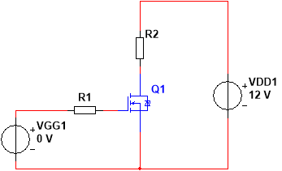

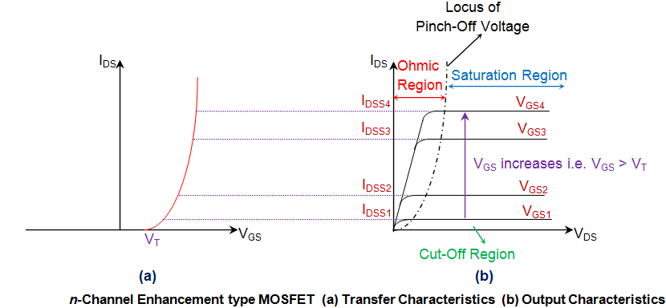

**Een voorbeeld van een klasse A instelling (versterking)**

Het type BUZ11 MOSFET bezit de transfertkarakteristiek, zie figuur. Deze wordt in bijhorend schema geschakeld. Controleer de instelling van de MOSFET. Bepaal IG, UGS, UDS, UR1 en het vermogensverbruik in de componenten.

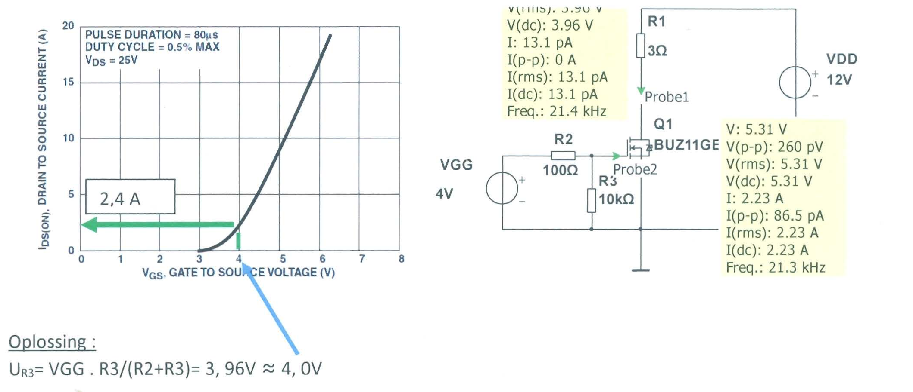

Doe dezelfde oefening voor het geval VGG = 2V. Bepaal alle grootheden in het circuit.

**Quasi IDEALE schakelaar**

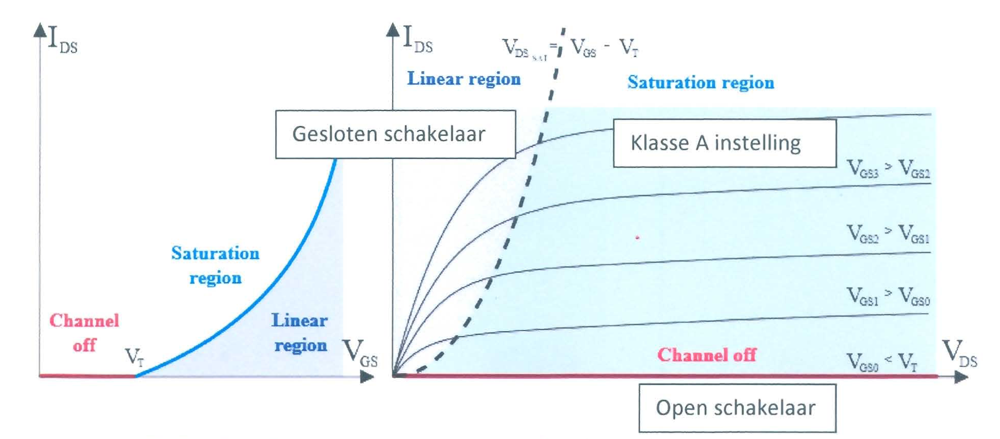

Hier komt een nieuw begrip aanbod, namelijk  RDSon. Dit kan gezien worden als de ohmse weerstand die terug te vinden is tussen de Drain en de Source wanneer de MOSFET in de ON-toestand geschakeld staat. Dus is volledige geleiding. Deze waarde is meestal in datasheets van een bepaald type terug te vinden.

Indien een MOSFET als een gesloten schakelaar ingesteld wordt staat er een restspanning over het kanaal. We noemen dit de UDSon spanning.  

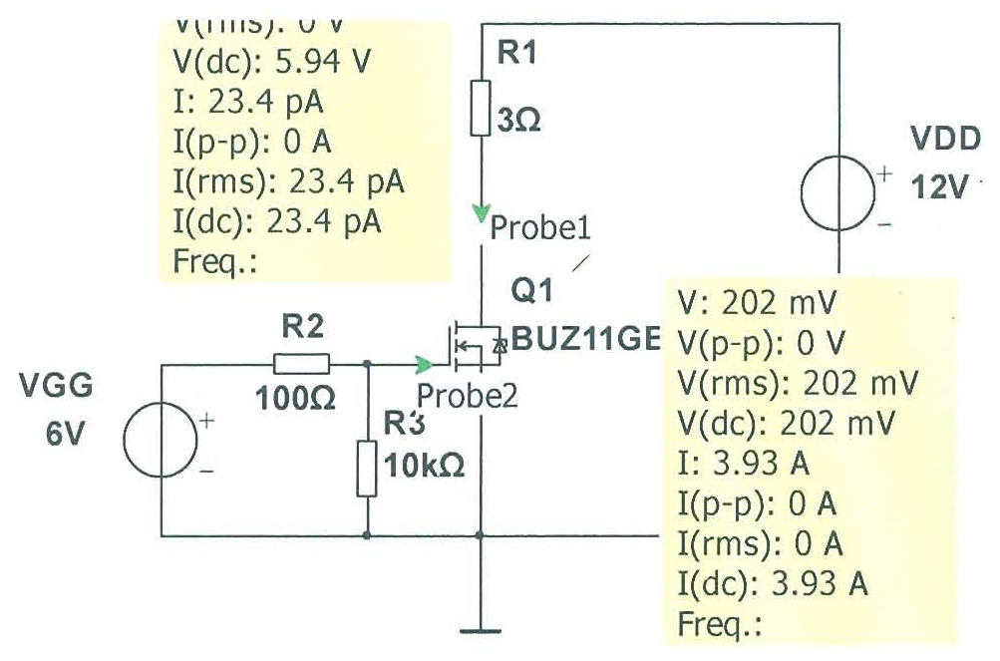

Bepaal IG, UGS, UDS, UR1 en het vermogensverbruik in de componenten als in figuur de VGG = 6V. 

Als we dit echter schakelen en bemeten, dan zien we dat er een kleine spanning over de Drain-Sorce klemmen komt te staan. In de vorige berekening hebben we dit verwaarloosd. We meten blijkbaar een spanning van UDSon  = 202mV bij een stroom van 3.93A.

Het kanaal gedraagt zich als een ohmse weerstand. Bij dit type MOSFET is :  

RDSon = UDSon / IDon = 0,051 Ohm.

De RDSon van een MOSFET is een belangrijk kenmerk. Het vermogenverlies in de schakelaar bij DC bedraagt. P = IDon² . RDSon (hier is dit 0,79W)

**De weerstand van het kanaal waarbij de MOSFET als gesloten schakelaar werkt noemen we dus RDSon.**

**Oefening:**

Neem dezelfde opstelling maar nu met een VGG = 5V. Bepaal alle grootheden in het circuit. Stel RDSon = 51mOhm. Wat stel je vast?

**Transferkarakteristiek ID = f(UGS)**

Bepaal ID bij de UGS waarden 4,5V en 5V telkens bij een kamertemperatuur van 25°C bij IRF540 (Power MOSFET) met een semi-logaritmische schaal, en bij BS170.

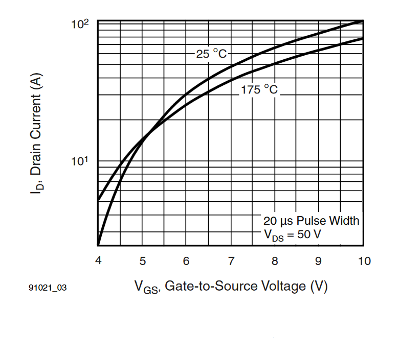

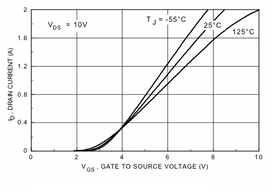

**Uitgangskarakteristiek ID = f(UDS) met UGS als parameter** 

Bepaal op een grafische manier bij een BS170 ID en UDS bij UGS waarden 4V, 5V en 6V. Bij een VDD = 20V, R1 = 33,3 Ohm (load). Teken eerst het schema. Wat stel je vast? Hoe kan je de RDSon berekenen?

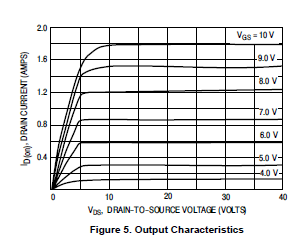

Bepaal op een grafische manier bij een IRF1407 ID en UDS bij UGS waarden 5V en 10V. Bij een VDD = 20V, R1 = 1,0 Ohm (load). Teken eerst het schema. Wat stel je vast? Hoe kan je de RDSon berekenen?

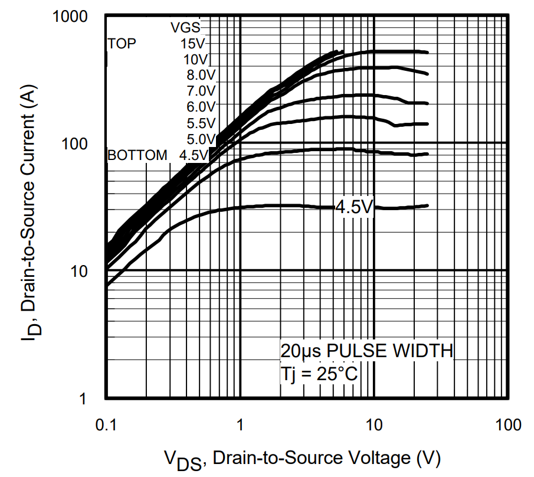

**Opmerkingen:**

MOSFETS hebben een aanzienlijke capaciteit tussen de verschillende klemmen. In de figuur kunnen we de belangrijkste parasitaire C herkennen, Cin. Deze ingangscapaciteit Cin zorgt voor een vertraging bij het in- en uitschakelen van de MOSFET.

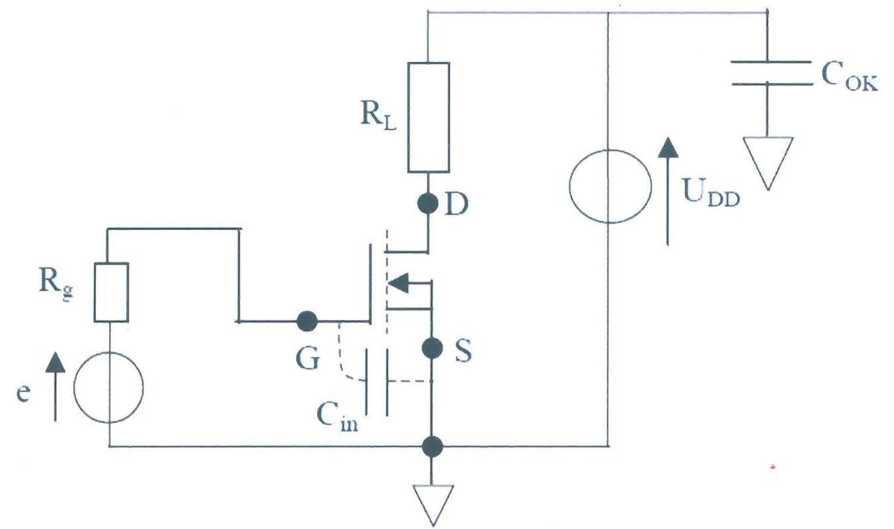

Neem Rg voldoende laagohmig. Een betere oplossing is het gebruik maken van MOSFET-drivers (IC). Ze kunnen MOSFET's snel laten schakelen. Ze zijn speciaal ontwikkeld en garanderen snelle overgangstoestanden (dus, ze bezitten een kleine ON-OFF delay of vertraging) en verkleinen op deze manier de schakelverliezen.

MOSFET's zijn erg gevoelig voor elektrostatische ontladingen (Electro-Static Discharge of ESD gevoelig). Neem hiervoor voldoende maatregelen. De natuurlijke elektrische lading van een menselijk lichaam kan voldoende zijn om de MOSFET te beschadigen.

**Een voorbeeld van een N-channel MOSFET van het verrijkingstype afbeelding is weergegeven in de figuur \ref{IRF3205}.**

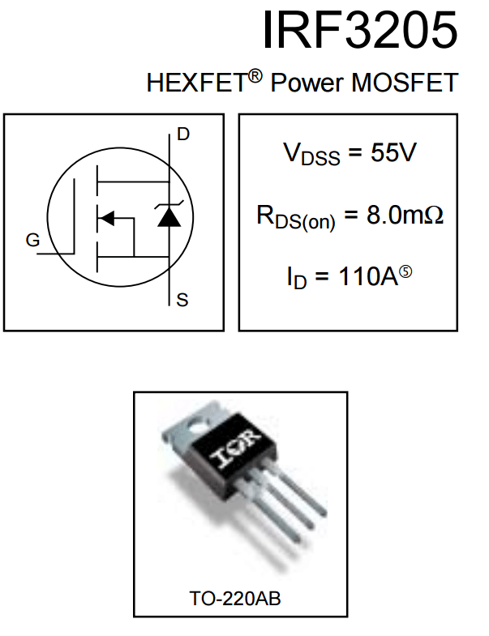

Een MOSFET wordt op een dergelijke manier aangesloten (zowel sturing als belasting). Een voorbeeld is terug te vinden in de figuur. De MOSFET gedraagt zich hier als een ideale schakelaar. Bij een HOOG signaal op de gate zal de schakelaar (tussen drain en source) sluiten. Bij een LAAG signaal staat de schakelaar open. Ook is het hier zo dat de stroom van de belasting, enkel van drain naar source kan vloeien.

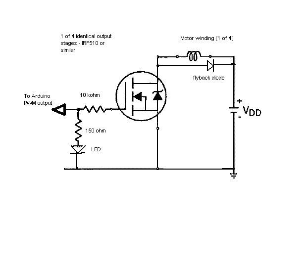

Een MOSFET kan meestal grotere spanningen en stromen schakelen dan een gewone NPN of PNP transistor. Tevens verbruikt een MOSFET minder energie omdat hij spanningsgestuurd is en niet stroomgestuurd. Een MOSFET kan heel snel schakelen. De schakelfrequentie kan dus hoog zijn en de MOSFET kan perfect gebruikt worden met PWM-signalen om bijvoorbeeld de snelheid van een DC-motor te sturen of de helderheid van LED's (LEDstrip) te regelen.

Meet hiervoor eerst de stroom die nodig zal zijn om de uw belasting an te sturen. Dit is trouwens ook de Drain stroom ID. Zorg ervoor dat de spanning op de Gate groot genoeg (controleer dit op de karakteristiek van het gebruikte type) is zodat de MOSFET volledig gesatureerd geraakt.  

## Opto-Coupler

Een opto-koppel bestaat uit een lichtzender, meestal een led, en een lichtgevoelig element die in een lichtdichte behuizing tegenover elkaar zijn opgesteld.  Soms plaatst men tussen beide componenten een stukje glasvezel als lichtgeleider om een minimale lichtverstrooing te bekomen.  Figuur \ref{optocoupler1} toont een mogelijke constructie.  

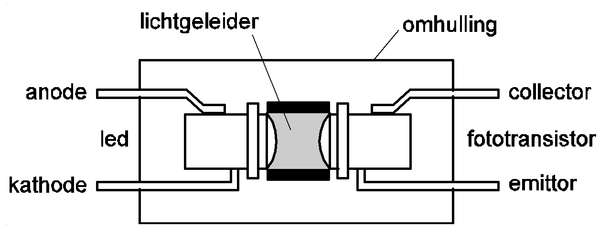

Een opto-coupler is een kleine geïntegreerde schakeling waarin zich een led en een lichtgevoelige transistor bevinden. Door een bepaalde spanning aan de klemmen van de led te leggen zal de transistor in geleiding gaan (gesloten schakelaar tussen ceollector en emitter). Hierdoor kan een signaal in de ene schakeling worden overgedragen op een andere schakeling zonder dat deze schakelingen elektrisch met elkaar verbonden zijn, wat uit veiligheidsoverwegingen in veel apparatuur (bijvoorbeeld medische apparaten) een vereiste is. Dit zorgt dus voor een galvanische scheiding die gemakkelijk toe te passen is in kleine elektronische schakelingen.

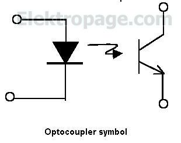

Opto-koppelaars zijn de ideale oplossing om gevoelige elektronische schakelingen te scheiden van elementen in een stuurkring of die op het net werken (opto triac).  Het schakelen van componenten op het net kan immers grote spanningspieken doen ontstaan die elektronische schakelingen kunnen vernietigen of de goede werking ervan in de war sturen.  Typische toepassingen zijn digitale systemen die lampen doen oplichten, maar ook gewone schakelingen die een relais aansturen.

Opto-koppelaars zijn voor die zaken een ideale oplossing omdat er geen enkele verbinding bestaat tussen het deel elektronica (stuurkring) en het deel dat op het net werkt (vermogenkring); er is een volledige galvanische scheiding.  Bijkomend voordelen zijn dat de weerstand tussen in- en uitgang praktisch oneindig is en dat ze zeer hoge frequenties kunnen verwerken.

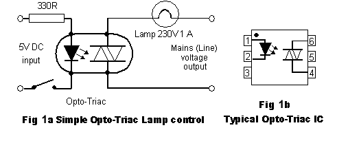

Opto-couplers kunnen vergeleken worden met een relais, maar dan zonder bewegende delen. Hierdoor kan de schakelfrequentie veel hoger liggen dan een relais.  

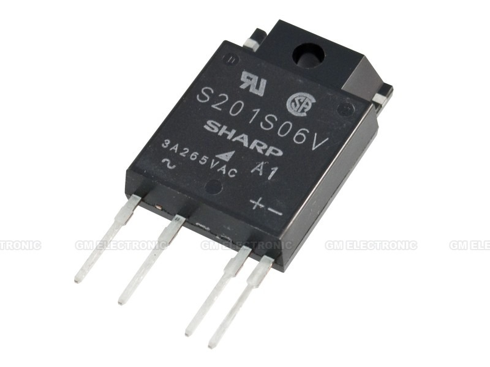