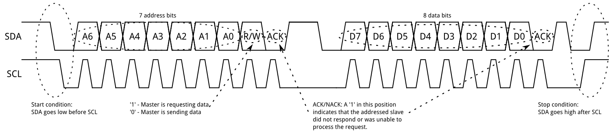

# I²C  


---

## Introductie_#

In dit deel van de cursus wordt de I²C communication protocol belicht. Waarom je dit zou gebruiken en hoe het te implementeren komt hier aan bod.


De Inter-integrated Circuit I²C Protocol is een protocol die meerdere slave devices op de bus toelaten. In de meeste gevallen wordt er met één master gewerkt (invorige figuur is dit een RpI, maar in ons geval zal dit onze Nucleo microcontroller zijn), alhoewel meerdere master van de bus kunnen gebruik maken. We zullen dit laatste in deze cursus achterwege laten. Er wordt dus hier gewerkt met één master en met meerdere slaves. Op dit vlak is het gelijkaardig aan de Serial Peripheral Interface (SPI). De bus wordt toegepast waar afstanden heel beperkt zijn, binnen een elektrisch toestel dus. Net zoals de Asynchronous Serial Interfaces (zoals des RS-232 of UARTs), werkt de bus maar met twee actieve lijnen die gebruikt wordt om data uit te wisselen tussen master en slave.

## Waarom I²C?

Om het gebruik te kunnen verantwoorden wordt i²c vergeleken met andere communicatie protocollen.


Omdat er bij seri\"ele asynchrone poorten geen klok info wordt verzonden, moeten er afspraken gemaakt worden tussen de devices (zender en ontvanger). De afspraken zijn specifiek gericht op het goede verloop van de datatransmissie zodat het voor de ontvanger duidelijk is op welke manier de zender zijn data zal verzenden. Deze afspraken zijn nodig omdat de zender die specificaties niet kan achterhalen uit de ontvangen data. Het gaat hier omtrent volgende specifieke gegevens: data-snelheid (baud rate, dit is bits per seconde, bps, of hoelang de zender een bit zal aanhouden en stabiel houden op de transmissielijn), aantal stopbits en pariteit. De twee devices bij seri\"ele communicatie zullen zelf een klok moeten opwekken waarvan de snelheid heel dicht bij elkaars waarde ligt. Indien dit niet zo is, dan zal de overdracht niet optimaal verlopen (onleesbare dataoverdracht).

Asynchrone seri\"ele poorten werken hardwarematig op basis van een UART. Deze is gebouwd met complexe elektronica en is softwarematig niet gemakkelijk te implementeren. Er is op zijn minst een start- en een stop bit nodig om een frame te hebben. Dit betekent dat er op zijn minst 10 bits nodig zijn om slechts 8 bit data te kunnen verzenden. Effici\"ent is dit niet.

Een ander groot nadeel van seri\"ele communicatie is dat de communicatie enkel maar kan gebeuren tussen twee devices en enkel tussen die twee devices. Communicatie tussen meerdere devices vervalt in een complexe opzet. Dit komt echter weinig voor.

Finaal kan er nog iets gezegd worden over de data-snelheid. Alhoewel er theoretisch geen beperking is aan de maximum baud rate, wordt deze meestal gelimiteerd door de UART op maximum 230400 bits per seconde. Verder wordt er gewerkt met vaste waarden van baudrate. 

## Wat is het nadeel van SPI?

Het meest voor de hand liggende nadeel van SPI is het aantal benodigde pinnen. Het verbinden van een enkele master met een enkele slave met een SPI-bus vereist vier lijnen; elke extra slave vereist één extra chip-selectie I/O-pin op de master. De snelle proliferatie van pinverbindingen maakt deze ongewenst in situaties waarin veel apparaten aan één master moeten worden gesleuteld. Ook kan het grote aantal verbindingen op een strakke pcb-layout voor problemen zorgen tijdens het routen van de print. SPI staat slechts één master toe op de bus, maar het ondersteunt wel een willekeurig aantal slaves (alleen afhankelijk van de aandrijfmogelijkheid van de apparaten die op de bus zijn aangesloten en het aantal beschikbare chipselectiepinnen).


SPI is goed voor full-duplex (gelijktijdig versturen en ontvangen van data) high-datasnelheidverbindingen, ondersteunt kloksnelheden van meer dan 10 MHz (en dus 10 miljoen bits per seconde) voor sommige apparaten, en de snelheid schaalt mooi. De hardware aan beide uiteinden is meestal een heel eenvoudig schuifregister, wat een eenvoudige implementatie in software mogelijk maakt.

## Enter I²C - The best of Both Worlds!


I²C vereist slechts twee draden, zoals een asynchrone seriële communicatie, maar die twee draden kunnen maximaal 1008 slave-apparaten ondersteunen(bij seriële communicatie zijn er maar twee devices aanwezig). In tegenstelling tot SPI kan I²C ook een multi-master-systeem ondersteunen, waardoor meer dan één master kan communiceren met alle apparaten op de bus (hoewel de master-apparaten niet met elkaar kunnen praten via de bus en om beurten gebruik moeten maken van de buslijnen ). Het dient hier echter opgemerkt te worden dat er in de meeste gevallen maar gewerkt wordt met één master maar wel met meerdere slaves. Nog een voordeel ten opgezichte van de SPI is dat er bij bijkomende slave geen extra chipselect lijn nodig is. I²C werkt niet met CS-lijnen zoals SPI maar met adressen. Iedere slave bezit een uniek slave-adres op de bus.

Datasnelheden van I²C vallen ergens tussen die van asynchrone seriële en SPI; de meeste I²C-apparaten kunnen communiceren op 100 kHz of 400 kHz. Er is wat overhead met I²C; voor elke 8 bits aan gegevens die verzonden moeten worden, moet een extra bit met de data (het "ACK / NACK" -bit, dat we later zullen bespreken) worden verzonden.

De hardware die nodig is om I²C te implementeren is complexer dan SPI, maar minder dan asynchrone seriële. Het kan vrij triviaal worden geïmplementeerd in software.

## I²C historiek

I²C is oorspronkelijk in 1982 door Philips ontwikkeld voor verschillende Philips-chips. De oorspronkelijke specificaties stonden alleen voor communicatie van 100 kHz toe en alleen voor 7-bits adressen, waardoor het aantal apparaten op de bus naar 112 werd beperkt (er zijn verschillende gereserveerde adressen die nooit voor geldige I²C-adressen zullen worden gebruikt). In 1992 werd de eerste openbare specificatie gepubliceerd, met een 400 kHz snelle modus en een uitgebreide 10-bits adresruimte. Op dit punt is er in de meeste gevallen (bijvoorbeeld in het ATMega328-apparaat op veel Arduino-compatibele kaarten) ondersteuning voor I²C. Er zijn drie extra modi gespecificeerd: fast-mode plus, op 1 MHz; high-speed modus, op 3,4 MHz; en ultrasnelle modus, op 5 MHz.

Naast de originele I²C introduceerde Intel in 1995 hierop een variant: "System Management Bus" (SMBus). SMBus is een strakker gecontroleerd formaat, bedoeld om de voorspelbaarheid van communicatie tussen ondersteunende IC's op pc-moederborden te maximaliseren. Het belangrijkste verschil tussen SMBus is dat het snelheden beperkt van 10 kHz tot 100 kHz, terwijl I²C apparaten van 0 kHz tot 5 MHz ondersteunt. SMBus bevat een klok-timeoutmodus die operaties met een lage snelheid onwettig maakt, hoewel veel SMBus-apparaten het toch zullen ondersteunen om de interoperabiliteit met ingesloten I²C-systemen te maximaliseren.

## Hardware

Elke I²C-bus bestaat uit twee signalen: SCL en SDA. SCL is het kloksignaal en SDA is het datasignaal. Het kloksignaal wordt altijd gegenereerd door de huidige busmaster; sommige slave-apparaten kunnen de klok soms te laag maken om de master te vertragen om meer gegevens te verzenden (of om meer tijd nodig te hebben om gegevens voor te bereiden voordat de master probeert deze uit te klokken). Dit wordt "clock stretching" genoemd en wordt verder beschreven.

In tegenstelling tot UART- of SPI-verbindingen zijn de I²C-busdrivers "open drain", wat betekent dat ze de bijbehorende signalen laag kunnen trekken, maar niet hoog kunnen forceren. Er kan dus geen busconflict zijn waarbij een apparaat de lijn probeert te besturen terwijl een ander probeert hem laag te trekken, waardoor de kans op schade aan de stuurprogramma's of overmatige vermogensdissipatie in het systeem wordt geëlimineerd. Elke signaallijn heeft een pull-upweerstand om het signaal hoog te trekken wanneer geen apparaat het laag bewerkt (stuurt).


De weerstandsselectie varieert met apparaten op de bus, maar een goede vuistregel is om te beginnen met 4.7k en indien nodig aan te passen. I²C is een redelijk robuust protocol en kan worden gebruikt met korte series draad (2-3 m). Voor lange leidingen en systemen met veel apparaten zijn kleinere weerstanden beter.

## I²C spanningsniveau's

Omdat de apparaten op de bus de signalen niet echt aansturen, biedt I²C enige flexibiliteit bij het aansluiten van apparaten met verschillende I/O-spanningen. Over het algemeen is het mogelijk dat in een systeem waarin het ene apparaat op een hogere spanning staat dan in het andere, de twee apparaten via I²C kunnen worden verbonden zonder daartussen een niveauverschuivingsschakeling. De truc is om de pull-up weerstanden aan te sluiten op de laagste van de twee voltages. Dit werkt alleen in sommige gevallen, waarbij de laagste van de twee systeemspanningen de hoge ingangsspanning van het hoog spanningsniveau overschrijdt ($ UiH_{Min} $ ), bijvoorbeeld een 5V Arduino en een 3,3V accelerometer.

Als het spanningsverschil tussen de twee systemen te groot is (bijvoorbeeld 5V en 2,5V), zijn er eenvoudige I²C-niveau omzetter schakelingen op de markt te vinden.

## Protocol bij I²C

Communicatie via I²C is complexer dan met een UART- of SPI-oplossing. De signalering moet voldoen aan een bepaald protocol voor de apparaten op de bus om het te herkennen als geldige I²C-communicatie. Gelukkig zorgen de meeste apparaten voor alle onhandige details voor u, zodat u zich kunt concentreren op de gegevens die u wilt uitwisselen. Het is hier dus duidelijk dat de verschillende slaves die op de bus zijn geschakeld een uniek adres zullen moeten hebben zodat de master de juiste slave kan aanspreken. De master is meestal de microprocessor zelf. Deze zal dus bij een bepaalde slave willen iets lezen of iets schrijven (Read of Write). De timing waarop alle communicatie zal verlopen wordt steeds door de master bepaald. Dus SCL signaal is een uni-direzctioneel signaal. Het feit dat de master data zowel wil lezen als schrijven naar een slave (dit gebuert over de SDA-lijn) is de SDA-lijn bi-directioneel.



Berichten worden opgesplitst in twee soorten frames: een adresframe, waarbij de master de slave aangeeft waarnaar het bericht wordt verzonden, en een of meer gegevensframes, die 8-bits gegevensberichten kunnen doorgegeven worden van master naar slave of omgekeerd . Gegevens worden op de SDA-regel geplaatst nadat SCL laag is en worden gesampled nadat de SCL-regel hoog is. De tijd tussen de klokflank en gegevens lezen/schrijven wordt bepaald door de apparaten op de bus en varieert van chip tot chip.

### Startconditie

Om het adresframe te initiëren, brengt de master de SCL hoog en trekt de SDA laag. Dit zet alle slave-apparaten in de start-conditie, wat wil zeggen dat de slaves nu op de hoogte zijn dat de master wenst te starten. (Als twee master-apparaten in één keer eigenaar van de bus willen worden, wint de race, ongeacht welk apparaat eerst de SDA-waarde onderschrijdt en wint de besturing van de bus.) Het is mogelijk om herhaalde starts uit te voeren, een nieuwe communicatiereeks te initiëren zonder de besturing van de bus aan een andere master op te geven; daar later meer over.

### Adresframe

Nadat het adresframe is verzonden, kunnen gegevens worden verzonden. De master zal gewoon doorgaan met het genereren van klokpulsen met een regelmatig interval, en de gegevens zullen op SDA worden geplaatst door de master of door de slave, afhankelijk van of de R/W bit een lees- of schrijfbewerking aangeeft. Het aantal dataframes is willekeurig en de meeste slave-apparaten zullen het interne register automatisch verhogen, wat betekent dat volgende lees- of schrijfbewerkingen van het volgende register in de rij komt.

### Stopconditie

Nadat alle dataframes zijn verzonden, genereert de master een stopconditie. Stopvoorwaarden worden gedefinieerd door een 0-> 1 (laag naar hoog) overgang op SDA na een 0-> 1 overgang op SCL, waarbij SCL hoog blijft. Tijdens normaal schrijven van gegevens mag de waarde op SDA niet veranderen als SCL hoog is, om verkeerde stopcondities te voorkomen.

## Advanced Protocol Topics

### 10 bit adres


In een 10-bits adresseringssysteem zijn twee frames nodig om het slave-adres te verzenden. Het eerste frame zal bestaan uit de code b11110xyz, waarbij 'x' de MSB van het slave-adres is, y is bit 8 van het slave-adres en z is het lees/schrijfbit zoals hierboven beschreven. Het ACK-bit van het eerste frame wordt bevestigd door alle slaves die overeenkomen met de eerste twee bits van het adres. Net als bij een normale 7-bits overdracht, begint onmiddellijk een andere overdracht en deze overdracht bevat bits 7: 0 van het adres. Op dit punt moet de geadresseerde slave reageren met een ACK-bit. Als dit niet het geval is, is de storingsmodus hetzelfde als een 7-bits systeem.

Houd er rekening mee dat 10-bits adresapparaten naast 7-bits adresapparaten kunnen bestaan, omdat het leidende deel '11110' van het adres geen deel uitmaakt van geldige 7-bits adressen.

### Repeated Start Conditie


Soms is het belangrijk dat een master-apparaat meerdere berichten in één keer kan uitwisselen, zonder dat andere masterapparaten op de bus interfereren. Om deze reden is de herhaalde startvoorwaarde gedefinieerd.

Om een herhaalde start uit te voeren, moet SDA hoog zijn terwijl SCL laag is, gevolgd door een hoog op de SCL en vervolgens SDA opnieuw laag te maken terwijl SCL hoog is. Omdat er geen stopconditie op de bus was, was de vorige communicatie niet echt voltooid en behoudt de huidige master de controle over de bus.

Op dit punt kan het volgende bericht beginnen met verzenden. De syntaxis van dit nieuwe bericht is hetzelfde als elk ander bericht: een adresframe gevolgd door gegevensframes. Een willekeurig aantal herhaalde starts is toegestaan, en de master zal de bus in stand houden totdat deze een stopconditie afgeeft.

### Clock stretching


Soms overschrijdt de datasnelheid van de master het vermogen van de slave om die gegevens te leveren. Dit kan zijn omdat de gegevens nog niet klaar zijn (de slave heeft bijvoorbeeld nog geen conversie van analoog naar digitaal voltooid) of omdat een eerdere bewerking nog niet is voltooid (bijvoorbeeld een EEPROM die nog niet klaar is met een vorige handeling) schrijven naar een niet-vluchtig geheugen en moet dit afmaken voordat het andere verzoeken kan afhandelen.

In dit geval zullen sommige slave-apparaten een 'Clock Stretching' uitvoeren. Nominaal worden alle klokken aangedreven door de master. Een slave zal eenvoudig gegevens op de bus plaatsen of data uit de bus te nemen op ritme van de klokpulsen van de master. Op elk punt in het proces voor gegevensoverdracht kan een geadresseerde slave de SCL-regel laag houden nadat de master deze heeft vrijgegeven. De master moet zich onthouden van extra klokpulsen of gegevensoverdracht totdat de slave de SCL-lijn vrijgeeft.

# Voorbeeld I²C in MBED voor Nucleo microcontroller

Hier gebruiken we een PCF8574. Dit is een 8bit I/O slave. Zoek datasheet op het internet en bestudeer dit.


```cpp
//I2C_MasterWrite
#include "mbed.h"

const int addr = 0x70;                  //PCF8574AP met adres 0

I2C iKwadraatC(I2C_SDA, I2C_SCL);       //SDA op PB_9 (D14) en SCL op PB_8 (D15) geen externe pullups nodig

DigitalOut myled(LED1);
char teller;
int main() {
    char cmd[1];
    while(1) {
 
        cmd[0] = teller;
        iKwadraatC.write(addr, cmd, 1);
        wait(0.1); // 1 sec
        
        teller--;
        
    }
}
```

In vorige opstelling , hardware en software, worden enkele LEDS aangestuurt. De software stuurt echter 8 LEDS aan.

In volgende code kunnen we een dergelijke I²C slave ook gebruiken als inputs (lezen van 8 I/O pinnen). Dit doen we zo (hier worden 2 slaves op de bus geplaatst):

```cpp
//I2C_MasterWrite
//Dit is een I²C communicatie met als master de Nucleo SDA op D14 en SCL op D15
//geen pullups nodig.
//2 PCF8574 slaves: 1 met 8 outputs en 1 met 8 inputs
//1° pcf8574AP met 8 outputs met adres 0x70 (write)
//2° pcf8574P met 8 inputs met adres 0x41 (read)

#include "mbed.h"

const int addr = 0x70;                  //PCF8574AP met adres 0

I2C iKwadraatC(I2C_SDA, I2C_SCL);       //SDA op PB_9 (D14) en SCL op PB_8 (D15) geen externe pullups nodig

DigitalOut myled(LED1);
char teller;
int main() 
{
    char cmd[1];
    while(1) 
    {
        iKwadraatC.read(0x41, cmd, 1);  
        //cmd[0] = teller;
        wait(0.1); // 1 sec
        iKwadraatC.write(addr, cmd, 1);
        wait(0.1); // 1 sec
        //teller--;
    }
}
```