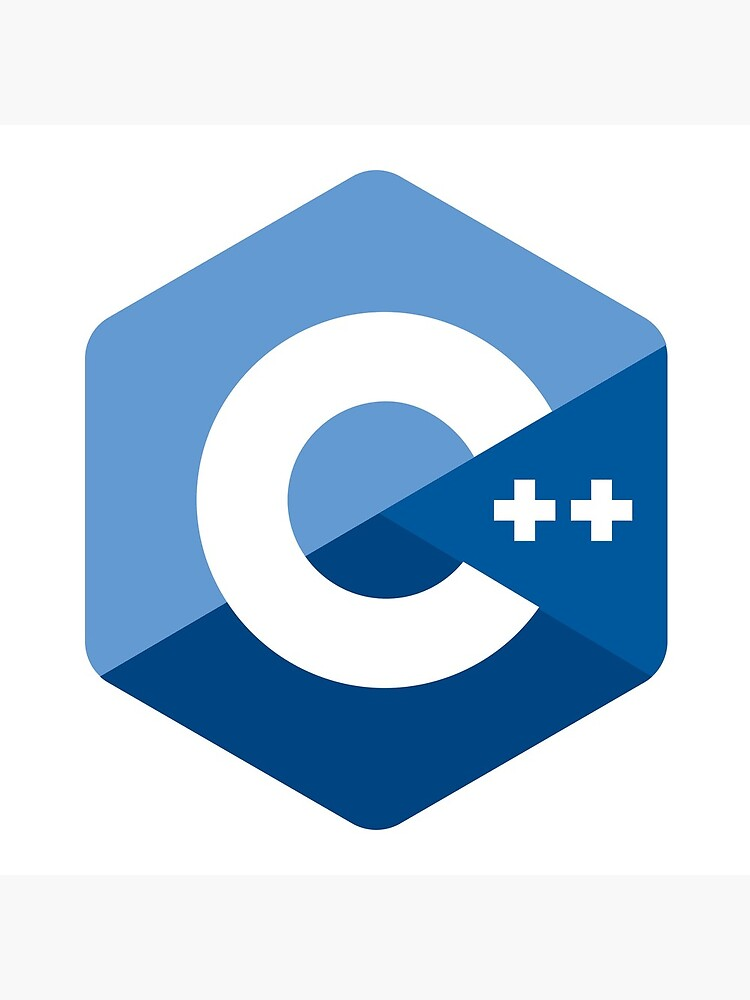
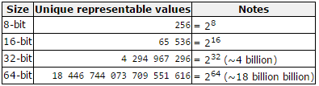

# C++  




---

C++ , Ce plus plus , is een programmeertaal die heel veel wordt gebruikt met betrekking tot microcontrollers. Net zoals in C# kunnen er applicaties worden geprogrammeerd die een logica uitvoeren op een bepaald elektronica platform. Dit kan een computer zijn, maar kan evengoed een klein microprocessor systeem zijn. Dergelijke kleine microcontrollers worden in heel veel elektronica toepassingen gebruikt. Een microgolgoven, kookfornuis, thermostaat, wasmachine, ... bevatten de dag van vandaag allemaal microcontrollers om de bediening van de machine te realiseren. Binnen een IoT systeem is een microcontroller niet weg te denken en speelt binnen het proces een belangrijke rol. Het is dus fundamenteel dat IoT-technicussen een zekere kennis hebben wat betreft microcontrollers.  

Een Arduino is zo'n gekend voorbeeld van een microcontroller. Die wordt zeer veel gebruikt voor prototyping van een systeem. Het is alomgekend binnen de huis- keuken en hobby toepassingen. Met een dergelijke controller kan er een logisch proces geprogrammeerd worden. Hierbij wordt bijna altijd gebruikt gemaakt van digitale ingangen en digitale uitgangen. Zoals je in de lessen zal zien wordt zo'n logisch proces beschreven door een programma. Dit programma wordt geschreven in een programmeertaal. Arduino gebruikt een soort van C-taal. In deze lessen zal er gebruikt gemaakt worden van een veel krachtiger processor dan de Arduino. Hier wordt een Nucleo microcontroller bordje gebruikt. Een microcontroller wordt getypeerd door zijn rekenkracht. Die rekenkracht wordt door een aantal zaken bepaald. De twee belangrijkste zaken die hier een rol in spelen zijn de klokfrequentie van de processor en het aantal bits die in één keer kunnen worden verwerkt. Een arduino is een 8bit processor (kan dus 8 bits in één keer verwerken) en werkt op een klokfrequentie van 16Mhz. Onze Nucleo processor is een 32 bit RISC processor (kan dus 32 bits in één keer verwerken) en werkt op een klok frequentie van maar liefst 80Mhz. Deze processor kan dus veel sneller en meer berekeningen uitvoeren dan een Arduino.

# MBED inloggen / compiler

De programmeer omgeving die wij hier zullen gebruiken is C++. Je moet niets installeren om je laptop want de IDE (ontwikkelomgeving) kan volledig in de Cloud worden uitgevoerd. Hiervoor moet je wel een account aanmaken.  

[YouTube](https://www.youtube.com/watch?v=BAzKg3vcB88)


Eenmaal een account kan er worden ingelogd en kan er doorgeklikt worden naar de Compiler.


# STM32 Nucleo bord hardware

Het bordje bezit een aantal pinnen die (vrij? ) te programmeren zijn. Het feit dat een microprocessor een digitaal componente is, werkt het dus met twee toestanden. Het werkt dus met nullen en eenen. De verschillende pinnen die je ziet op het bordje kan als ingang (om iets te lezen), of als uitgang (om iets te sturen) worden gebruikt. Sommige pinnen kunnen ook speciale functies hebben (zie later). Een pin kan dus zich in twee toestanden bevinden. Er kan een nul zijn of er kan een één zijn. Hoe zich dit voordoet hangt af of de pin een ingang- of een uitgang is.  

Voor we verder gaan dient nog opgemerkt te worden dat de processor die we hier gebuiken een werkspanning bezit van 3,3V. Een Arduino werkt trouwens op een spanning van 5V. Dus niet alle processoren en elektronica werkt op dezelfde spanning. Opletten dus. Je kan de processor kapot maken door een verkeerde spanning te gebruiken!!!

## Digitale uitgangen

Een pin kan dus als uitgang worden geprogrammeerd. In een LOW toestand zal de spanning op die pin 0V (theoretisch) en in een HIGH toestand zal er 3,3V (3V3) (theoretisch) op de pin beschikbaar zijn. Het hoog al laag zijn wordt bepaald door het programma die deze pin zal aansturen en bepalen wat de toestand moet zijn.

  

De meest eenvoudige manier om een een uitgang te visualiseren is door er een LED mee aan te sturen. En LED is een diode die licht zal afgeven wanneer deze juist is geschakeld (in doorlaat) en wanneer er voldoende spanning over de LED staat er een voldoende stroom door vloeit. Let wel dat de stroom en de spanning niet te groot is!!! Een gewone oplichtende LED bezit een spanning van 1,5V en een stroom die er door vloeit van 20mA. Je ziet sowieso dat de spanning die uit een uitgang van een van een output pin komt, te groot is (3,3V) voor die LED, hierdoor zou er teveel stroom vloeien en wordt de LED en de processor te zwaar belast (lees, kan kapot gaan). Om dit te vermijden wordt er altijd een voorschakelweerstand geplaatst. Een LED kan op twee manieren worden verbonden aan een uitgangspin van de controller:


Merk op dat de LED bij active LOW zal oplichten bij een logische NUL aan de uitgang van de poort. Bij de andere schakeling, active HIGH, zal de LED plichten bij een logische één op de uitgangspin.

[YouTube]https://www.youtube.com/watch?v=kP_zHbC_5eM

Hoe programmeer je nu een output? Op het bordje staat al 1 LED geschakeld die je zelf kan programmeren. Dit doe je zo: Zorg dat je microcontroller via een USB kabel is gekoppeld aan je pc. Controlleer of je computer de nieuwe hardware herkent door in configuratiescherm de nieuwe hardware terug te vinden (zie COM-poorten). Je zou ook moeten een DRIVE-letter bijgekregen hebben op uw computer (zoals een USB stick).

Om aan te geven welke pin je wil gebruiken als output, kan je terecht binnen de IDE door rechtsboven op het juiste platform te klikken:


Dan zie je de pinnummers die beschikbaar zijn voor gebruik:


De ene LED die beschikbaar is bezit ook een pinnummer (speciaal nummer = LED1). Je zou ook evengoed pinummer D3 kunnen gebruiken om een LED te schakelen. Maar dan moet je die wel zelf koppelen aan die pin volgens vorige schema's.  

Laten we verder werken met de LED die reeds aan boord is van het bordje. Maak en nieuwe applicatie binnen de IDE en programmeer volgende code:

```cpp
//Nucleo_output, dit is commentaar  
#include "mbed.h"
DigitalOut led(LED1);   //pin LED1 is een output pin en krijgt de naam led
int main()              //hoofdprogramma
{
   while(1)             //oneindige lus
   {           
            led = 0;    // OFF, er staat 0V op de pin
            wait(0.5);  //wacht een halve seconde
            led = 1;    // ON, er staat 3V3 op de pin
            wait(1.0);  //wacht een seconde
    }
}

```

Save, klik op Compile. Je krijgt een bestand dat je kan downloaden. Download dit op de DRIVE van de controller.
Kijk wat er gebeurt. Wijzig het programma een aantal keren.

## Digitale ingangen

[YouTube]https://www.youtube.com/watch?v=XmWqP8laxxk

Een bepaalde pin kan dus ook als ingang worden geprogrammeerd. Hier zal het logisch programma (de software) de toestand (voltage) van die pin gaan interpreteren. Is er op dat moment een spanning aan gekoppeld van 0V , dan zal de software dit als een NUL beschouwen, staat er echter 3V3 op die pin geschakeld, dan zal de software die toestand interpreteren als zijnde logisch EEN.  

De meest eenvoudige manier om een digitale ingang aan te sturen is met een drukknop. Deze kan twee toestanden bezitten OPEN of GESLOTEN. (zie video). Zoals in de video wordt aangegeven kan je dus een drukknop op twee manieren schakelen aan de ingang van een digitale poort. Actief hoog of actief laag. Het is zeer belangrijk dat je de werking van beide schakelingen goed begrijpt. Zie les.  


Je kan het gebruik van een weerstand ook software matig oplossen. Dit gaan we hier niet doen. Er is dus ook een drukknop reeds aanwezig op het bordje (blauwe knop). Deze is ook gekoppeld aan een pin van de processor. Hier is dit pinnummer (ook weer een beetje raar = USER_BUTTON). Je zou natuurlijk ook zelf een drukknop kunnen plaatsen en die koppelen aan een pin (vb aan pin A1).

Programmeren doe je zo om bijvoorbeeld de LED aan te sturen met de drukknop:

```cpp
//Nucleo_output, dit is commentaar  
#include "mbed.h"
DigitalOut led(LED1);           //pin LED1 is een output pin en krijgt de naam led
DigitalIn knop(USER_BUTTON);    //pin USER_BUTTON is een input pin en krijgt de naam knop
int main()              //hoofdprogramma
{
   while(1)             //oneindige lus
   {           
            led = knop;    // OFF, er staat 0V op de pin
            
    }
}

```

Begrijp je de werking? Welke logica zit hier achter? Op welke manier is de LED geschakeld? Actief H/L? Op welke manier is de drukknop geschakeld? Actief H/L?
Wijzig het programma een aantal keren.

## Extension Shield

Op het Nucleo bordje kan een extension shield worden geplugd. Meer info omtrent dit opplugbordje is te vinden op <https://rubu.be/index.php?request=nucleoextensionshield&category=diy>.
Op dit bordje zijn 8 leds en 4 drukknoppen aangebracht die al verbonden zijn met enkele pinnen. Kan je nagaan over welke pinnen dit gaat? Ga zelf na of leds actief hoog of laan werken? Ga ook na of de drukknoppen actief hoog of laag werken!!!!

Op het bordje is ook nog een potentiolmeter gemonteerd. Bestudeer de schakeling hiervan. Wat is een potentiometer. Op welke pin is deze aangesloten van de Nucleo? Wta zou de functie hiervan zijn?

 ---

# MBED C++ basics

Dit hoofdstuk belicht de basics van de C++ programmeertaal. Dit is gelijkaardig aan de C# taal.  

## Variabelen

Wanneer je data wil opslaan, bewaren, dan moet er een zekere plaats gereserveerd worden in het geheugen om die data in op te slaan. Afhankelijk van de vorm (hoeveel bits) van die data zal er meer of minder ruimte moeten gereserveerd worden. Zo zijn er verschillende typen variabelen ontstaan (datatypes). Op die manier kan er optimaal omgesprongen worden met het gebruik en het organiseren van het geheugen van het processorsysteem. Het is niet zinvol om honderden geheugenplaatsen te reserveren als er maar één enkele nul of één moet opgeslagen worden. Gelukkig moet de programmeur zelf die reservering niet voorzien. De programmeur dient enkel op te geven welk type variabele (datatype) er nodig is, en de compiler zal zelf een bepaalde geheugenruimte hiervoor aanwijzen en reserveren (kan dan niet voor iets anders gebruikt worden).

Er bestaan veel soorten variabelen (datatypes), en de programmeur kan ook zelf soorten aanmaken. Zo spreekt men in de software-wereld over primitieve variabelen of primitieve datatypes. Deze komen bijna in alle programmeertalen voor en worden ook zeer veel gebruikt. Het zijn als het ware de bouwstenen om data te manipuleren (wat een logische software programma altijd doet). Zulke type variabelen zijn eenvoudig en dienen om er envoudige bewerkingen mee te doen.

C++ ondersteunt volgende primitieve datatypes zoals weergegeven in volgende tabel.


Primitieve datatypes zijn basis types en kunnen direct worden toegepast in de programmeertaal. Ze zijn welomschreven naar wat er als data in kan worden weggeschreven (en natuurlijk ook achteraf weer worden gelezen). Eenvoudige bewerkingen kunnen er worden op uitgevoerd. Ze kunnen in hoofdzaak als volgt worden geclassificeerd:

> * Character types: Deze variabelen kunnen characters van het alfabet en tekens bevatten. Meestal worden characters (karakters) geconverteerd naar enen en nullen op basis van ASCII (zoek eens zo'n tabel op). Karakters zoals 'A' of '$' of '6'. De meest basis type voor dergelijke variabelen is 'char' en kan dus één enkel karakter bevatten. Bepaalde tekens hebben soms meer geheugenruimte nodig en dan volstaat 8 bit niet meer. Dan wordt een ander type gebruikt die bestaat uit meer bitlocaties in het geheugen. Character types zijn basisbouwstenen voor wat een string is (opeenvolging van char's). Op die manier kan leesbare tekst worden gebruikt binnen de software. Concatenatie is een soort bewerking met strings (aan elkaar plakken van twee afzonderlijke strings).  
> * Numerische integer types: Deze variabelen kunnen getallen opslaan en verwerken. Getallen zoals 7 of 1024. Het kunnen enkel gehele getallen zijn , dus geen komma getallen. Ze kunnen in bepaalde omstandigheden een teken bevatten (positief of negatief). Maar bepaalde zijn 'unsigned' wat wil zeggen dat die variabelen geen teken bevatten.  
> * Floating-point types: Deze variabelen zijn in de wiskunde gekend als reële getallen. Komma getallen dus zoals 3.1415 of 0.005. Er zijn hier ook verschillende typen te onderscheiden met hun eigen precisie en eigen limieten.
> * Boolean types: Een Boolean , of kortweg bool, neemt maar 1 bit in het geheugen in en kan dus enkel 0 of 1 zijn. Soms spreekt men niet over 0 en 1, maar over False en True, wat hetzelfde is.

Sommige compilers verwerken bool-variabelen als een integer-variabele. Zo is dan enkel 0 = False en alle andere waarden zijn dan True (vb +5 of -66 of 1).

Over de reserveringsruimte per type kunnen er wat verschillen zijn afhankelijk waarop de applicatie wordt ontwikkelt en uitgevoerd.

Binnen iedere groep in bovenstaande tabel is tseeds de bovenste de variabele die het minst ruimte in het geheugen zal verbruiken. De onderste is steeds de grootste vebruiker van geheugenplaatsen. En de groepen die in de tabel bovenaan staan nemen de minste plaats in het geheugen.  

::: tip De fundamentele opslag unit in C++
De meest fundamentele geheugenruimte waarop het geheugenmodel is gebaseerd van een computersysteem is de byte (8bits). Dit is groot genoeg om tekenloze getallen te bevatten tot 255. Het kan ook een karakter bevatten volgens ASCII of een karakter volgens Unicode UTF-8 encoding tabel. Binnen een reeks van meerdere bits (sequentie van bits) spreekt men altijd van LSB (Least significant bit) en MSB (Most significant bit) zodat er een zekere orde is binnen de verschillende bits in het geheel.
:::

Zoals eerder vermeld wordt de size (grootte = nodige geheugenruimte) uitgedrukt in bits bij een bepaalde type variabele. Uit hoe meer bits een variabele bestaat, hoe groter en complexer de variabele (datatype) als data kan bewaren. Langs de andere kant zal een dergelijke variabele meer ruimte opslorpen binnen het geheugen van het computersysteem.  



### Declaratie van variabelen

C++ is een strongly-typed language (taal), wat wil zeggen dat iedere variabele eerst moet kenbaar gemaakt worden aan de compiler voor die kan worden gebruikt. Dit noemt men declareren van een variabele. Hierbij zal de compiler een bepaalde geheugenruimte reserveren voor die variabele. Zo weet ook de compiler hoe de data van die variabele kan worden verwerkt. Kunnen er wiskundige bewerkingen mee gedaan worden (zoals met Integers), of andere bewerkingen als het over een ander datatype gaat. De syntax, dit is de schrijfwijze binnen de programmeertaal van de instructies, om een variabele te declareren is eenvoudig te doen door het type te schrijven en daarna de naam van de variabele ( = identifier).

Na declaratie bevat de variabele nog geen inhoud. Hiervoor is een toekenning nodig of een initialisatie.  

```cpp
int radius;
int waarde = 30;
char firstLetter = 'a';
```

In bovenstaande code kan een declaratie gevolgd worden door een toekenning . Dan spreekt men van een Literal Value. Dit is niet noodzakelijk.  

De naam van een variabele kan vrij worden gekozen met volgende regels. De naam moet beginnen met een letter of een underscore ('_'), niet met een cijfer of een getal. C++ is case sensitive, wat wil zeggen dat de namen hoofdletter gevoelig zijn.

### De toekenningsoperator (assign)

De meeste gekende operator is '='. Hiermee kan een waarde toegekend worden aan een variabele. Let wel dat bij een toekenning altijd eerst het rechterdeel wordt gelezen en daarna wordt dit toegekend aan het linkerlid. Dit is wel belangrijk indien er ook bewerkingen in het rechterlid staan, of als de toekenning gebeurt in dezelfde variabele vb: 'getal = getal +  1 ;'  

```cpp
radius =  50;
firstLetter = 'b';
```

### Initialiseren van een variabele

Het is dus niet nodig al onmiddelijk bij de declaratie een toekenning uit te voeren (initialiseren). Maar dan kan de variabele nog niet gebruikt worden om er een bewerking of iets anders mee te doen.  

```cpp
int radius;
int waarde = radius;    //niet zinvol omdat radius nog geen waarde bevat (nog niet geïnitialiseerd)

```

Dit kan leiden tot onvoorspelbare resultaten. Men spreekt over undefined. Een variabele die undefined is kan eigenlijk van alles bevatten en is niet altijd 0!! Hier dus mee opletten.

## Constanten

In C++ zijn er twee manieren om een constante te declareren

> * Gebrik makend van de preprocessor '#define' directive
> * Gebruik makend van 'const' keyword

```cpp
#define MAX_NUMBER_OF_STUDENTS 25
```

Wanneer een applicatie wordt gecompileerd, de preprocessor zal alle waarde waar de directive wordt gezien vervangen door die waarde.

```cpp
const int NUMBER_OF_TEACHRES = 85;
```

Een const variabele declaratie declareert een eigenlijke waarde in het geheugen. Je kan er dus ook bewerkingen mee uit voeren.  

Namen van constanten worden meestal volledig in hoofdletters geschreven met underscors als onderverdeling.

## Mathematical Operators

De meest basic operatoren zijn de wiskundige bewerkingen. Ze zijn eenvoudig te begrijpen en hebben dezelfde functionaliteit als in de klassieke wiskunde. Volgende operatoren zijn beschikbaar in C++ voor eenvoudige bewerkingen:

| Operator        | Beschrijving  |
| ------------- |:-------------:|
| +    | Optelling (bij strings concatenatie) |
| -      | Aftrekking      |
| * | Vermenigvuldiging      |
| / | Gehele deling      |
| % | Restdeling      |

Deze bewerkingen zijn onderdeel van binaire bewerkingen en hebben dus twee operanden nodig met name een linkeroperand en een rechteroperand.  

```cpp
int right = 14;
int left = 12;

int result  = left + right; //result is now 26

```

De optelling, aftrekking en vermenigvuldiging is dezelfde als in de wiskunde.

```cpp
int a = 2 + 3;      // a = 5
int b = a + 5;      // b = 10

int c = 6 * b;      // c = 60
int d = c - 120;    // d = -60

```

De deling en restdeling verdienen speciale aandacht. Het resultat hangt af van het type van de operanden. Als de operanden van het type 'short' 'int' 'byte' dan zal de volledige bewerking volgens het type worden uitgevoerd. Dit wil zeggen dat de bewerking geen komma getal zal opleveren als de operanden gehele getallen zijn. Bv: '3/2' resulteert in 1. Als één van de operanden een float of een double is, dan zal de bewerking ook zo worden uigevoerd en zal dit resulteren in een float of double. Bv: '3.0/2' resulteert in 1.5

Als je operanden gehele getallen zijn en je wenst toch een komma getal te bekomen, dan kan je altijd één van de operanden eerst vermenigvuldigen met 1.0

```cpp
int x = 5;
int y = 2;

int z = x / y;              // z = 2 (whole division)
double w = x / y;           // w = 2.0 (still whole division)
double q = 1.0 * x / y;     // w = 2.5 (real division)

double a = 3.0;
double b = 2;       // 2 will actually be converted to 2.0

double k = a / b;   // k = 1.5 (real division)

```

Tevens valt het ook op te merken dat bij de bewerking 'double w = x / y ;' w resulteert in 2.0. De reden is hierbij dat de compiler eerst in het rechterlid kijkt naar de operanden. Deze ziet twee integervers die moeten worden gedeeld. De compiler kiest het eenvoudigste type om dit te doen, dus een integer. Dit resulteert in 2. Daarna wordt dit toegkend aan het linkerlid, namelijk een variabele w van het type double. Het resultaat 2 wordt dus nu geconverteerd naar een double en resulteert in 2.0

Het valt ook steeds aan te raden, om misverstanden te vermijden, te werken met haakjes in complexe berekeningen. Echter de prioriteitsregels uit de wiskunde zijn ook hier van toepassing. Zie volgend voorbeeld:

```cpp
int a = 5;
int b = 6;
int c = 10;
int d = 2;

int result = a * b + c - d * a / 5 - 3;     // result = 35

```

Het resultaat is 35. Maar kan duidelijker en leesbaarder worden geprogrammeerd:

```cpp
int a = 5;
int b = 6;
int c = 10;
int d = 2;

int result = (a * b) + c - (d * a / 5) - 3;     // result = 35

```

Compilers zullen gelijkheidsoperatoren van rechts naar links uitvoeren. Bewerkingsoperatoren worden van lninks naar rechts uitgevoerd. Zo zal 'a = b = c' worden behandeld zoals 'a = (b = c)'. Dus rechts operanden krijgen prioriteit in de verwerking. Terwijl 'a + b - c' eerst de linkeroperanden zullen worden uitgevoerd zoals '(a + b) - c'.

### Verkorte bewerkingen (compound operators)

Bewerkingen die heel veel in programmeertechieken worden gebruikt kennen sinds geruime tijd verkorte schrijfwijzen. het komt regelmatig voor dat een kleine bewerking moet gebeuren op een variabele en dat het resultaat terug moet worden bewaard in dezelfde variabele zoals 'a = a + 3' . Hierbij wordt de eerst het rechterlid uitgevoerd nl waarde a wordt gelezen, er wordt er 3 bij opgeteld, en het resultaat wordt terug op de geheugenplaats van a weggeschreven. De variabele a krijgt dus een update met deze bewerking. Dit wordt meestal korter geschreven in C++:

```cpp
int x = 5;

x += 4;   // Same as writing x = x + 4;
x -= 4;   // Same as writing x = x - 4;
x *= 4;   // Same as writing x = x * 4;
x /= 4;   // Same as writing x = x / 4;
x %= 4;   // Same as writing x = x % 4;

```

### Increment en Decrement Operatoren

Wat nog meer voorkomt op het vorige is dat een variabele maar met eentje moet worden opgeteld of worden afgetrokken. Dit kan nog korter worden geschreven door:

```cpp
int i = 5;

i++;    // Same as writing i = i + 1;
i--;    // Same as writing i = i - 1;

```

Er kan wel verwarring ontstaan bij volgende bewerkingen. Er kunnen prioriteiten worden gelegd bij de toekenning en de bewerking.

```cpp
int i = 5;
int b = ++i;    // b = 6, i = 6

```

Let in voorgaande op dat de increment-bewerking eerst wordt uitgevoerd en daarna de toekenning. Dit kan omgedraaid worden door:

```cpp
int i = 5;
int b = i++;  // b = 5, i = 6

```

## Vergelijkings Operatoren (Comparison)

Twee operanden kunnen met elkaar worden vergeleken en zal steeds een BOOL-type opleveren (dus waar of niet waar) (True or False).  

Volgende vergelijkingsoperatoren zijn beschikbaar in C++

| Operator        | Beschrijving  |
| ------------- |:-------------:|
| ==    | equal to |
| !=      | not equal to      |
| > | greater than      |
| >=| greater than or equal to      |
| < | less than      |
| <= | less than or equal to     |

Deze conditities leveren dus steeds een True of een False op en kan dus toegekend worden aan een variabele die van het type boolean is.

Ziehier enkele voorbeelden:

```cpp
int a = 4;
int b = 8;
bool result;
result = (a < b);     // true
result = (a > b);     // false
result = (a <= 4);    // a smaller or equal to 4 - true
result = (b >= 9);    // b bigger or equal to 9 - false
result = (a == b);    // a equal to b - false
result = (a != b);    // a is not equal to b - true

```

Een valkuil is de Gelijkheidsoperator. Daar worden twee == gebruikt. Hier wordt wel eens de fout gemaakt door er maar ééntje te plaatsen. Let op dit wordt dan een toekenning, wat dus niet hetzelfde is!!

Dergelijke operatoren worden zeer veel gebruikt binnen een programmeertaal.

## Logische Operatoren

Wanneer er complexe condities moeten worden gemaakt, dan wordt gebruik gemaakt van extra voorwaarden. Deze verschillende voorwaarden verhouden zich met elkaar met logische functies zoals : voorwaarde1 EN voorwaarde2 moet ....

Zo is de EN-functie een logische operator. Deze operaoren zijn fundamentele bouwstenen binnen de digitale technieken.

In onderstaande tabel worden de belangrijkste weergegeven:

| Operator        | Beschrijving  |
| ------------- |:-------------:|
| &&    | AND |
| &#124;&#124;      | OR      |
| ! | NOT      |

Deze bewerkingen behoren tot de Booleaanse algebra. Een tak van de wiskunde die zich bezig houdt met de binaire talstelsels en functies. De OR-operator zal een True opleveren als aan één van de twee voorwaarden is voldaan. Terwijl het bij een AND-operator het noodzakelijk is dat aan beide voorwaarden is voldaan om een True te resulteren. Een NOT-operator zal de oorspronkelijke Bool-waarde complementeren (inverteren).

In het voorbeeld hieronder controleert tot welke categorie de persoon behoort:

```cpp
int age = 16;
bool isAChild = (age >= 0 && age <= 14);        // false
bool isAnAdolescent = (age > 14 && age < 18);   // true
bool isAnAdult = (age >= 18 && age <= 75);      // false
```

### Lazy Evaluation

De compiler zal bij een OR-operator de tweede voorwaarde niet meer uitvoeren als de eerst al een False oplevert. Volgende voorbeelden maken dit duidelijk:

```cpp
int counter = 0;
bool result = (false && counter++);
```

Vorige resulteert in Counter : 0 en Result : 0

```cpp
int counter = 0;
bool result = (true && counter++);
```

Vorige resulteert in Counter : 1 en Result : 0

De laatste bewerking lijkt wel triviaal. De vergelijking wordt eerst uitgevoerd en daarna het incrementeren. Dit wil zeggen dat op het moment van de vergelijking de waarde van Counter nog gelijk was aan 0. Een 0 wil zeggen False.

## If-statement

Alle statements (bewerkingen) worden meestal van boven naar onder uitgevoerd. Voorwaarde statements kunnen hier verandering in brengen. Er kan hierdoor gesprongen worden naar andere statements. Of er kunnen bepaalde statements overgeslagen worden wanneer een voorwaarde False is. De flow van opeenvolgende statements kan dus gebroken worden door een voorwaarde-statement.  

Hier wordt de IF-voorwaarde besproken en met uitbreding de IF-ELSE. Het is een zeer fundamenteel statement binne programmeertalen. In volgend voorbeeld wordt nagegaan of een bepaalde variabele te groot is geworden. Indien de variabele groter of gelijk is aan 100 dan wordt die variabele terug op de 100 gezet. Er wordt dus een limiet geprogrammeerd voor die variabele. Dit doe je zo:

```cpp
int temperature;
...
temperature  =  ..... //hier wordt de temperatuur van een sensor gelezen
if (temperature >= 100) // Als voorwaarde NIET-WAAR is dan wordt er gesprongen na de accolades en worden de twee statements binnen de accoloades NIET uitgevoerd
{                       //ALs de voorwaarde WEL-WAAR is dan worden binnen de accolades de statemnts uitgevoerd.  
    temperature = 100;
    printf("Max Temp is bereikt");
}
... //hier zal de variabele temperature nooit een waarde bevatten die groter is dan 100.  
... //de statements die hier staan worden altijd uitgevoerd.
```

Er bestaat een flowchart binnen programmeertalen om de flow te visualiseren. Een IF-statement ziet er als volgt uit


### IF-ELSE Statement

Met dit statement kunnen ook afzonderlijke statements worden uitgevoerd wanneer voorwaarde NIET-WAAR is.

```cpp
int temperature;
...
temperature  =  ..... //hier wordt de temperatuur van een sensor gelezen
if (temperature >= 100) // Als voorwaarde NIET-WAAR is dan wordt er gesprongen tot de ELSE en worden statements binnen die accolades uitgevoerd
{                       //ALs de voorwaarde WEL-WAAR is dan worden binnen de accolades de statements uitgevoerd.  
    temperature = 100;
    printf("Max Temp is bereikt");
}
else
{
    printf("Temp is lager dan 100");
}
... //hier worden verder statements afgewerkt
```

Een grafische wergave hiervan is te zien in volgende figuur:


Een dergelijke conditie structuur kan nog uitgebreid worden door in de ELSE een nieuwe voorwaarde op te nemen. Een ELSE IF .. Een grafische weergave hiervan is te zien in volgende figuur:


In volgdende code wordt dit toegepast:

```cpp
int temperature;
...
temperature  =  ..... //hier wordt de temperatuur van een sensor gelezen
if (temperature >= 100) // Als voorwaarde NIET-WAAR is dan wordt er gesprongen tot de ELSE en worden statements binnen die accolades uitgevoerd
{                       //ALs de voorwaarde WEL-WAAR is dan worden binnen de accolades de statements uitgevoerd.  
    temperature = 100;                      // limiteren van Temp in hoogte op 100
    printf("Max Temp (100) is bereikt");  
}
else if (temperature <= 0)
{
    temperature = 0;                        // limiteren van Temp in laagte op 0
    printf("Min Temp (0) is bereikt");
}
else
{
    printf("Temp ligt tussen 0 en 100")
}
... //hier worden verder statements afgewerkt
... // temperature is hier nooit groter dan 100 en nooit kleiner dan 0
```

Er dient hier opgemerkt te worden dat het nesten van veel IF-staements behoorlijk verwarrend kan worden. Vermijd hierom IF structuren die tot meer dan 3 niveaus diep gaan.

## SWITCH-Statement

Wanneer het zich voordoet dat er veel IF-statements moeten worden gebruikt, dan kan beter gebruik gemaakt wordt van een SWITCH-statement. Indien je een variabele wenst te controleren op verschillende mogelijkheden dan is het aan raden niet met verschillende IF-statements te werken maar met een SWICTH-CASE. Als voorbeeld nemen we hier een variabele die als getal de dag van de week voorstelt. 1 komt overen met maandag , 2 met dinsdag , 3 met ... . Dit zou kunnen gedaan worden met verschillende IF-statements.  

```cpp
int dayOfTheWeek = 0;

  printf("What day of the week is it today [1-7]? ");
  dayOfTheWeek = ..... ; //hier wordt om de een of andere manier de waarde ergens van ingelezen als integer

  if (dayOfTheWeek == 1) {
    printf("Than it's Monday today");
  } else if (dayOfTheWeek == 2) {
    printf("Than it's Tuesday today");
  } else if (dayOfTheWeek == 3) {
    printf("Than it's Wednesday today");
  } else if (dayOfTheWeek == 4) {
    printf("Than it's Thursday today");
  } else if (dayOfTheWeek == 5) {
    printf("Than it's Friday today");
  } else if (dayOfTheWeek == 6) {
    printf("Than it's Saturday today");
  } else if (dayOfTheWeek == 7) {
    printf("Than it's Sunday today");
  } else {
    printf("That is not a valid number");
  }
}
```

De SWITCH case structuur ziet er als volgt uit:

```cpp
switch (<variable>) {
  case <integral_literal_1>:
    // Code to be executed
    break;
  case <integral_literal_2>:
    // Code to be executed
    break;
  case <integral_literal_3>:
    // Code to be executed
    break;
  // ...
  default:
    // Code to be executed in case no match found
}
```

De eerdere code met de dagen van de week ziet er dan zo uit met een SWITCH-CASE:

```cpp
int dayOfTheWeek = 0;

printf("What day of the week is it today [1-7]? ");
dayOfTheWeek = ..... ; //hier wordt om de een of andere manier de waarde ergens van ingelezen als integer

switch(dayOfTheWeek) {
  case 1:
    printf("Than it's Monday today");
    break;
  case 2:
    printf("Than it's Tuesday today");
    break;
  case 3:
    printf("Than it's Wednesday today");
    break;
  case 4:
    printf("Than it's Thursday today");
    break;
  case 5:
    printf("Than it's Friday today");
    break;
  case 6:
    printf("Than it's Saturday today");
    break;
  case 7:
    printf("Than it's Sunday today");
    break;
  default:
    printf("That is not a valid number");
}
```

Grafisch ziet een SWITCH-CASE er als volgt uit:


## FOR-Loop

Een For-Loop wordt gebruikt al er een aantal statements een aantal keer (gekend) moeten worden uitgevoerd. Indien het aantal keer niet gekend is zal eerder een WHILE-Loop worden gebruikt. Hier wordt de FOR-Loop besproken.
In C++ ziet de syntax van een FOR-Loop er als volgt uit:

```cpp
for ( <initialization>; <condition>; <increment> ) {
  // statements
}
```

Er worden hier een aantal parameters onderscheiden:

> * De *initialization* wordt eerst uitgevoerd en wordt maar 1 keer uitgevoerd. In deze stap is er de mogelijkheid om een variabele te declareren die aangeeft hoeveel keer de LOOP reeds is doorlopen. Het is als het ware een teller die bijhoud het aantal keer de LOOP al is doorlopen. Dit zal dus meestal een integer zijn die je kan initialiseren met een startwaarde (meestal 0).
> * De volgende parameter is de *condition*. Hier wordt ingegeven aan wat de tellervariabele, die in de initialization is gedeclareerd, moet voldoen om de herhaling te blijven uitvoeren. Er gebeurt hier dus een vergelijking. Die vergelijking levert een True of een False op. Indien dit een True oplevert, dan wordt de herhaling (aantal statements = body = statements binnen de accolades) nog eens uitgevoerd. Indien dit een False oplevert dan wordt er uit de herhalingslus gesprongen en worden de statements binnen de body niet meer uitgevoerd.
> * De laatste parameter is de *increment*. Hiermee wordt aangegeven wat de initialization variabele wordt gewijzigd, telkens er een keer door de body is gelopen. Meestal is i++ waarmee er een eentje wordt bijgeteld aan de initailization variabele. Deze wort dan tekens vergeleken in de conditie.

Een voorbeeldje:

```cpp
for (int i = 0; i < 10; i++) {
  printf("i = " + i );
}
```

Grafisch ziet er dit als volgt uit:


## WHILE-Loop

Indien er niet geweten is hoeveel keer een lus moet worden herhaald, omdat er ergens op een status moet worden gewacht, dan wordt meestal gebruikt gemaakt van een WHILE-Loop. Er bestaan hiervan twee versies: WHILE-LOOP en DO-WHILE-LOOP.  

Een WHILE-Loop ziet er als volgt uit:  


Een een Do-WHILE ziet er als volgt uit:


Een voorbeeld kan gegeven worden met een drukknop. Zolang er op een drukknop wordt gedrukt (is dus LOW, zie eerder actief LAGE schakeling met een drukknop op een INPUT) wordt er een bepaalde code uitgevoerd. Indien de drukknop niet is ingedrukt, dan wordt de body van de WHILE niet uitgevoerd. Een dergelijke code zou er als volgt kunnen uitzien:

```cpp
#include "mbed.h"
DigitalOut led(LED1);           //pin LED1 is een output pin en krijgt de naam led
DigitalIn knop(USER_BUTTON);    //pin USER_BUTTON is een input pin en krijgt de naam knop
int main()              //hoofdprogramma
{
   while(1)             //oneindige lus
   {           
            while (!knop)
            {
                led = 0;
                wait (0.1);
                led = 1;
                wait (0.1);
            }
            
    }
}

```

Het dient hierbij opgemerkt te worden dat in de vorige code er twee WHILE-Loops worden gebruikt. De eerste is een oneindige lus waarin zonder conditie (er is wel een conditie , maar die is altijd True) alle statements binnen de body worden uitgevoerd.

Binnen de body van de eerste WHILE staat een tweede WHILE (ook met zijn eigen body). Daar is de conditie het FALSE zijn van de knop (moet dus 0 zijn). Zie inverter-teken voor knop staan (!). In vorige code zal de led knipperen zolang de knop is ingedrukt.  

Deze functionaliteit zou ook kunnen gerealiseerd worden met IF-statements.  

Grafisch ziet een WHILE er zo uit:


Het verschil tussen een WHILE-Loop en een DO-WHILE-Loop is dat de plaats van de conditie. Bij en WHILE-Loop wordt de conditie bij aanvang van de herhaling uitgevoerd. Het kan dus zijn dat de body nooit wordt uitgevoerd als de conditie al bij aanvang FALSE is.

Bij een DO-WHILE wordt de body sowieso 1 keer uitgevoerd en na het beëindigen van die eerste keer wordt de conditie gecontroleerd. Indien True wordt de body nog eens uitgevoerd.  

## Functions

Een Function is een blok samenhorende statements die als geheel iets kunnen doen. Meestal worden statements die samen een bepaalde werking hebben en die meerdere keren in het programma wordt aangeroepen gegroepeerd en als aparte Functie opgeslagen in de software. Die blok kan dan vanuit verschillende plaatsen binnen de software worden aangeroepen. Na het beëindigen van een functie zal de compiler terugspringen naar het statement die volgt op het statement die de functie eerder heeft aangeroepen.

Functions kunnen parameters bevatten. Hierdoor kan het aanroepen van een Function voorzien worden van enkele variabelen die dan binnen de Function kunnenn worden verwerkt.  

Een Function kan ook een resultaat retourneren. Typisch is dat een Function de data van enkele paramerts verwerkt tot een resultaat en dit ook zal terug geven aan de aanroeper van de function.

Een Function kan gezien worden als een blackbox waarin een aantal parameters kunnen worden ge-input en waar er soms ook een output is die een resultaat retourneert.  

Het hergebruiken van function statements is een belangrijk onderdeel bij het programmeren. Beginners hebben het daar meesatl niet gemakkelijk mee.

Net als variabelen krijgt een Function ook een naam. kies hiervoor steeds een duidelijke naam die eenduidig aangeeft wat de Function juist doet. Dit zorgt voor een verbetering van de leesbaarheid van de code.

Functions worden dus aangeroepen, worden uitgevoerd en kunnen ook iets teruggeven (retourneren)

### Creating a Function

De syntax in C++ voor een Function ziet er als volgt uit:

```cpp
<return_type> function_name( <comma_separated_parameter_list> ) {
  // Statements (body / implementation)
  return <value>;  // In case of a non-void function
}
```

Dit is een Function definitie. Deze bestaat uit een header (met de naam en de parameters en het datatype die wordt teruggegeven) en een body (bevat alle samenhorende statements die en functionaliteit vormen).  

> Het Return type: Een function kan een datatype (soort variabele) retourneren. Er is niet noodzakelijk dat een Function iets retourneert. Dan wordt het woord VOID hier gebruikt.
> De Function Naam: Dit is de naam van de Function. Deze wordt gebruikt om de function te beschrijven en wordt ook gebruikt om de Function aan te roepen.
> Parameter Lijst: (Argumenten) Er kunnen verschillende parameters met hun datatype worden meegegeven bij het aanroepen van de Function. Deze worden in de lijst gescheiden door een komma. Deze parameters worden geladen met waarden en zijn nieuwe lokale variabelen voor deze Function. Na het beëindigen van de Function, bestaan deze variabelen niet meer in het geheugen van het computer systeem. Deze variabelen worden tijdens het aanroepen in dezelfde volgorde gekopieerd in de parameterlijst.
> Function body: Bevat dus alle logische statements die samen een functionaliteit beschrijven. Indien het over geen-VOID Function gaat (retourneert dus iets) staat binnen deze body het statement return gevolgd door de waarde die moet gerourneerd worden. Als het over een VOID-Function gaat dan mag dit statement weggelaten worden.

Een Function wordt ook wel een Methode genoemd.

Een voorbeeldje van een Function die twee getallen (integers) aanneemt en die in twee lokale variabelen (a en b) binnen de Function opslaat. Daarna worden de twee variabelen opgeteld met elkaar. En daarna zal het resultaat teruggeven woren als een integer. Na het beëindigen van de Function bestaan a en b niet meer in het geheugen.  

```cpp
int sum(int a, int b) {
  return a + b;
}
```

sum is de naam van de Function en er wordt een integer geretourneerd.  

### Declareren van Functions

Net zoals andere variabelen moet een Function ook gedeclareerd worden (in C# is dit niet nodig, maar in C++ wel). Dit doe je zo:

```cpp
<return_type> function_name( <comma_separated_parameter_list> );
```

Voor de sum-Function zou dit er zo uitzien:

```cpp
int sum(int a, int b);
```

### Function in het geheel

In volgend voorbeeld zie je twee manieren om Functions samen met het hoofdprogramma (main) te integreren (declaratie, Function zelf en het aanroepen met parameters en het opvangen van de retourneerde waarde):

```cpp

int sum(int a, int b) {
  return a + b;
}

int main() {
  printf("sum of 12 and 15 = " + sum(12, 15) );
  return 0;
}
```

Door het feit dat de function voor de Main-Function volledig is beschreven is een afzonderlijke declaratie niet nodig. Indien dit anders is, is het wel nodig. Zie volgende code:

```cpp

// Function declaration, comment out to see the compiler error
int sum(int a, int b);

int main() {
  printf("sum of 12 and 15 = " sum(12, 15) );
  return 0;
}

int sum(int a, int b) {
  return a + b;
}
```

Een voorbeeld van een Function zonder return waarde zie je hier: (kan je nagaan wat de werking is van deze Function?)

```cpp
void ToonLEDS (unsigned char data)
{
if (data/128%2 != 0) { led8 = true; } //Set LED8
else { led8 = false;} //Reset LED8
if (data/64%2 != 0) { led7 = true; } //Set LED7
else { led7 = false;} //Reset LED7
if (data/32%2 != 0) { led6 = true;} //Set LED6
else { led6 = false;} //Reset LED6
if (data/16%2 != 0) { led5 = true;} //Set LED5
else { led5 = false;} //Reset LED5
if (data/8%2 != 0) { led4 = true;} //Set LED4
else { led4 = false;} //Reset LED4
if (data/4%2 != 0) { led3 = true;} //Set LED3
else { led3 = false;} //Reset LED3
if (data/2%2 != 0) { led2 = true;} //Set LED2
else { led2 = false;} //Reset LED2
if (data%2 != 0) { led1 = true;} //Set LED1
else { led1 = false;} //Reset LED1
}
```

## Arrays

Een array data structuur is een verzameling van meerdere variabelen van hetzelfde datatype die samenhoren. Zo kunnen bijvoorbeeld meerdere integer waarden een verzameling zijn van waarden die bijvoorbeeld de gemiddelde regenneerslag per dag bevatten. Bijvoorbeeld op maandag  3 l/m², op dinsdag 2, op woensdag 8, .... Er kan daar natuurlijk allemaal afzonderlijke variabelen voor gebruikt worden, maar beter is om al die waarden bij te houden in een verzameling (een array).

In deze inleidende cursus beperkt zich de diepgang op array's zich tot ééndimensionele arrays. Er kunnen ook twee-dimensionele array's gebruikt worden of zelfs meer. Hier wordt niet dieper op ingegaan.  

Typisch aan array's is dat er een aantal elementen (afzonderlijke waarden) kunnen in bewaard worden. Al die afzonderlijke elementen worden gekenmerkt door een adres (index). Het eerste element zal zich op index-waarde 0 bevinden, hetvolgende op 1, enz. In het geheugen van het computersysteem zal een array starten op een bepaald adres (let op dit is niet de index) starten. Afhankelijk van het datatype per element zal het volgende element zich een beetje verder bevinden in het geheugen (wel aaneensluitend). Een computersysteeù geheugen is meestal Byte gestructureerd. Dus adressen verwijzen naar een plaats in het geheugen waar er een byte is opgeslagen.  

Dus als een byte wordt gebruikt als datatype voor een array en het array start op adres vb: 2000, dan zal ieder volgend element zich op adres 2000 + i bevinden. i is hier de index van het zoveelste element in het array. Stel dat er 100 elementen in het array zitten dat start het array op het geheugenadres 2000 en loopt tot het geheugenadres 2099. 

Stel dat er er 16 bit als datatype wordt gebruikt, dan zijn er twee adressen in het geheugen nodig om 1 element in te bewaren. Dan zal het array voor 100 elementen dubbel zo groot zijn als bij een byte datatype.

### Eéndimensionele Array

Dit is dus een verzameling, container waarin een aantal elementen kunnen bewaard worden die van hetzelfde datatype zijn, en dit in één dimensie. Het aantal elementen die een array kan bevatten moet tijdens de declaratie worden vastgelegd.  

Zo zal een één dimensionele array waarin 10 integer waarden kunnen worden in bewaard als volgt gedeclareerd worden:

```cpp
int someNumbers[10];
```

Grafisch zou dit er als volgt uitzien:


Ieder afzonderlijk item binnen het array wordt een element genoemd. Een specifiek element bevind zich op een wel bepaalde plaats in het array. Die plaats wordt aangeduid met een index (integer waarde). De index waarde is steeds kleiner precies 1 kleiner dan het het aantal elementen die het array kan bevatten. Dit omdat de eerste index waarde begint bij 0. Het negende element bezit dus een index pointer van 8.

Hieronder code waarbij 5 integer elementen gestored worden in een array:

```cpp
int main()
{
    const unsigned int NUMBERS_SIZE = 5;
    int userNumbers[5];

    int sum = 0;        // Make sure to initialize
    for (unsigned int i = 0; i < NUMBERS_SIZE; i++) {
        userNumbers[i] = ... ;  //hier wordt een waarde van ergens gehaald en gestokkeerd in die specifieke plaats met index i
        sum += userNumbers[i];
    }

    printf("The sum equals " + sum );
    return 0;
}
```

De functie spreekt voor zich. de variabele sum zal de som bevatten van alle 5 de ingegeven integer waarden.

### Quick Initialization  

Net zoals een gewone variabele moet er na declaratie een toekenning gebeuren om iets in die variabele weg te schrijven. Zolang dit niet is gebeurd, is de inhoud van die variabele niet bepaald. Dit is ook zo bij een Array. Om er er zeker van te zijn dat alle elementen bij de start (na declaratie) bijvoorbeeld allemaal 0 hebben als inhoud , kan dit als volgt geprogrammeerd worden:

```cpp
int main()
{
    const unsigned int NUMBERS_SIZE = 5;
    int numbers[NUMBERS_SIZE];

    for (unsigned int i = 0; i < NUMBERS_SIZE; i++) {
        numbers[i] = 0;
    }
    return 0;
}
```

Dit hoeft niet te gebeuren, maar dan kan het zijn dat na declaratie van het array de afzonderlijke elementen random waarden bevatten.

Hetzelfde resultaat kan ook als volgt bekomen worden:

```cpp
// initialize all elements to 0
// (not allowed in C)
int someArray[10] = {};

// Initialize all elements to 0
// (allowed in C)
int someOtherArray[10] = { 0 };
```

Is het wenselijk dat alle elementen een andere waarden hebben, dan kan dit ook als volgt:

```cpp
int myArray[10] = { 5, 5, 5, 5, 5, 5, 5, 5, 5, 5 };
```

Of

```cpp
int myArray[10] = { 1, 2 };   // initialize to 1, 2, 0, 0, 0 ...
```

Verkort kan declaratie en initialisatie ook samen uitgevoerd worden:

```cpp
int myArray[] = { 1, 2, 3, 4, 5 };      // Will automatically create an array of 5 elements
```

## Overzicht van Keywords (sleutelwoorden) in C++

Volgende lijst bevat enkele gereserveerde woorden die niet mogen gebruikt worden voor namen van variabelen of Functions

| Keyword        | Short description  |
| ------------- |:-------------:|
| alignas (since C++11)|-|
| alignof (since C++11)|-|
| and|-|
| and_eq|-|
| asm|-|
| auto(1)|-|
| bitand|-|
| bitor|-|
| bool|-|
| break|-|
| case|-|
| catch|-|-|
| char16_t (since C++11)|-|
| char32_t (since C++11)|-|
| class(1)|-|
| compl|-|
| concept (since C++20)|-|
| const|-|
| constexpr (since C++11)|-|
| const_cast|-|
| continue|-|
|decltype (since C++11)|-|
|default(1)|-|
|delete(1)|-|
|do|-|
|double|-|
|dynamic_cast|-|
|else|-|
|enum|-|
|explicit|-|
|export(1)|-|
|extern(1)|-|
|false|-|
|float|-|
|for|-|
|friend|-|
|goto|-|
|if|-|
|inline(1)|-|
|int|-|
|long|-|
|mutable(1)|-|
|namespace|-|
|new|-|
|noexcept (since C++11)|-|
|not|-|
|not_eq|-|
|nullptr (since C++11)|-|
|operator|-|
|or|-|
|or_eq|-|
|private|-|
|protected|-|
|public|-|
|register(2)|-|
|reinterpret_cast|-|
|requires (since C++20)|-|
|return|-|
|short|-|
|signed|-|
|sizeof(1)|-|
|static|-|
|static_assert (since C++11)|-|
|static_cast|-|
|struct(1)|-|
|switch|-|
|template|-|
|this|-|
|thread_local (since C++11)|-|
|throw|-|
|true|-|
|try|-|
|typedef|-|
|typeid|-|
|typename|-|
|union|-|
|unsigned|-|
|using(1)|-|
|virtual|-|
|void|-|
|volatile|-|
|wchar_t|-|
|while|-|
|xor|-|
|xor_eq|-|

Meer info op :
<https://oop-cpp.netlify.app/02-basics-of-cpp-in-a-nutshell/#functions>


l