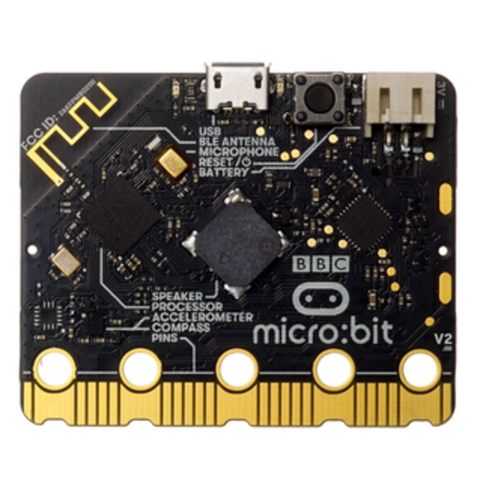
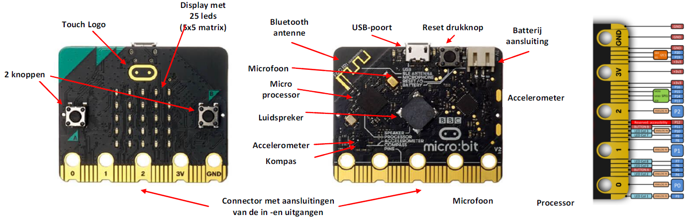

# Micro:Bit



---

## Introductie

De Micro:Bit is een microcontroller zoals er vele op de markt te verkrijgen zijn zoals Arduino, Nucleo, PIC, ... Deze worden heel frequent gebruikt zowel in industriële ontwikkeling, prototyping, als bij hobby-isten. De Micro:Bit is populair door zijn lage kostprijs, zijn laagdrempelige programmeeromgeving, de aanwezigheid van vele sensoren op de Micro:Bit, de veelheid aan demo en info op het internet. 

De Micro:bit is een geweldige manier om de basisprincipes van programmeren en informatica te leren. De Microsoft MakeCode-coderingsomgeving op basis van blokken is een krachtige en intuïtieve manier om de Micro:bit te laten reageren op allerlei soorten invoer, en u kunt fundamentele concepten zoals iteraties, voorwaardelijke instructies en variabelen introduceren met MakeCode.
Studenten richten zich vaak vooral op het 5x5 LED-scherm voor het leveren van output (actuator). Hoewel dit de meest direct toegankelijke manier is om een reactie op een of andere input te zien, zijn er veel meer creatieve mogelijkheden wanneer je je leerlingen aanmoedigt om de Micro:Bit te zien als een "brein" dat fysieke, tastbare creaties kan besturen.

Deze creaties hoeven niet complex of technisch hoogstaand te zijn. Het is geweldig om studenten te laten bouwen met gemeenschappelijke huishoudelijke benodigdheden. Omdat de Micro:bit zo licht is en zoveel sensoren ondersteunt, kan hij gemakkelijk in een fysiek ontwerp worden opgenomen, zolang studenten maar vooruit plannen voor de grootte en het gewicht. Een van de eerste vragen die je studenten zou kunnen stellen, is "Waar past de Micro:Bit in je creatie?"

De Micro:Bit kan in verschillende talen worden geprogrammeerd. De meest gebruikte programmeeromgeving voor kinderen in de Microsoft MakeCode editor. Met deze omgeving kan er online worden geprogrammeerd in 4 verschillende talen: Grafische blokken, MakeCode JavaScript, MakeCode Python. Wij zullen hier echter als initiatie hier de MicroPython gebruiken. Dit heeft het voordeel dat de gebruiker leert omgaan met de syntax van Python. In deze omgeving wordt een soort operating systeem geïnstalleerd op de Micro:Bit die volledig kan bestuurd worden met de standaard Python taal. 



## Activity: De programmeeromgeving

Er bestaan verschillende manieren om de Micro:Bit in de Python programmeertaal te programmeren. Dit kan via Visual Studio Code, dit moet je dan zelf downloaden en installeren op uw computer, maar er bestaat ook een online omgeving voor MicroPython voor de Micro:Bit. Op die manier hoef je niets te installeren op uw computer. Ga hiervoor naar de website : https://microbit.org/ en klik bovenaan op "Let's code" en kies op die pagina voor de link : Python editor.


Herken hierop:
<ol>
  <li>Reference : Python bibliotheek</li>
  <li>Simulator</li>
  <li>Programmeer Python code zone</li>
</ol>

### MicroPython code

Initialisatie : Omdat we werken met een Micro:bit moeten we dit steeds aangeven bovenaan de code.  Importeer steeds (*) om alle (hardware)mogelijkheden van de Micro:Bit te gebruiken. Doe dit door bovenaan in de python code te schrijven :

```python
from microbit import *
#Dan de rest van de python code
```

Commentaar in Puthon begint met een #.
