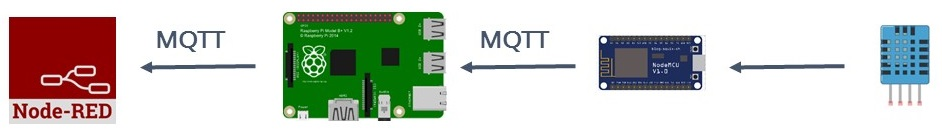
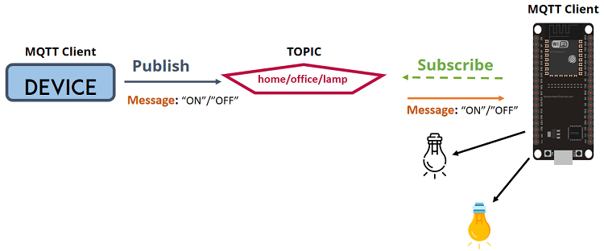

# MQTT  

---

## Inleiding

MQTT staat voor MQ Telemetry Transport. Het is een publish / subscribe, extreem eenvoudig en lichtgewicht messaging-protocol, ontworpen voor beperkte apparaten met een lage bandbreedte, hoge latentie (sterk vertragend werkende netwerken) of onbetrouwbare netwerken. De ontwerpprincipes zijn om de bandbreedte van het netwerk en de apparaatvereisten te minimaliseren en tegelijkertijd te proberen betrouwbaarheid en een zekere mate van zekerheid van levering te garanderen. Deze principes blijken het protocol ook ideaal te maken voor de opkomende "machine-to-machine"(M2M) of "Internet of Things-wereld van verbonden apparaten, en voor mobiele toepassingen waar bandbreedte en batterijvermogen beperkt zijn.  

MQTT was invented by Dr Andy Stanford-Clark of IBM, and Arlen Nipper of Arcom (now Eurotech), in 1999.

---

MQTT has been widely implemented across a variety of industries since 1999.  
[YouTube](https://www.youtube.com/watch?v=NtyyfcYQxa4)

---  

Vanaf maart 2013 is MQTT bezig met standaardisatie bij OASIS. De protocolspecialisatie is al vele jaren openlijk gepubliceerd met een royalty vrije licentie en bedrijven zoals Eurotech (voorheen bekend als Arcom) hebben het protocol geïmplementeerd in hun producten. In november 2011 kondigden IBM en Eurotech hun gezamenlijke deelname aan de Eclipse M2M Industry Working Group en de schenking van MQTT-code aan het voorgestelde Eclipse Paho-project aan.

---

TCP/IP-poort 1883 is gereserveerd bij IANA voor gebruik met MQTT. TCP/IP-poort 8883 is ook geregistreerd voor het gebruik van MQTT via SSL.

---

MQTT is speciaal gebouwd om communicatie over een TCP/IP netwerk te vereenvoudigen. Het communiceren binnen dit protocol zou kunnen gerealiseerd worden door enerzijds een server op te zetten en anderzijds een client. De server zou in dit geval zo zijn ingesteld dat die luistert op een bepaalde poort voor inkomende pakketjes (request). Deze zouden van een client zijn verzonden naar de server (al of niet via DNS of rechtstreeks naar een TCP/IP adres). Hierop zou de server een antwoord sturen naar de client. Een typisch voorbeeld van een dergelijke werking is het HTTP-protocol. Dit protocol draait bovenop het TCP/IP protocol. (HTTP trekt zich niets aan hoe, en langswaar de datapakketjes hun weg zoeken van zender naar ontvanger). Hierbij wordt de poort 80 gebruikt al request kanaal. Een random (gekozen door de client) poort ergens boven de 1024 zou dan als antwoord kanaal gebruikt worden. Tussenliggende routers en switchen zorgen dat de pakketjes heen en weer worden verzonden en de juiste bestemming bereikt.

Voor dergelijke toepassingen moeten een Socket geprogrammeerd worden. Een Socket is een stuk code die de computer (of het netwerk device) in staat stelt om naar een poort adres te luisteren tot een inkomend pakket arriveert. Dit is niet zo eenvoudig te programmeren. Het gebruiken van een MQTT protocol boven het TCP/IP stelt de gebruiker in staat om eenvoudige data te versturen van een client naar een server (publish). Het protocol zorgt ervoor dat het antwoord van de server niet alleen naar de client wordt teruggestuurd, maar dat het ook aan een eventuele geïntereseerde (of meerdere) (subscribers) zal worden medegedeeld.

  

---

Stel je wilt het licht meten met een lichtsensor op een bepaalde plaats. Je wilt ook die gemeten lichtsterkte (waarschijnlijk een analoog getal??, bij een detector zou een digitaal getal volstaan) doorgeven aan een ander device (aangesloten op het internet, bedraad of mobiel). Dan kan je hiervoor het MQTT protocol gebruiken. Hierbij zal het device die het licht meet, ook moeten verbonden zijn aan het internet. Dit device kan zijn data (lichtsterkte) door sturen naar een server. De server wordt bij MQTT een Broker genoemd. De lichtsterkte wordt dus gepubliceerd op de Broker. Dit zal gebeuren in een specifieke `topic` op de broker
.
Een sensor (temperatuur en/of licht) kan de gemeten waarde doorsturen naar de Broker. Dit kan eenmalig zijn of continue. De Broker zal deze gegevens opslaan in een specifieke `topic`. Een gebouwbeheersapplicatie kan zich abonneren op deze gegevens (`topic`) en zal dus deze waarden weten / kennen / doorgestuurd krijgen. Bij bepaalde sensorwaarden kan de gebouwenbeheersapplicatie beslissen om bijvoorbeeld de rolluiken neer te laten. Hiervoor gebruikt de applicatie ook de Broker om via een andere (of dezelfde, maar dan wordt het een beetje ingewikkeld) `topic` een commando te sturen (publishen) naar het device die de rolluiken kan activeren (dit device is dus een subscriber op deze laatste topic).

De node die de rolluiken bediend is op zijn beurt geabonneerd (subscribed) op de `topic` en zal de rolluiken activeren. Eventueel kan nu nog een controle worden ingebouwd door de rolluiken node via een eindeloopsensor op de rolluik het einde van het proces te laten bevestigen naar de beheersapplicatie. Dit kan opnieuw via de Broker worden uitgevoerd.

---

Het MQTT protocol is dus een berichten wachtrij systeem voor lichtgewichte data. Het is tevens een asynchroon communicatiemodel dat werkt op berichten op basis van een bepaalde gebeurtenis (event). Het protocol voorziet een beperkte overhead (2 bytes) zodat het heel geschikt is voor netwerken met een lage bandbreedte (lees: geschikt voor trage netwerken).
Zoals in het voorbeeld duidelijk werd gesteld, werkt het protocol volgens een publish (publiceer een `topic`) en subscribe (abonneer op een `topic`) model. Er is dus een ontkoppeling van dataproducent (publisher) en dataconsument (subscriber) door `topic`s (berichtenwachtrijen). Het is een eenvoudig protocol, gericht op een lage complexiteit, een laag stroomverbruik en implementaties met weinig footprint zoals WSN netwerken (WSN = Wireless Sensor Networks).
Het protocol werkt via een connection-oriented verbinding (TCP). Door het lichtgewicht protocol is MQTT erg geschikt bij (draadloze) netwerkverstoringen.

---

## Hoe het werkt, technische achtergrond  

Dit protocol werkt dus bovenop het TCP/IP protocol. Vandaar dat er hier geen rekening moet gehouden worden met problematieken omtrent DNS, poorten, adressen, ... Het is dus een lichtgewicht protocol die toch heel sterk vertegenwoordigd is binnen IoT-systemen. Het protocol laat zowel het publiceren als het abonneren van berichten (data) toe door een client.  

MQTT is een eenvoudig berichten protocol ontworpen voor apparaten met een beperkte bandbreedte (lees, de berichten bevatten beperkt aantal bytes). Hierdoor leent dit protocol zich perfect voor Internet of Things applicaties.  MQTT laat toe om berichten te verzenden die ergens outputs kunnen aansturen, of toestanden van detectoren en waarden van sensoren kan versturen (publiceren).

Hiervoor wordt er een eenvoudige communicatie opgezet tussen meerdere devices.

[Youtube](https://www.youtube.com/watch?time_continue=1&v=EIxdz-2rhLs&feature=emb_logo)

## High Level Overview

De volgende figuren vatten eigenlijk heel kort samen wat het MQTT protocol kan realiseren.

Er kan een bericht verzonden worden met een client om een output aan te sturen.

Of je kan data lezen van een sensor of detector (binaire toestand ervan) met een client.

Uitleg bij vorige figuren: Laat je niet misleiden door de naam Node-Red. Dit staat voor een client. Een client kan (meestal) een mobile device zijn die als dashboard functioneert binnen het IoT-systeem. Een dashboard is een scherm waarmee toestanden van detectoren/sensoren kan worden gevisualiseerd en waarmee outputs (actuatoren) kunnen worden aangestuurd. 

Er dient nog opgemerkt te worden dat devices nooit rechtstreeks met elkaat communiceren. Alle MQTT berechten binnen een IoT-systeem worden met elkaar uitgewisseld via een Broker. In vorige figuren voorgesteld door een Raspberry PI. Dit kan evengoed iets anders zijn (een vaste server of bij professionele applicaties, een cloudservice).

## MQTT Basics

Om te werken met MQTT zijn volgende concepten belangrijk. Het is noodzakelijk om deze concepten te begrijpen:

> - Publish / Subscribe
> - Messages (berichten)
> - Topics
> - Broker
> - Client

## MQTT - Publish / Subscribe

In een publish en subscribe systeem kan een device (client) berichten publiceren in een topic op de broker. Evenals kan een device (client) geabonneerd zijn op een topic op de broker.

## Messages

Messages zijn de berichten die de data (informatie) bevatten over de toestand van een detector/sensor of over de toestand die een output moet aannemen bij een actuator (dit is dan een commando). De vorm van zo'n bericht is een string waarin de informatie staat. Bijvoorbeeld `temp=25` of `ventilatorAan` . Dit wordt vrij gekozen door de IoT-ontwikkelaar en moet duidelijk zijn voor beide clients.

## MQTT - Topics

Zoals al eerder opgemerkt worden Messages tussen clients uitgewisseld via een Broker (server binnen het Iot_systeem). Om toe te laten dat een broker meerdere subscribers en publishers kan verwerken, is deze georganiseerd met topics. Topics zijn hiërarchisch georganiseerd. Ze zijn een beetje te vergelijken met de mappenstructuur op een computersysteem.

Op een topic kan een publiceerder zijn message publiceren. Een subscriber op die topic zal dan die message ontvangen (dit is de taak van de broker). 

Topics zijn strings met forward slash. Deze slash zorgt voor de hiërarchie tussen verschillende topics. Iedere slash representateert dus een `level` . Volgend voorbeeld zou een topic kunnen zijn die de lamp in een bureau voorstelt (aanstuurt). 

Topics zijn case-sensitive.

Dit zou een voorbeeld kunnen zijn van deze applicatie met een topic op de broker en een message in die topic :

https://randomnerdtutorials.com/what-is-mqtt-and-how-it-works/
https://en.wikipedia.org/wiki/MQTT