# Seriële communicatie  


---

## Introductie

Embedded electronics gaat omtrent het interconnecteren van elektronische schakelingen en circuits (processoren en andere integrated circuits (IC)) om tot een werkend systeem te komen. Opdat deze individuele circuits informatie kunnen uitwisselen, is er een gemmenschappelijk protocol nodig tussen die bouwstenen. Dit wordt een communicatie protocol genoemd, en zo zijn er heel veel. Honderden van deze protocollen zijn heel duidelijk beschreven en uitgewerkt. Als een studie zich opdringt dan kan het verzamelen van verschillende protocollen in groepen hier duidelijkheid in brengen. Zo kunnen alle protocollen onderdverdeeld worden in seriële communicatie of parallelle communicatie.

## Parallel versus Serial

Parallelle interfaces transferen meerdere bits op hetzelfde ogenblik. Ze maken meestal gebruik van meerdere datalijnen, die soms een bus wordt genoemd. Zo kan een bus bijvoorbeeld 8 bits ophetzelfde ogenblik vertransporteren door gebruik te maken van 8 datalijnen. Bij moderene computers worden er soms bussen gebruikt met 64 datalijnen. Data zal getransfereerd worden met een hoge dichtheid aan eenen en nullen.


Seriële interfaces laten hun data bit-na-bit stromen doorheen 1 verbindingslijn. Er wordt dus maar 1 bit terzelfdertijd verstuurd. Deze interfaces kunnen dus functioneren over 1 draad, meestal zijn er enkele meer (max 4).


Als een datastroom zou vergeleken worden met een stroom van wagens, dan zou een 8-bit brede parallele communicatie een 8 vakken brede autosnelweg zijn. Terwijl een seriële communicatie dan een gewone rijweg (1 vak) is.  Binnen een bepaalde tijdspanne kan er gesteld worden dat de snelweg dus 8 keer meer wagens kan verplaatsen, dan de gewone rijweg. Dus parallel communicatie is sneller dan seriële, maar een 8 vakken brede autosnelweg kost in opbouw veel meer dan een gewone rijweg. Dit is in de digitale wereld dus ook zo.

Parallelle communicatie bezit dus een aantal voordelen. Het is snel, rechtdoor, en relatief eenvoudig te implementeren. Maar er is nood aan een heleboel bedrading die zorgen voor meerdere input/output (I/O) lijnen. Dit is sterk afhankelijk van het type processor waar je mee werkt. Er kan zich een probleem voordoen wanneer een bij een bepaalde toepassing van processor wordt gewijzigd. Om die reden wordt er meestal in interfacing gewerkt met seriële interfaces. De snelheid van vele serieële interfaces is gedurende verdere ontwikkeling steeds toegenomen.  

## Serieel Asynchroon

Gedurende de computerevolutie zijn er tientallen seriële protocollen ontwikkeld geweest die werden geïmplementeerd bij embedded systemen. USB (universal serial bus), en Ethernet, zijn een set aan seriële protocollen die heel gekend zijn, op iedere moderne computer aanwezig, en wijdverspreid gestandaardiseerd zijn. Andere veel gebruikte standaarden bij embedded systemen zijn SPI, I2C, (USB) en de serial standard die we zullen bespreken in dit deeltje van de cursus. De groep van alle seriële interfaces kan op zijn beurt worden opgesplitst in twee gsubgroepen: Synchrone en asynchrone.

Een synchrone seriële interface maakt steeds gebruik van een combinatie van een klok-signaal (klok-lijn) en een data-signaal (data-lijn). Zo zullen alle devices die zijn aangesloten op een seriële interface gebruik maken van dezelfde klok-lijn. Op die manier wordt de opbuw van de hardware envoudig, maar er is nood aan een extra bedrading die deze klok voorziet tussen de communicerende devices. SPI, en I2C behoren tot deze groep en zijn dus synchrone seriële interfaces.

Asynchroon, betekent dat de data wordt verstuurd zonder dat een klok wordt meegestuurd. Deze transmissie is dus perfect wanneer het aantal draden en I/O pinnen moet worden gereduceerd of beperkt zijn. Maar zo eenvoudig mag het niet gesteld worden, dit kan niet zomaar. Er zullen inspanningen moeten worden gedaan om de data leesbaar van zender naar ontvanger te sturen. De ontvanger zal moeten weten wanneer een volgende bit zich zal aanbieden, en wanneer een vorige bit is beëindigd. Net zoals in een tekst de woorden van elkaar worden gescheiden door een spatie, om aan te geven dat er een nieuw woord begint. Er zal dus een manier moeten worden bedacht die tussen zender en ontvanger dit duidelijk maakt. Asynchrone communicatie is de allereerste standaard die reeds bij de eerste computer uit 1980 van toepassing was. Hierdoor wordt meestal naar verwezen als men in het algemaan spreekt over seriële communicatie.

Een clock-less serieel protocol die we hier bespreken is nog steeds heel courant in toepassingen en meestal bevat een microprocessor of een embedded systeem de nodige pinnen die deze functie verzorgen, dus een Rx en een Tx pin. Ook inwendig bezit een processor of controller de nodige registers die softwarematig kunnen worden ingesteld voor bepaalde eigenschappen van die poort. Via deze interface kunnen oa volgende modules worden aangesproken vanuit een bepaald systeem: GPS module, Bluetooth, XBee’s, serial LCDs, en vele andere externe devices van uw project.

## Rules of Serial

Het asynchrone serieel protocol heeft een aantal built-in rules - mechanismen die de robuustheid van het transport verzorgen om tot een error-free data transfer te komen. Deze mechanismen, die we krijgen om het externe kloksignaal te voorkomen, zijn:

* Data bits,
* Synchronization bits,
* Parity bits,
* en Baudrate.

Door de brede variëteit van signaal mechanismen, zijn er vele manieren om de data serieel te versturen. Er is niet één juiste manier, maar vele. Het protocol bezit een hoge graad van configureerbaarheid en bezit dus instellingen of parameters bij de items die hierboven zijn opgesomd. Het meest kritieke aan dit protocol is dat beide kanten (zender en ontvanger) dezelfde instellingen moeten bezitten opdat de transfer error-free kan gewaarborgd worden.

### Baudrate

De baud rate specifieert de snelheid van iedere te verzenden bit, of hoe snel worden e bits na elmkaar verzonden, of wat is de tijdsduur van 1 bit die op de data-lijn komt te staan. Baud rate, of kortweg baud, wordt meestal uitgedrukt in eenheden van bits-per-second (bps). Als je de baud rate inverteert, dan bekom je de tijd die nodig is om 1 bit te versturen. Gedurende deze tijd zal de zender de data-lijn hoog of laag (afhankelijk van de waarde van de te verzenden bit) houden. Het is dus duidelijk dat de ontvanger deze bit het best binnenhaalt (lezen) in het mideen, dus halverwege de bittijd. Daar zal de bitwaarde het meest constant zijn. We spreken dan dat de ontavnger de waarde sampled, of bemonstert.

Baud rates kan van waarde worden gewijzigd volgen enkele standaarden. Enige voorwaarde hierbij is dat de beide devices op dezelfde baud rate ingesteld staan. Een gebruikelijke waarde waarbij snelheid niet van groot belang is, is 9600 bps. Andere standard baud zijn 1200, 2400, 4800, 19200, 38400, 57600, en 115200.

Hoe hoger de baud rate, hoe sneller de data wordt verzonden/ontvangen, maar er zijn limieten aan deze snelheid. Deze worden meestal bepaald door de enerzijds de gebruikte devices, maar anderzijds ook door de bandbreedte van het gebruikte medium. Ook de afstand tussen de devices zal een rol spelen. Bij bedrade verbinding, wordt de afstand beperkt tot 5 meter. Meestal kan de snelheid ingesteld worden tot een waarde van  115200 - wat snel is bij de meeste microcontrollers. Bij een te hoge waarde kunnen er transmissiefouten optreden (bits worden niet correct gelezen). Dit is dus niet meer error-free en er gaat informatie verloren.

### Framing the data

De data-blok wordt ingekapseld in een frame. Ieder blok bestaat meestal uit een byte met de data. Deze blok wordt ingekapseld met extra bits. Dit wordt een frame genoemd. Die extra bits hebben twee functies. De eerste functie verzorgd de synchronisatie tussen de communicerende devices en de tweede functie is de controle op de juistheid van de data. Deze tweede functie wordt gerealiseerd dmv pariteitbit.


De eigenlijke informatie bij data die serieel wordt verzonden zit in de data-bits. Het aantal gebruikte bits hiervoor kan variëren tussen 5 bits en 9 bits. Meestal wordt een byte (8 bits) gebruikt die de data representateert, maar andere data-formaten kunnen dus voorkomen. Een 7-bit formaat komt ook regelmatig voor, zeker wanneer de data bestaat uit tekst die gevormd zijn door de ASCII-tabel.


Na het vastleggen door beide devices van het aantal te gebruiken data-bits, kan er afgesproken worden hoe de data gerangschikt zal worden in het pakket. Wordt eerst de MSB of komt de LSB eerst aan bod? Wordt in de data eerste de meest-significant-bit (MSB) verstuurd of omgekeerd? Als dit niet gespecifieerd staat, dan mag je ervan uitgaan dat de data wordt verstuurd volgens de laagst-significante bit (LSB) eerst.

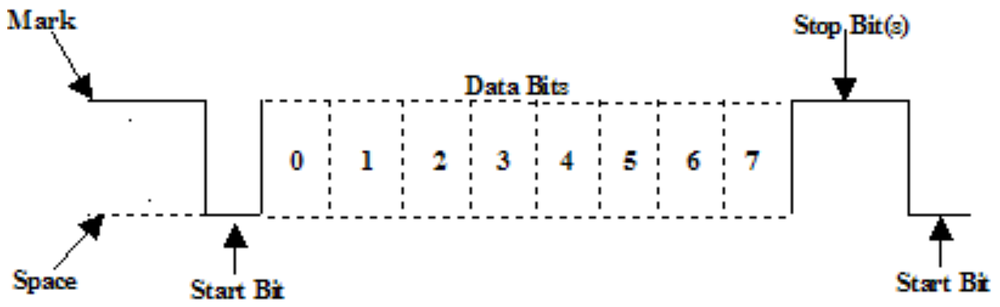

### Synchronisatie bits

Meestal worden hier twee tot drie bits voor gebruikt. Deze bits hebben geen content-waarde en zijn enkel bedoeld om de ontvanger er attent op te maken dat de bit-stroom zal beginnen / wordt afgesloten. Respectievelijk spreekt men over een start-bit bij de aanvang van de bitstroom, en over stop-bits die de datastroom afsluiten. De start-bit is steeds 1 bit die de data-lijn van een IDLE-toestand naar de startconditie brengt. Het aantal stopbits kan variëren van 1 tot 2. Deze brengt de data-lijn na het be\"eindigen terug in een IDLE-toestand. Het aantal gebruikte stop-bits zal dus als parameter in beide devices moeten overeenstemmen. Bij voorkeur wordt het aantal stopbits op 1 ingesteld.

De start bit is altijd aanwezig en brengt de data-lijn van ee IDLE-toestand (logisch 1) naar 0. Een stop-bit is steeds logisch 1 signaal, dit is overigens ook de IDLE-toestand van de data-lijn.

Een logische 0 wordt een space genoemd en een logische 1 wordt een mark genoemd.

### Parity bit

Pariteit is een heel eenvoudige vorm, low-level, om aan error-controle te doen door de ontvanger. Er bestaan twee vormen van pariteit: even of oneven pariteit. De pariteit bestaat uit 1 bit die toegevoegd kan worden aan het data-pakket binnen een frame. De bit neemt evenveel tijd in zoals een andere bit. Dit bit wordt door de zender geset of gereset. Bij een even-pariteit wordt de bit zodanig ingesteld zodat het totale bit-pakket (data + pariteitbit) even aantal eenen bevat. Dezelfde redenering wordt gemaakt bij een oneven pariteit. De ontvanger kan hierdoor beperkte bitfouten detecteren. Als voorbeeld willen we hier in een even-pariteit werken. Veronderstel dat we over volgend datapakket (1 byte) beschikken: 0b01011101. Er moet dus een negende bit aan het pakket worden toegevoegd, de pariteit-bit. We tellen in de data-byte 5 eenen. Dit is dus oneven. Doordat we met een even-pariteit werken moet databyte + PB een even aantal eenen bevatten. Dus wordt hier de PB op 1 geplaatst. Dezelfde redenering kan gemaakt worden bij het gebruik van oneven pariteit.

Pariteit is optioneel, dit wil zeggen dat er ook kan gewerkt worden zonder pariteit. Het werken met pariteit en afspraken welke pariteit moet door beide devices geresepecteerd en ingesteld worden. Het gebruik van een pariteit kan nuttig zijn bij het detecteren van fouten binnen een data-verbinding. Het nadeel bij het gebruik ervan is wel dat er volledige bittijd nodig is om een beperkte controle te hebben. Er worden tenslotte maar 8 bits aan data verstuurd. Het vertraagd dus de gemiddelde datasnelheid. Wat doet de ontvanger bij foutdetectie? Het pakket zal worden genegeerd en, als het protocol het toestaat, zou het pakket opnieuw kunnen worden aangevraagd (re-sent).

### Een voorbeeld parameters : 9600/N/8/1

9600 8N1 - 9600 baud, 8 data bits, no parity, and 1 stop bit - is een instelling die regelmatig voorkomt. Hoe ziet er zo een bit-stroom uit wanneer 2 bytes worden verzonden. Een voorbeeld!

Een device wenst de ASCII characters ‘O’ en ‘K’ te verzenden als data. De ASCII waarde van O (uppercase) is 79, in een 8 bits formaat omgezet ziet dit er alsvolgt uit 01001111, een K’s binaire waarde is 01001011. Er wordt volgens de instelling geen gebruik gemaakt van een PB, dus moeten enkel de start- en stopbits (synchronisatie bits) worden toegevoegd om twee frames te krijgen.

In normale omstandigheden wordt de lsb eerst verstuurd binnen het frame van het datapakket. Op die manier wordt de data bij de zender uit een register geschoven en bij de ontvanger op die manier in een register ingeschoven. De totale bistroom is van dit voorbeeld terug te vinden in volgende figuur. Let wel dat de twee frames exact na elkaar worden verzonden. Er kan gerust een tijdsgap zijn tussen de stopbit van het eerste frame en de startbit van het tweede frame.


Doordat de baud rate is ingesteld op 9600 bps, is de bittijd (die iedere bit inneemt op de datalijn) gelijk aan 1/(9600 bps) of 104 microseconden per bit.

Voor iedere verzonden byte (8bit data) zijn er dus 10 bits nodig: een start bit, 8 data bits, en een stop bit. Zo, bij 9600 bps, worden er 960 (9600/10) bytes per seconde verzonden.

Nu is er genoeg kennis hoe paketten bij een serieel protocol worden samngesteld. Nu kan de hardware eens bekeken worden. Hoe ziet met andere woorden de bedrading eruit tussen twee devices. Daar wordt besproken hoe eenen en nullen en de baud rate geïmplementeerd worden in signaal levels!

## Bedrading en hardware

Een seriële bus bestaat alleen maar uit twee lijnen (eigenlijk drie als we de GND meerekenen). Een lijn voor de te verzenden data en eentje voor de te onvangen data. Dergelijke devices bezitten dus twee pinnen: de ontvanger (receiver), RX, en de zender (transmitter), TX.

.")

Het is belangrijk aan te stippen dat de notatie van RX en TX labels met respect tot het device zelf. Zo is de RX van een device vebonden met de TX van het ander device, en vice-versa. Dit kan bij andere interfaces anders zijn (uitzondering is natuurlijk voor de GND). Andere interfaces gebruiken bijvoorbeeld MOSI naar MOSI (bij SPI). Maar het gebruik van een cross-kabel is hier logisch. De transmitter moet zijn data doorsturen naar een receiver, niet naar een andere transmitter.

Een serieel interface waarbij beide devices mogen zenden en ontvangen is een full-duplex of half-duplex verbinding. Full-duplex betekent dat beide devices simultaal kunnen zenden en ontvangen. Een half-duplex verbinding wil zeggen dat de seri\"ele devices om beurt kunnen zenden en ontvangen, maar niet simultaan.

Sommige seriële bussen geraken weg met slechts één connectie (met uitsluiting van de GND, die altijd moet worden verbonden tussen de beide devices). Dan spreekt men van een unidirectionele bus. Er kan dus enkel in één richting data worden verstuurd. Bij sommige devices is dit voldoende. Er dient natuurlijk opgermerkt te worden dat het ontvangende device geen data kan terug sturen. Hier spreekt men dan van een simplex verbinding. Er is hier dan enkel nood aan een *single wire* van de master device’s TX naar de listener’s RX lijn.

### Hardware implementation

We weten nu hoe een serieel interface conceptueel eruit ziet. We weten welke verbindingen er moeten worden gelegd tussen de twee devices. Maar hoe wordt een seriële communicatie geïmplementeerd wat betreft de signaal levels? Of met andere woorden, op welke manier worden eenen en nullen gepreseneteerd in een elektrische grootheid? Zoals in de meeste gevallen worden hiervoor elektrische spanningen gebruikt. Op welke wijze worden de logische bit-waarden omgezet in die spanning? En met welke waarde van spanning is dit dan? Op dit vlak is een asynchrone seriële interface te catalogeren in twee groepen. We spreken over enerzijds een RS-232 en anderzijds over zijn TTL-variant.

Wanneer microcontrollers en andere low-level ICs een seriële communicatie realiseren, dan wordt dit normaal gedaan met de beschikbare spanning (meestal de voedingsspanning van de controller). De voorstelling van nullen een eenen wordt dan op TTL (transistor-transistor logic) niveau geregeld. TTL seriële signalen bestaat uit de microcontroller’s voltage supply range - normaal 0V to 3.3V or 5V. Een signaal op VCC level (3.3V, 5V, etc.) indiceert zowel een idle toestand, een bit met waarde 1, als een stop bit. Een 0V (GND) signaal representeert zowel een start bit als een data bit met waarde 0.

.")

RS-232, die kan gevonden worden op een SUBD9 connector op computers en randapparaten is net als een TTL signaal, maar dan geflipt op zijn kop. RS-232 signalen bevinden zich normaal tussen -13V en 13V, alhoewel de specificaties spreken van een spreidingsgebied tussen  +/- 3V tot +/- 25V. Een lage spanning wordt hier gepresenteerd door een spanning (-5V, -13V, etc.) stelt volgende toestanden voor: idle line, een stop bit, of een  data bit met waarde 1. Een hoge spanning bij RS-232 signaal betekent ofwel een start bit, of een 0-waarde data bit. That’s kind of the opposite of TTL serial.

.")

Bij een embedded systeem wordt meestal de TTL standdard gebruikt. Beperktheid hiervan zit er vooral in dat er geen grote afstanden kunnen worden overbrugd. Bij grotere afstanden treden snel datafouten op. Doordat de spanningsniveaus bij RS-232 verder uit elkaare liggen, kan er hiermee een grotere afstand worden overbrugd. (15 meter met gewone draden). Een standaard als RS-485 is geschikt om nog grotere afstanden te overbruggen.

Wanneer er twee devices serieel met elkaar worden verbonden is het zeer belangrijk dat de spanningsniveaus met elkaar overeenstemmen (matchen). Het is strikt verboden om te interfacen tussen verschillende spanningsniveaus. Schade zal zeker het gevolg zijn van de devices!! Dus een connectie tussen een TTL en een RS-232 is uit ten boze. Een oplossing is om de spanningsniveaus aan te passen, maar ook het signaal te inverteren. Hier kan soms een kleine uitzondering worden gemaakt als er communicatie is tussen devices op 5V en 3V3. Hier dient het 5V tolerant zijn te worden nagegaan op het 3V3 device, wat bij een Nucleo soms zo is (controle datasheet!!).

Als vervolg onderzoeken we de tool die microcontrollers gebruiken om hun  data te converteren van een parallelle bus naar een seriële bitstroom. Hierbij wordt gebruik gemaakt van een UART!

## UART

Het laatste stukje van de seriële puzzel is het onderdeel die verantwoordelijk is voor de seriële bitstroom bij microcontrollers. Dankzij de nodige interne registers verzorgt de UART de correcte seriële interface.

Een universal asynchronous receiver/transmitter (UART) is een interne block van het circuitry die verantwoordelijk is voor de implementatie van de seriële communicatie. In essentie, de UART doet zich voor als een tussenschakel tussen parallelle werking van de processor en de seriële interface. De UART bezit dus enerzijds een bus structuur (bv. 8 bit) met de nodige controlelijnen en aan de andere kant zijn twee pinnen, - RX en TX, beschikbaar die de seriële interface vormen.

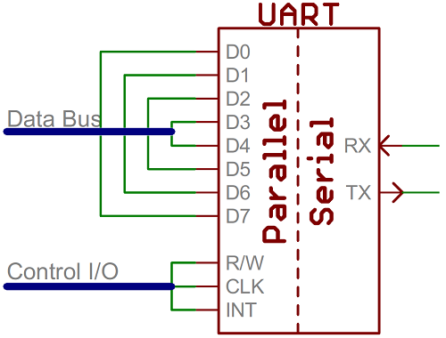

UARTs bestaan in de vorm van stand-alone ICs, maar ze komen heel frequent en courant voor als intern element binnen een microcontroller. Controleer de datasheet van uw microcontroller op aanwezigheid van UARTs. Sommige bezitten er geen (ze zullen al wel zeldzaam zijn), andere hebben er één, nog andere hebben er meerdere.

De UART verzorgen zowel het verzenden van de data als het ontvangen ervan. De zenderkant (the transmit side), zorgt ervoor dat er een pakket wordt samengesteld met synchronisatiebits, data en desnoods een pariteitbit. Dit frame wordt verzonden bit-na-bit via de Tx pin met de juiste timing volgens de baud rate(bps). Aan de ontvangstzijde verzorgt de UART het bemonsteren van de Rx lijn op de gepaste tijdstippen om zo de correcte data en parieit eruit te halen. Synchronisatiebits en parameters instellingen helpen de UART om ook deze taak correct uit te voeren.

")

Meer geavanceerde UARTs plaatsen de ontvangen data in een buffer en geven een signaal aan de controller dat er data klaar staat zodat de microcontroller deze kan ophalen. UARTs gebruiken hiervoor buffers van het type first-in-first-out (FIFO). Deze buffers kunnen heel beperkt zijn in dataopslag, maar evengoed zijn er controllers die een heel uitgbreide buffer ruimte bezitten.

### Software UART

Als een microcontroller niet beschikt over een UART (of er is een extra nodig, maar niet beschikbaar), dan kan de seri\"ele interface worden gebit-banged - direct door de processor. Dit is de manier waarop  Arduino libraries zijn gebaseerd zoals SoftwareSerial. Bit-banging is processor-intensive, en meestal niet zo precies als een UART.

## Pitfalls

Zo, dit was de seriële communicatie. Hier volgt enkel nog enkele veel voorkomende fouten die zich kunnen voordoen bij het gebruik ervan.

### RX to TX, TX to RX

Het verkeerd verbinden van zenders met ontvangers komt heel regelmatig voor. Let hier op, het kan de UART ook stuk maken. Let vooral op wanneer je twee Tx lijnen aan elkaar zou leggen. Dit kan de UART stuk maken!! Gebruik dus steeds een cross-kabel.

### Baudrate Mismatch

Foutieve instellingen/afspraken tussen de beide devices op vlak van de baud rate, kan leiden tot een foute data overdracht.Als twee devices niet aan dezelfde snelheid communiceren, dan begrijpen de devices elkaar niet doordat de data telkens foutief zal worden gelezen. De ingelezen data zal eruit zien als garbage. Zorg dus dat de baud rate op elkaar is afgestemd.


### Bus Contention

Seriële communicatie is ontwikkeld om slechts twee devices met elkaar te laten communiceren. Als meer dan één device probeert te zenden op dezelfde lijn, dan treed er een databotsing op (Collision). Hierdoor wordt de data corrupt is niet meer betrouwbaar.

Als bijvoorbeeld twee transmitters met elkaar zijn verbonden (beide TX lijnen liggen met elkaar verbonden), dan kunnnen er collisions optreden wanneer beide transmitters op hetzelfde moment data proberen te versturen naar de receiver. Een dergelijke opstelling wordt best sterk vermeden!!


Twee devices die proberen data te verzenden op eenzelfde lijn is altijd slecht!! Hardwarematig kan dit de beide zenders beschadigen.  

Wat wel kan, is naar twee ontvangers data sturen vanuit een enkelvoudige zender. Alhoewel dit geen normale opstelling is. Er kan niet geselecteerd worden naar welk device de data zal worden gestuurd. Een seri\"ele communicatie is bedoeld tussen twee devices.  


---

In de cursus Interface wordt de seriele asynchrone communicatie tussen devices uitgelegd. Hier willen we enkel aangeven hoe je met een microcontroller kan communiceren met een aantal programma's op de computer via de USB poort.  

We leren hier hoe we een microcontroller kunnen laten communiceren via de virtuele COM-poort van de computer (er is dus geen aparte bedrading nodig). Er bestaan programma's die alle data die via een COM-poort (al of niet virtueel) de computer binnekomt kan visualiseren. En die programma's laten ook toe om data te verzenden vanuit de computer via de COM-poort van de computer naar de buiten wereld. Dit is een asynchrone seriele communicatie die gepaard gaat met enkele specifieke eigenschappen zoals baudrate (bits/seconde), pariteit, stop en startbits, etc. (zie cursus Interface technieken)

---

## MBED C++ Nucleo microcontroller

Zoals eerder werd gezien is de microcontroller in staat om data te ontvangen en te verzenden via de USB programmer die op het bordje aanwezig is. Dit is ook zo bij een Arduino of bij een Micro:Bit ea.

Met het commando  `printf`  kan er data vanuit de microcontroller via asynchrone seriele wijze worden verzonden. Het hangt af op welke pinnen dit zal gebeuren door de decelaratie van de seriele poort eerder in de code. Zie OOP.pdf . Wordt hierbij de standaard poort gekozen, dan zal de data via die poort uitgewisseld worden via de programmer-poort. Dit is dus via de virtuele COM-poort alover de USB-verbinding met de computer of RaspberryPi. 

Voorbeeldjes van code op de Nucleo kan terug gevonden worden in het OOP.pdf document.

---
## Terminal APP

Het komt zeer veel voor dat wanneer we dergelijke coommunicaties willen opzetten dat we nood hebben aan een programma op de computer om effectief te zien wat de microcontroller aan data allemaal verstuurt. Maar ook om eventueel data terug te sturen naar de microcontroller. Vooraleer we dit laten doen door een applicatie, kunnen we daar als test een teriminalprogramma voor gebruiken. Dit wordt zeer veel gedaan bij de ontwikkeling van systemen en is dus uiterst belangrijke stap in de ontwikkeling van een werkend systeem.

Er bestaan wel meer dergelijke programma's. De verzamelnaam voor die programma's is een terminal programma of editor. Voorbeelden zijn Putty of RealTerm. Ik ben nogal fan van RealTerm. Vandaar dat we dit hier eens gaan bekijken.


Je kan dit op het internet downloaden.
Voor goede werking is het belangrijk dat je een aantal zaken weet, zoals:

- Met welke COM-poort wil je communiceren? Als je dat niet weet dan kan de Device Manager (Apparaatbeheer) binnen uw computer systeem u wel wegwijs brengen. Zoek daar op welke COM-poort uw hardware is verbonden. Stel dit in bij Port in RealTerm (tabblad Port).
- Ook de snelheid waarmee moet worden gecommuniceerd is van belang. Dit bepaal je binnen uw microcontroller. Het is natuurlijk de bedoeling dat het terminal programma op de zelfde snelheid data verzend en ontvangt als de snelheid van de controller. Dit is wat BaudRate (kortweg Baud) wordt genoemd.
- Verder zijn nog instellingen als pariteit, databits, aantal stopbits en flow controle belangrijke parameters bij een hardwarematieg seriele verbinding. Deze spelen minder een rol bij virtuele COM-poorten. Standaard staan die waarschijnlijk juist.
- Breng je wijzigingen aan binnen RealTerm, klik dan op *Change* om uw wijziging door te voeren naar de poort.
- Verder dient er nog opgemerkt te worden dat een programma een seriele poort kan openen. Let wel eenmaal een software pakket een poort heeft geopend, dan kan een ander programma er geen gebruik meer van maken. Wil je dit doen? Sluit dan eerst het ene programma af (poort wordt dan automatisch gesloten).
- Er zijn verschillende manieren om de ontvangen data te visualiseren (zie tabblad Display)
- Wil je data versturen, kies dan voor het tabblad Send.
- Het komt heel regelmatig voor dat de instellingen van een seriele poort wordt samengevat in een omschrijving: vb: 9600,8,1,N : Wat wil zeggen dat de bitsnelheid 9600 bits/sec is, dat er pakketjes wordt verstuurd die bestaan it 8 bits, dat er maar 1 STOPBit wordt gebruikt en dat er geen pariteit controle wordt toegepast binnen deze communicatie.


\newpage
Een voorbeeldje:

```c
//Nucleo_read_hyperterminal
#include "mbed.h"

Serial pc(SERIAL_TX, SERIAL_RX);
DigitalOut led(LED1);
char c = '0';
void ToonTekstTerminal (char data);

int main()
{
    ToonTekstTerminal(c);
    while(1) {
        c = pc.getc(); // Read hyperterminal
        if (c == '0') {
            led = 0; // OFF
            
        }
        if (c == '1') {
            led = 1; // ON
        }
        ToonTekstTerminal(c);
    }
}
void ToonTekstTerminal(char waarde)
{
    pc.printf("De LED1 is %c\r\n", waarde);
    pc.printf("Press '1' to turn LED1 ON, '0' to turn it OFF\r\n");
    
}
```

Bestudeer deze eenvoudige code. Merk op met `getc` wordt één karakter binnengelezen door de microcontroller.  

Stel dat je hiermee vanuit RealTerm wil communiceren dan zou dit er zo uitzien. Klik op tab Send en zet een 0 of een 1 in het veld en klik op Send ASCII:


Ok, we hebben nu een werkende applicatie, maar dit is niet voldoende. We kunnen niet verwachten dat de IoT applicatie RealTerm zal gebruiken.

Laat ons een stap verder zetten en dit eens proberen vanuit Node-Red.

---

## Node-Red

We zullen nu het terminal programma vervangen door een Node-Red flow. Hiervoor moeten we Node-Red uitbreiden met een extra groep binnen de *palette*. Door dit te doen krijgen we enkele nodes ter beschikking: `Serial`. Met een Serial-node kunnen we data verzenden , met een andere Serial-node kunnen we data ontvangen van, jawel, opnieuw COM-poorten (al of niet virtueel). Dit is dezelfde functionaliteit als het terminal programma.

Zoek binnen Node-Red via Manage Palette naar extra nodes `node-red-node-SerialPort`.
Je krijgt nieuwe nodes binnen de Palette (mss moet je Node-Red eens herstarten?).


Net zoals je bij het terminal programma , waar er instellingen dienden te gebeuren, zal dit hier ook moeten gedaan worden. Sleep Serial in - node op de flow. Dubbelklik erop:


Maak een nieuw configuratie aan van een poort. Herinner je nog de instellingen bij het terminal programma:


Wijzig zoals terminal prog:


Maak volgende flow en gebruik debug node om te zien wat er binnenkomt:


Zo kan je ook sturen vanuit Node-Red om de LED aan te sturen:


Nog een stap verder is dat we van dit geheel een Node-Red-dashboard maken om de gebruiksvriendelijkheid van het geheel te vergroten:


Bekijk de User Interface en bedien de drukknop


Je zou ook de data die je terug ontvangt van de Nucleo kunnen visualiseren op de User Interface webpage:


Maar de tekst is hier dan een beetje triviaal.


---

In volgend voorbeeld wordt er een dashboard gemaakt met een Gauge en een switch. De gauge is een analoge meter die de ingestelde waarde van de potentiometer zal weergeven (waarde tussen 0 en 1). Tevens wordt die analoge waarde (een float waarde tussen 0 en 1), gebruikt als duty-cycle waarde om een PWM signaal (met vaste frequentie) te genereren, waarmee we LED6 van het shield zullen aansturen.  

Ook zullen we het aansturen van de LED op de Nucleo zelf blijvend kunnen bedienen met een SWITCH op het dashboard. Door het feit dat we hier in de MBED code `if (pc.readable)` gebruiken wordt het lezen (en dus wachten op een binnenkomende char vermeden) verenvoudigd. Op die manier blijft de processor niet hangen, en kan de processor binnen de While(true) - lus blijven ronddraaien.  

Let ook op dat bij het versturen van de analoge waarde via printf naar Node-red er een NewLine wordt toegevoegd (\n). De reden daarvoor is dat Node-Red bij het binnenlezen van verschillende waarden, deze ondersheidt door een NewLne (zie instellingen bij de Serial_IN instellingen van die node).

```c
//Analog_Read_NodeRed
#include "mbed.h"

//Mooie opdracht om Nucleo te laten communiceren met Node_red dashboard (2 richtingen)
//Potentiometer bediend een Gauge op het dashboard en stuurt ook LED 6 in PWM duty cycle aan.
//Op dashboard wordt een SWITCH gezet waarmee de LED op de Nucleo zelf aan en uit kan worden gezet.
//Tevens wordt er gebruik gemaakt van pc.readable omte voorkomen dat bij getc() de Nucleo staat te wachten op een binnenkomende char.

PwmOut led6(PA_8);
DigitalOut led (LED1);

AnalogIn potentiometer(A0);
Serial pc(SERIAL_TX, SERIAL_RX);  


int main()
{
    led6.period(0.01f);         //freq = 100Hz ; periode = 10 milliseconden
    led6.write(0.9f);       //duty cycle = 90%
    float gemetenWaarde;

    while(true)
    {
      gemetenWaarde = potentiometer.read(); //lees analoge waarde van de pot-meter
      wait(0.03);                           //waarschijnlijk niet nodig
      led6.write(gemetenWaarde);            //stuur duty-cycle bij
      pc.printf("%f\n", gemetenWaarde);     //stuur analoge waarde naar Node-Red
      if (pc.readable())
      {
          char c = pc.getc();               //Lees de 0 of 1 binnen afkomstig van SWITCH dahBoard Node-Red
          if (c == '0'){led = true;}
          if (c == '1') {led = false;}
      }
    }
}
```

De Node-Red flow ziet er dan als volgt uit (Tevens ziet u ook de Layout-opmaak van het dashboard).:


Waarbij dan het dashboard er als volgt uit ziet:


---

Het aansturen van meerdere LED's zou je kunnen doen door een CHAR-variable (8 bits) binnen te lezen via GETc. Als je die waarde dan naar de methode stuurt die we eerder hebben gezien in het OOP.pdf document, dan zou iedere getal tussen 0 en 255 een specifieke combinatie moeten opleveren op de 8 LED's van het shield. Uw MBED code zou er dan als volgt uitzien:

```c++
//GETc_Leds
#include "mbed.h"

Serial pc(USBTX, USBRX);

void ToonLEDS (unsigned char data);

DigitalOut LED(LED1);
DigitalOut led1(PC_0);
DigitalOut led2(PB_3);
DigitalOut led3(PB_5);
DigitalOut led4(PB_4);
DigitalOut led5(PB_10);
DigitalOut led6(PA_8);
DigitalOut led7(PC_7);
DigitalOut led8(PB_6);

DigitalIn mybutton(USER_BUTTON);
DigitalIn sw1(PA_1);
DigitalIn sw2(PA_4);
DigitalIn sw3(PB_0);
DigitalIn sw4(PC_1);

int main ()
{
    pc.printf("Stuur een getal door en we tonen de waarde ervan op de LEDs\r\n");
    unsigned char waarde;

    while(1)
    {
        if (pc.readable())
        {
            waarde = pc.getc();
            ToonLEDS(waarde);
            pc.printf("Je stuurde de waarde : %d \r\n", waarde);
        }
        wait(0.05);
        //pc.printf("Stuur een getal door en we tonen de waarde ervan op de LEDs\r\n");
        LED = !LED;
        
    }
    
    
}

void ToonLEDS (unsigned char data)
{        
    if (data/128%2 != 0)
            { led8 = true; }        //Set   LED8
    else    { led8 = false;}        //Reset LED8
    if (data/64%2 != 0)
            { led7 = true; }         //Set   LED7
    else    { led7 = false;}     //Reset LED7
    if (data/32%2 != 0)
            { led6 = true;}           //Set   LED6
    else    { led6 = false;}      //Reset LED6
    if (data/16%2 != 0)
            { led5 = true;}         //Set   LED5
    else    { led5 = false;}     //Reset LED5
    if (data/8%2 != 0)
            { led4 = true;}           //Set   LED4
    else    { led4 = false;}      //Reset LED4
    if (data/4%2 != 0)
            { led3 = true;}           //Set   LED3
    else    { led3 = false;}      //Reset LED3
    if (data/2%2 != 0)
            { led2 = true;}           //Set   LED2
    else    { led2 = false;}      //Reset LED2
    if (data%2 != 0)
            { led1 = true;}           //Set   LED1
    else    { led1 = false;}      //Reset LED1
}

```

Dit moet heel eenvoudig te testen zijn met RealTerm. Stuur hiervoor een getal door naar de Nucleo, en deze toont de respectievelijke waarde. Controlleer de werking.

Via Node-Red zou dit ook moeten lukken. Je kan natuurlijk dit met een Injectie-node testen. Wil je er een dashboard van maken dan zou dit er zo kunnen uitzien:  


Iedere Switch node zal in de payload een waarde doorsturen naar de Function-node. Afhankelijk van de waarde van de LED in de rij zal die waarde de respectievelijke binaire-decimale waarde doorgeven. Zo zal LED1 een waarde +1 doorsturen bij een ON-switch en een waarde -1 doorsturen bij een OFF-switch naar de Function-Node (deze zal die waarde optellen bij een variabele). Bij LED2 zal dit +2 en -2 zijn, bij LED3: +4 en -4, ... In volgende afbeelding is te zien hoe dit ingesteld staat voor de LED4-switch:


De Function-Node die hier wordt gebruikt zal dus een variabele hebben die telkens het inkomend getal (payload van de SWITCH) van een LED-switch zal optellen (of aftrekken bij een negatief getal) bij de oude waarde van die variabele. De oude waarde heeft dus eigenlijk onthouden wat de andere toestanden zijn van de verschillende SWITCHEN.  

Door het feit dat bij het bedienen van een switch niet weten hoe de andere switchen staan, gaan we er hier vanuit dat de decimale waarde van die switch wordt opgeteld bij een JavaScript variabele. Dit ziet er zo uit:

```Java
var waarde = context.get('waarde') || 0;
var inkomendeWaarde = Number(msg.payload);

waarde = Number(waarde) + inkomendeWaarde;
context.set('waarde', waarde);

msg.payload = String.fromCharCode(Number(waarde));
return msg;

```

Deze code is niet 100% waterdicht. Twee problemen doen zich voor bij die code:

* Indien je Node-Red (re)start (Deploy) en er zou op dat moment nog een switch ON staan op het dashboard, dan kan de Function-node dit niet weten. Daardoor zal de function-Node ervan uitgaan dat de variabele die de waarde van de switchen moet bijhouden op nul wordt gezet. Hierdoor zal bij het UnSwitchen van die switch er een getal worden afgetrokken van 0. Hierdoor komt de waarde van die variabele negatief te staan, wat hier geen betekenis heeft.
* Tweede beperking van deze code is dat de omzetting  `String.fromCharCode(Number(waarde))` een omzetting doet van een decimale waarde naar een 7bit waarde. Hierdoor kunnen niet alle 8 LEDS op de shield worden gebruikt (Voor 7 LEDS werkt dit wel best goed). Een beter resultaat kan bekomen worden door `String.fromCodePoint(Number(waarde))` te gebruiken.  

Natuurlijk kan er gezocht worden om deze opstellingen beter te maken. Maar als inzicht in de werking kunnen we de bovenstaande beperkingen accepteren. Zoals in volgende:

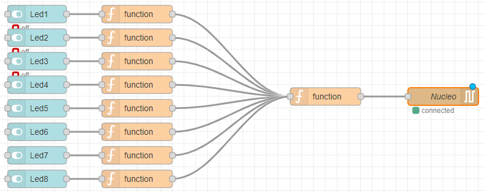

Met per Switch dashboad LED een Function Node met volgende code (gebruik van NodeRed Context variabelen):

```Java
var led1 = context.get('led1') || 0;
var inkomendeWaarde = Number(msg.payload);

//waarde = Number(waarde) + inkomendeWaarde;
context.set('led1', inkomendeWaarde);

//msg.payload = String.fromCodePoint(Number(waarde));
msg.payload = "";

return msg;
```

En dan nog eens een gemeenschappelijke Function Node met volgende:

```Java
var waarde = context.get('waarde') || 0;
var led1 = context.get('led1') || 0;
var led2 = context.get('led2') || 0;
var led3 = context.get('led3') || 0;
var led4 = context.get('led4') || 0;
var led5 = context.get('led5') || 0;
var led6 = context.get('led6') || 0;
var led7 = context.get('led7') || 0;
var led8 = context.get('led8') || 0;

//var inkomendeWaarde = Number(msg.payload);
waarde = led1+led2+led3+led4+led5+led6+led7+led8;
//waarde = Number(waarde) + inkomendeWaarde;
context.set('waarde', waarde);

msg.payload = String.fromCodePoint(Number(waarde));

return msg;

```

---

## JSON


JSON of JavaScript Object Notation, is een gestandaardiseerd gegevensformaat. JSON maakt gebruik van voor de mens leesbare tekst in de vorm van data-objecten die bestaan uit een of meer attributen met bijbehorende waarden. Het wordt hoofdzakelijk gebruikt voor uitwisseling van data tussen server en webapplicatie, als een alternatief voor XML.

JSON is oorspronkelijk ontstaan uit de programmeertaal JavaScript, maar is een taalonafhankelijk dataformaat. Code voor het lezen en maken van JSON-data is beschikbaar in een grote diversiteit van programmeertalen. JSON wordt ook veel gebruikt om data te versturen en ontvangen vanuit een webgebaseerde API.

### Structuur JSON

In JSON worden uitsluitend de volgende constructies gebruikt:

* getallen: 3.15 (positieve als negatieve komma-getallen)
* strings: "dit is een string" (een string wordt altijd tussen dubbele quotes geplaatst)
* de letterlijke waardes true, false en null
* array-initialisers: [ waarde , ... ] (Een lijst staat tussen vierkante haken, de gegevens worden gescheiden door een komma)
* object-initialisers: { string : waarde , ... } (een object wordt gescheiden door twee accolades. Een onderdeel van een object bestaat uit reeksen van een string en een waarde die gescheiden worden door een komma. De 5 bovenstaande structuren kunnen daar ook deel van uitmaken).

Het onderstaande voorbeeld is de JSON-weergave van een lijst met twee elementen. Beide elementen zijn zelf een object met weer een diepere structuur.

```JSON
[
   {
      "Naam":"JSON",
      "Type":"Gegevensuitwisselingsformaat",
      "isProgrammeertaal":false,
      "Zie ook":[
         "XML",
         "ASN.1"
      ]
   },
   {
      "Naam":"JavaScript",
      "Type":"Programmeertaal",
      "isProgrammeertaal":true,
      "Jaar":1995
   }
]

```

Meer studie over JSON kan op het internet worden gevonden.

Er zou dus kunnen worden gekozen om de communicatie tussen de Nucleo en Node-Red volledig in een jSON formaat te laten verlopen. Dus ook de LEDS aan te sturen via JSON en dus ook de toestand van de buttons weergeven door een JSON string te sturen naar Node-Red. 

In vorige voorbeelden werd met een constante datastroom gewerkt vanuit de Nucleo naar extern. Hiermee werd de toestand van de drukknoppen op elk ogenblik doorgestuurd. Echter zou er ook kunnen gewerkt worden met een Toggle-functie binnen de Nucleo. Hiermee wordt met de vier drukknoppen steeds de vier bool variabelen getoggled bij het indrukken van een drukknop. In volgend voorbeeld wordt enkel een datastroom gemaakt als een drukknop wordt ingedrukt. Hier wordt overbelasting van de seriële datalijn vermeden.

Hiervoor wijzigen we de code van de Nucleo en verder ook nog de FLOW van Node-Red:

```cpp
/*  Het programma communcieert met een programma gebouwd in Node-red.
    Op de Nucleo wordt de Nucleo-shield geplaatst.
    Vanaf dat er op 1 van de vier drukknoppen gedrukt wordt, wordt de status
    van de knop getoggeld en wordt er een bericht verstuurd in een JSON-formaat
    via de seriële bus. Als er aan de potentiometer wordt gedraaid wordt 
    zijn waarde via de seriële bus eveneens verstuurd.
    Het programma in Node-red verstuurd eveneens berichten naar de Nucleo in een
    JSON-formaat die de 8 leds kan aan- of uitschakelen.
    De baudrate is 9600bps, 8 databits, geen pariteit en 1 stopbit.
*/ 
#include "mbed.h"

Serial Communicatie(SERIAL_TX, SERIAL_RX);//Declaratie van de seriële verbinding.

//Declaratie van de 8 leds, de potentiometer en de 4 drukknoppen.
DigitalOut led1(A5);
DigitalOut led2(D3);
DigitalOut led3(D4);
DigitalOut led4(D5);
DigitalOut led5(D6);
DigitalOut led6(D7);
DigitalOut led7(D9);
DigitalOut led8(D10);
AnalogIn potentiometer(A0);
DigitalIn sw1(A1);
DigitalIn sw2(A2);
DigitalIn sw3(A3);
DigitalIn sw4(A4);

unsigned char OntvangenByte = 0; //variabele om een ontvangen byte in te bewaren
void StuurLed (); //Functie die de leds aan- en uitzetten.
void OntvangenData(); // Kijken of er data is ontvangen.
void CheckDrukknoppen(); //Kijken of er een drukknop is ingedrukt.
void CheckPotentiometer(); //Kijken of de potentiometer verdraaid is.
    
//variabelen nodig voor de 4 drukknoppen
int ToestandSw1 =0; //Geeft de toestand van sw1 weer. 1=AAN en 0=UIT
int ToestandSw2 =0; //Geeft de toestand van sw1 weer. 1=AAN en 0=UIT 
int ToestandSw3 =0; //Geeft de toestand van sw1 weer. 1=AAN en 0=UIT
int ToestandSw4 =0; //Geeft de toestand van sw1 weer. 1=AAN en 0=UIT
bool VorigeWaardeSw1 =0; //Variabele nodig voor negatieve flankdetectie van sw1.
bool VorigeWaardeSw2 =0; //Variabele nodig voor negatieve flankdetectie van sw2. 
bool VorigeWaardeSw3 =0; //Variabele nodig voor negatieve flankdetectie van sw3.
bool VorigeWaardeSw4 =0; //Variabele nodig voor negatieve flankdetectie van sw4.

// timer nodig om het denderen van de drukknoppen op te vangen.
Timer Antidendertimer;

int State = 0; //Variabele nodig 
int TeSturenLed;//Variabele nodig welke led er gestuurd moet worden.
bool WaardeLed; //De waarde die de led moet hebben die gestuurd moet worden.

// variabelen nodig voor de waarde van de potentiometer.
// Vanaf dat er een bepaald verschil is t.o.v. de vorige gemeten waarde dan
// wordt de waarde seriëel verstuurd.
float VorigeGemetenWaarde=0;
float gemetenWaarde100;
float gemetenWaarde;
int Verschil;

//******************************************************************************
// Hoofdroutine   
int main()
{
    Communicatie.baud(9600);//baudrate instellen op 115,2kbaud.
    Antidendertimer.start(); //starten van de antidendertimer.

    gemetenWaarde = potentiometer.read();//lezen van de potmeterwaarde.
    //Bewaren van de waarde om nadien te vergelijken of deze veranderd is zodat
    // niet constant de waarde serieel verstuurd moet worden
    VorigeGemetenWaarde = gemetenWaarde*100;

    //Versturen van de waarden bij start.
   Communicatie.printf("{\"button\":\"1\",\"toestand\": %i }\r\n", ToestandSw1);
   Communicatie.printf("{\"button\":\"2\",\"toestand\": %i }\r\n", ToestandSw2);
   Communicatie.printf("{\"button\":\"3\",\"toestand\": %i }\r\n", ToestandSw3);
   Communicatie.printf("{\"button\":\"4\",\"toestand\": %i }\r\n", ToestandSw4);
   Communicatie.printf("{\"analog\":\"1\",\"waarde\": %f }\r\n",gemetenWaarde);
    
  while (true)
  {
    OntvangenData(); // Kijken als er data serieel ontvangen is.
    CheckDrukknoppen(); //Kijken of er een drukknop is ingedrukt.
    CheckPotentiometer(); //Kijken of de potentiometer verdraaid is.
  }
}
//******************************************************************************

//******************************************************************************
// Lezen van de toestand van de potentiometer. Deze vergelijken met een vorige
// gemeten waarde en als deze 1% is gewijzigd wordt de waarde serieel verstuurd.
void CheckPotentiometer()
{
    //lezen waarde potmeter. Resultaat is een kommagetal tussen 1 en 0
    gemetenWaarde = potentiometer.read(); 

    //gelezen waarde *100 zodat we de procentuele waarde hebben.
    gemetenWaarde100 = gemetenWaarde*100;
    
     //Kijken welke waarde het grootst is. De huidige waarde of de vorige waarde.
    if (VorigeGemetenWaarde > gemetenWaarde100)
    {
      Verschil = VorigeGemetenWaarde - gemetenWaarde100; //Verschil berekenen.
    } 
    else
    {
      Verschil = gemetenWaarde100 - VorigeGemetenWaarde; //Verschil berekenen.
    } 

    if (Verschil > 1) //Kijken als het verschil groter is dan 1%
    {
      //Het verschil is groter dan 1% en de waarde wordt verstuurd.
      Communicatie.printf("{\"analog\":\"1\",\"waarde\":%f}\r\n",gemetenWaarde);
      VorigeGemetenWaarde = gemetenWaarde100;//De nieuwe waarde wordt bewaard.
    }
}
//******************************************************************************


//******************************************************************************
// Functie die kijkt of er data serieel is ontvangen.De data die ontvangen wordt
// is de data om de 8 leds te sturen. Dit wordt verstuurd in een JSON-formaat.
// Er zijn 16 verschillende JSON-strings die ontvangen worden.
// {"LED":"1","toestand":"1"}    {"LED":"1","toestand":"0"}
// {"LED":"2","toestand":"1"}    {"LED":"2","toestand":"0"}
// {"LED":"3","toestand":"1"}    {"LED":"3","toestand":"0"}
// {"LED":"4","toestand":"1"}    {"LED":"4","toestand":"0"}
// {"LED":"5","toestand":"1"}    {"LED":"5","toestand":"0"}
// {"LED":"6","toestand":"1"}    {"LED":"6","toestand":"0"}
// {"LED":"7","toestand":"1"}    {"LED":"7","toestand":"0"}
// {"LED":"8","toestand":"1"}    {"LED":"8","toestand":"0"}
// De strings worden ontleed en welke led en de toestand wordt in een veriabele
// geplaatst om later in deze functie aan- of af te zetten.
void OntvangenData()
{
    while (Communicatie.readable()) //Zolang er bytes ontvangen zijn worden
    {                               //deze opgehaald en verwerkt.
      OntvangenByte = Communicatie.getc();// Lezen van de ontvangen byte.
      switch (State)
      {
        case 0: //Zoek naar een '{' -> Dit is 0x7B
        {
            if (OntvangenByte == '{') State=1;
            break;           
        }    
        case 1: //Zoek naar een '"' -> Dit is 0x22
        {
            if (OntvangenByte == '"') State=2;
            else State=0; //Er is een fout, alle code weggooien behalve {
            break;           
        }    
        case 2: //Zoek naar een 'L' -> Dit is 0x4C
        {
            if (OntvangenByte == 'L') State=3;
            else State=0; //Er is een fout, alle code weggooien behalve {
            break;           
        }
        case 3: //Zoek naar een 'E' -> Dit is 0x45
        {
            if (OntvangenByte == 'E') State=4;
            else State=0; //Er is een fout, alle code weggooien behalve {
            break;           
        }
        case 4: //Zoek naar een 'D' -> Dit is 0x44
        {
            if (OntvangenByte == 'D') State=5;
            else State=0; //Er is een fout, alle code weggooien behalve {
            break;           
        }
        case 5: //Zoek naar een '"' -> Dit is 0x22
        {
            if (OntvangenByte == '"') State=6;
            else State=0; //Er is een fout, alle code weggooien behalve {
            break;           
        }
        case 6: //Zoek naar een ':' -> Dit is 0x3A
        {
            if (OntvangenByte == ':') State=7;
            else State=0; //Er is een fout, alle code weggooien behalve {
            break;           
        }
        case 7: //Zoek naar een '"' -> Dit is 0x22
        {
            if (OntvangenByte == '"') State=8;
            else State=0; //Er is een fout, alle code weggooien behalve {
            break;           
        }
        case 8: //Zoek naar een cijfer tussen 1 t.e.m. 8 ->
                // '1' = 0x31 en '8' = 0x38
        {
            TeSturenLed = OntvangenByte - 0x30;
            if ((TeSturenLed >0) && (TeSturenLed <9))
            {
                State=9;
            }
            else State=0; //Er is een fout, alle code weggooien behalve {
            break;           
        }
        case 9: //Zoek naar een '"' -> Dit is 0x22
        {
            if (OntvangenByte == '"') State=10;
            else State=0; //Er is een fout, alle code weggooien behalve {
            break;           
        }
        case 10: //Zoek naar een ',' -> Dit is 0x2C
        {
            if (OntvangenByte == ',') State=11;
            else State=0; //Er is een fout, alle code weggooien behalve {
            break;           
        }
        case 11: //Zoek naar een '"' -> Dit is 0x22
        {
            if (OntvangenByte == '"') State=12;
            else State=0; //Er is een fout, alle code weggooien behalve {
            break;           
        }
        case 12: //Zoek naar een 't' -> Dit is 0x74
        {
            if (OntvangenByte == 't') State=13;
            else State=0; //Er is een fout, alle code weggooien behalve {
            break;           
        }
        case 13: //Zoek naar een 'o' -> Dit is 0x6F
        {
            if (OntvangenByte == 'o') State=14;
            else State=0; //Er is een fout, alle code weggooien behalve {
            break;           
        }
        case 14: //Zoek naar een 'e' -> Dit is 0x65
        {
            if (OntvangenByte == 'e') State=15;
            else State=0; //Er is een fout, alle code weggooien behalve {
            break;           
        }
        case 15: //Zoek naar een 's' -> Dit is 0x73
        {
            if (OntvangenByte == 's') State=16;
            else State=0; //Er is een fout, alle code weggooien behalve {
            break;           
        }
        case 16: //Zoek naar een 't' -> Dit is 0x74
        {
            if (OntvangenByte == 't') State=17;
            else State=0; //Er is een fout, alle code weggooien behalve {
            break;           
        }
        case 17: //Zoek naar een 'a' -> Dit is 0x61
        {
            if (OntvangenByte == 'a') State=18;
            else State=0; //Er is een fout, alle code weggooien behalve {
            break;           
        }
        case 18: //Zoek naar een 'n' -> Dit is 0x6E
        {
            if (OntvangenByte == 'n') State=19;
            else State=0; //Er is een fout, alle code weggooien behalve {
            break;           
        }
        case 19: //Zoek naar een 'd' -> Dit is 0x64
        {
            if (OntvangenByte == 'd') State=20;
            else State=0; //Er is een fout, alle code weggooien behalve {
            break;           
        }
        case 20: //Zoek naar een '"' -> Dit is 0x22
        {
            if (OntvangenByte == '"') State=21;
            else State=0; //Er is een fout, alle code weggooien behalve {
            break;           
        }
        case 21: //Zoek naar een ':' -> Dit is 0x3A
        {
            if (OntvangenByte == ':') State=22;
            else State=0; //Er is een fout, alle code weggooien behalve {
            break;           
        }
        case 22: //Zoek naar een '"' -> Dit is 0x22
        {
            if (OntvangenByte == '"') State=23;
            else State=0; //Er is een fout, alle code weggooien behalve {
            break;           
        }
        case 23: //Zoek naar een '0' of een '1' -> Dit is 0x22
        {
            if (OntvangenByte == '0')
            {
                WaardeLed = false;
                State=24;
            }
            else if (OntvangenByte == '1')
            {
                WaardeLed = true;
                State=24;
            }
            else State=0; //Er is een fout, alle code weggooien behalve {
            break;           
        }
        case 24: //Zoek naar een '"' -> Dit is 0x22
        {
            if (OntvangenByte == '"') State=25;
            else State=0; //Er is een fout, alle code weggooien behalve {
            break;           
        }
        case 25: //Zoek naar een '}' -> Dit is 0x7D
        {
            if (OntvangenByte == '}')
            {
                StuurLed(); //Het sturen van de led.
            }
            State=0;
            break;           
        }
      }   
    }
}
//******************************************************************************


//******************************************************************************
// Deze functie stuurt de gewenste led aan of uit.
void StuurLed ()
{
    switch (TeSturenLed)
    {
        case 1: //led1 sturen
        {
            led1 = WaardeLed;
            break;           
        }    
        case 2: //led2 sturen
        {
            led2 = WaardeLed;
            break;           
        }    
        case 3: //led3 sturen
        {
            led3 = WaardeLed;
            break;           
        }    
        case 4: //led4 sturen
        {
            led4 = WaardeLed;
            break;           
        }    
        case 5: //led5 sturen
        {
            led5 = WaardeLed;
            break;           
        }    
        case 6: //led6 sturen
        {
            led6 = WaardeLed;
            break;           
        }    
        case 7: //led7 sturen
        {
            led7 = WaardeLed;
            break;           
        }    
        case 8: //led8 sturen
        {
            led8 = WaardeLed;
            break;           
        }    
    }
}
//******************************************************************************

//******************************************************************************
// Functie die kijkt of er een dalende flank is op de 4 drukknoppen.
// Als de drukknop is ingedrukt wordt zijn toestand gewijzigd en wordt deze
// serieel verstuurd.
void CheckDrukknoppen()
{
 //functie wordt om de 5ms uitgevoerd om dender
 // van de drukknoppen weg te werken.
  if (Antidendertimer.read_ms() >= 5)
  {
   Antidendertimer.reset(); //Op 0 zetten van de timer.
        
    if ((sw1==0) && (VorigeWaardeSw1==1))//Controle ingedrukte toets
    {
     ToestandSw1 = !ToestandSw1; //inverteren van de toestand.
     Communicatie.printf("{\"button\":\"1\",\"toestand\":%i}\r\n", ToestandSw1);
    } //bewaren van de huidige toestand, nodig voor de flankdetectie.
    VorigeWaardeSw1 = sw1; 
        
    if ((sw2==0) && (VorigeWaardeSw2==1))//Controle ingedrukte toets
    {
     ToestandSw2 = !ToestandSw2;
     Communicatie.printf("{\"button\":\"2\",\"toestand\":%i}\r\n", ToestandSw2);
    } //bewaren van de huidige toestand, nodig voor de flankdetectie.
    VorigeWaardeSw2 = sw2;
    
    if ((sw3==0) && (VorigeWaardeSw3==1))//Controle ingedrukte toets
    {
     ToestandSw3 = !ToestandSw3;
     Communicatie.printf("{\"button\":\"3\",\"toestand\":%i}\r\n", ToestandSw3);
    } //bewaren van de huidige toestand, nodig voor de flankdetectie.
    VorigeWaardeSw3 = sw3;
    
    if ((sw4==0) && (VorigeWaardeSw4==1))//Controle ingedrukte toets
    {
     ToestandSw4 = !ToestandSw4;
     Communicatie.printf("{\"button\":\"4\",\"toestand\":%i}\r\n", ToestandSw4);
    }  //bewaren van de huidige toestand, nodig voor de flankdetectie.
    VorigeWaardeSw4 = sw4;     
  }
}
//******************************************************************************

```

---

De NodeRed code zou er dan als volgt kunnen uitzien:
Voor de Leds kan dit gebruikt worden:

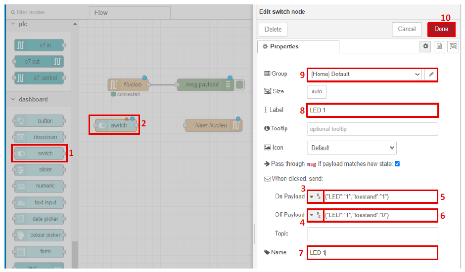

Voor de drukknoppen:

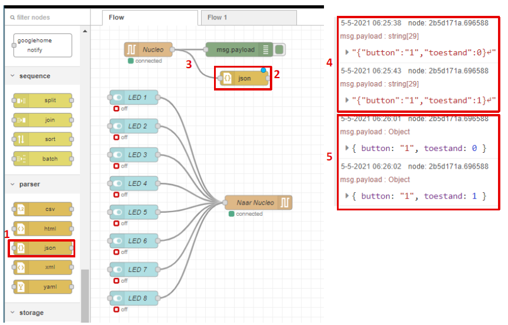

Met een Switch node met meerdere uitgangen (nl 4 in dit geval):

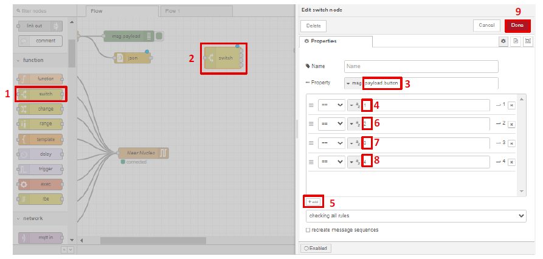

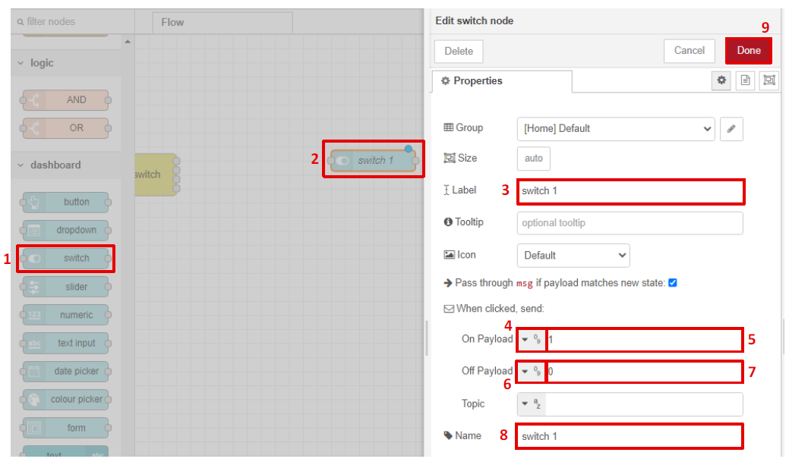

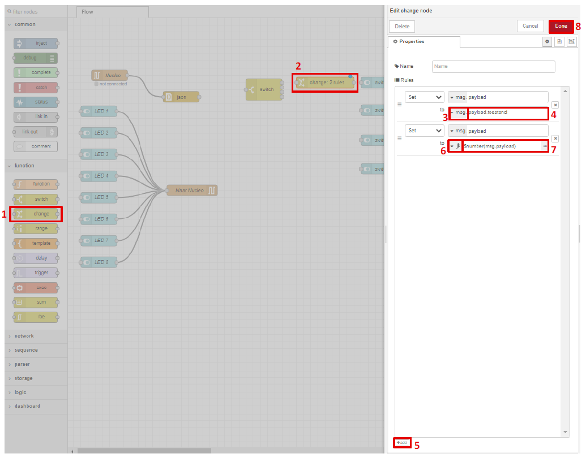

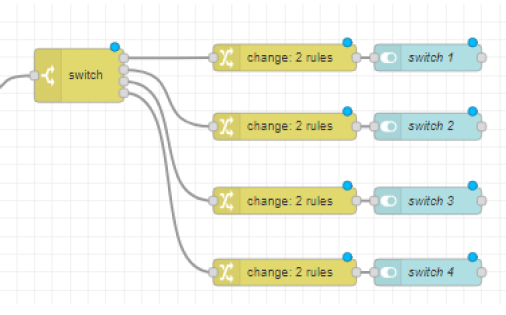

En ook de analoge waarde op de Nucleo (A0 = potentiometer op de shield) kan gevisualiseerd worden:

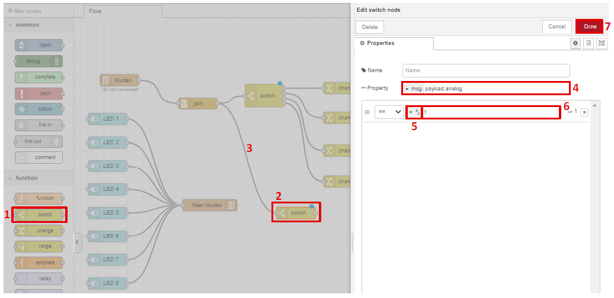

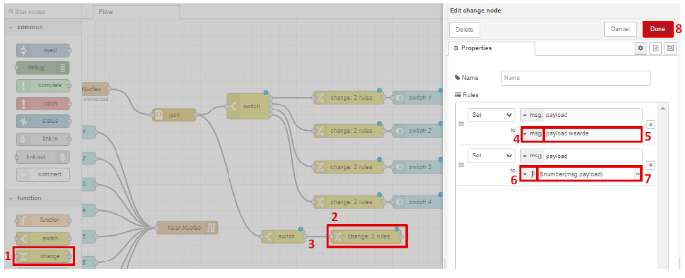

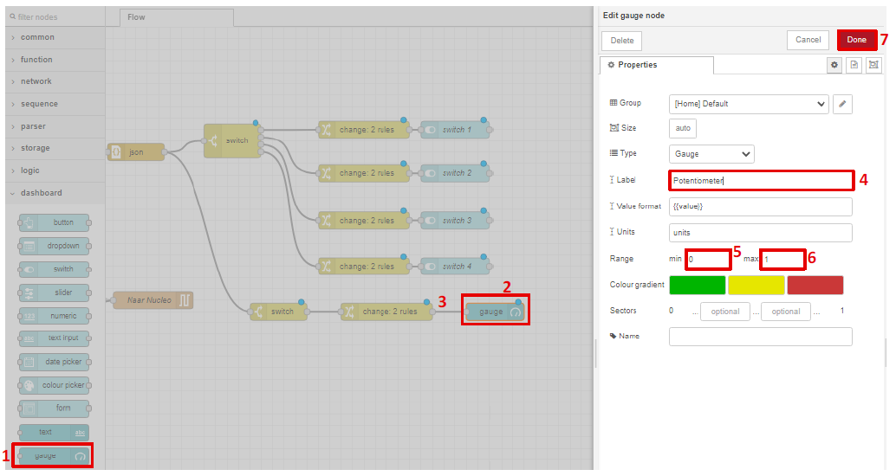

Met een totale dashboard:

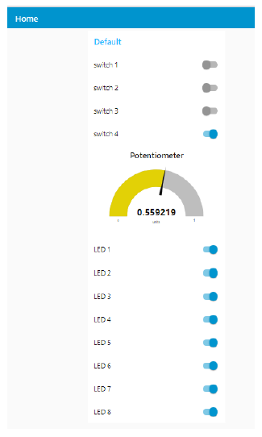

Wat in de code nog ontbreekt is de mogelijkheid om van extern een PWM signaal in te stellen. Het zal meestal gewenst zijn om enkel de duty cycle van het signaal te manipuleren. De frequentie is hier op een vaste waarde ingesteld. Dit zou ook via een JSON string kunnen gebeuren. Die zou er zo kunnen uitzien:

```JSON
{"PWM":"0", "toestand":"000"}
```

Dan zal de MBED code er iets anders uitzien. De structuur waarbij char per char via de seriële connectie wordt ingelezen zal deze vorm ook moeten ondervangen. Let wel dat bij toestand de waarde, bestaande uit drie cijfer characters, kan vaieëren tussen "000" en "100", waarmee de duty cycle van het PWM signaal kan worden ingesteld.

```cpp
/*  Het programma communcieert met een programma gebouwd in Node-red.
    Op de Nucleo wordt de Nucleo-shield geplaatst.
    Vanaf dat er op 1 van de vier drukknoppen gedrukt wordt, wordt de status
    van de knop GETOGGLED en wordt er een bericht verstuurd in een JSON-formaat
    via de seriële bus. Als er aan de potentiometer wordt gedraaid wordt 
    zijn waarde via de seriële bus eveneens verstuurd.
    Het programma in Node-red verstuurd eveneens berichten naar de Nucleo in een
    JSON-formaat die de 8 leds kan aan- of uitschakelen.
    De baudrate is 9600bps, 8 databits, geen pariteit en 1 stopbit.
*/ 
#include "mbed.h"

Serial Communicatie(SERIAL_TX, SERIAL_RX);//Declaratie van de seriële verbinding.

//Declaratie van de 8 leds, de potentiometer en de 4 drukknoppen.
DigitalOut led1(A5);
DigitalOut led2(D3);
DigitalOut led3(D4);
DigitalOut led4(D5);
DigitalOut led5(D6);
DigitalOut led6(D7);
DigitalOut led7(D9);
DigitalOut led8(D10);
AnalogIn potentiometer(A0);
DigitalIn sw1(A1);
DigitalIn sw2(A2);
DigitalIn sw3(A3);
DigitalIn sw4(A4);
PwmOut pwm1 (D8);
PwmOut pwm2 (D11);
PwmOut pwm3 (D12);


unsigned char OntvangenByte = 0; //variabele om een ontvangen byte in te bewaren
void StuurLed (); //Functie die de leds aan- en uitzetten.
void StuurPWM (); //Functie die de PWM uitgang aanstuurt.
void OntvangenData(); // Kijken of er data is ontvangen.
void CheckDrukknoppen(); //Kijken of er een drukknop is ingedrukt.
void CheckPotentiometer(); //Kijken of de potentiometer verdraaid is.
    
//variabelen nodig voor de 4 drukknoppen
int ToestandSw1 =0; //Geeft de toestand van sw1 weer. 1=AAN en 0=UIT
int ToestandSw2 =0; //Geeft de toestand van sw1 weer. 1=AAN en 0=UIT 
int ToestandSw3 =0; //Geeft de toestand van sw1 weer. 1=AAN en 0=UIT
int ToestandSw4 =0; //Geeft de toestand van sw1 weer. 1=AAN en 0=UIT
bool VorigeWaardeSw1 =0; //Variabele nodig voor negatieve flankdetectie van sw1.
bool VorigeWaardeSw2 =0; //Variabele nodig voor negatieve flankdetectie van sw2. 
bool VorigeWaardeSw3 =0; //Variabele nodig voor negatieve flankdetectie van sw3.
bool VorigeWaardeSw4 =0; //Variabele nodig voor negatieve flankdetectie van sw4.

// timer nodig om het denderen van de drukknoppen op te vangen.
Timer Antidendertimer;

int State = 0; //Variabele nodig 
int TeSturenLed;//Variabele nodig welke led er gestuurd moet worden.
int TeSturenPWM;//Variabele nodig welke PWM output er wordt gebruikt.
int TeSturenPWMDC_honderdtallen;
int TeSturenPWMDC_tientallen;
int TeSturenPWMDC_eenheden;
int TeSturenPWMDC;//Variabele nodig om PWM duty cycle te maken uit de
//honderdtallen, tientallen en eenheden. (000 => 100)
bool WaardeLed; //De waarde die de led moet hebben die gestuurd moet worden.

// variabelen nodig voor de waarde van de potentiometer.
// Vanaf dat er een bepaald verschil is t.o.v. de vorige gemeten waarde dan
// wordt de waarde seriëel verstuurd.
float VorigeGemetenWaarde=0;
float gemetenWaarde100;
float gemetenWaarde;
int Verschil;

//******************************************************************************
// Hoofdroutine   
int main()
{
    Communicatie.baud(9600);//baudrate instellen op 115,2kbaud.
    Antidendertimer.start(); //starten van de antidendertimer.

    gemetenWaarde = potentiometer.read();//lezen van de potmeterwaarde.
    //Bewaren van de waarde om nadien te vergelijken of deze veranderd is zodat
    // niet constant de waarde serieel verstuurd moet worden
    VorigeGemetenWaarde = gemetenWaarde*100;

    //Versturen van de waarden bij start.
   Communicatie.printf("{\"button\":\"1\",\"toestand\": %i }\r\n", ToestandSw1);
   Communicatie.printf("{\"button\":\"2\",\"toestand\": %i }\r\n", ToestandSw2);
   Communicatie.printf("{\"button\":\"3\",\"toestand\": %i }\r\n", ToestandSw3);
   Communicatie.printf("{\"button\":\"4\",\"toestand\": %i }\r\n", ToestandSw4);
   Communicatie.printf("{\"analog\":\"1\",\"waarde\": %f }\r\n",gemetenWaarde);
    
    
  while (true)
  {
    OntvangenData(); // Kijken als er data serieel ontvangen is.
    CheckDrukknoppen(); //Kijken of er een drukknop is ingedrukt.
    CheckPotentiometer(); //Kijken of de potentiometer verdraaid is.
  }
}
//******************************************************************************

//******************************************************************************
// Lezen van de toestand van de potentiometer. Deze vergelijken met een vorige
// gemeten waarde en als deze 1% is gewijzigd wordt de waarde serieel verstuurd.
void CheckPotentiometer()
{
    //lezen waarde potmeter. Resultaat is een kommagetal tussen 1 en 0
    gemetenWaarde = potentiometer.read(); 

    //gelezen waarde *100 zodat we de procentuele waarde hebben.
    gemetenWaarde100 = gemetenWaarde*100;
    
     //Kijken welke waarde het grootst is. De huidige waarde of de vorige waarde.
    if (VorigeGemetenWaarde > gemetenWaarde100)
    {
      Verschil = VorigeGemetenWaarde - gemetenWaarde100; //Verschil berekenen.
    } 
    else
    {
      Verschil = gemetenWaarde100 - VorigeGemetenWaarde; //Verschil berekenen.
    } 

    if (Verschil > 1) //Kijken als het verschil groter is dan 1%
    {
      //Het verschil is groter dan 1% en de waarde wordt verstuurd.
      Communicatie.printf("{\"analog\":\"1\",\"waarde\":%f}\r\n",gemetenWaarde);
      VorigeGemetenWaarde = gemetenWaarde100;//De nieuwe waarde wordt bewaard.
    }
}
//******************************************************************************


//******************************************************************************
// Functie die kijkt of er data serieel is ontvangen.De data die ontvangen wordt
// is de data om de 8 leds te sturen. Dit wordt verstuurd in een JSON-formaat.
// Er zijn 16 verschillende JSON-strings die ontvangen worden.
// {"LED":"1","toestand":"1"}    {"LED":"1","toestand":"0"}
// {"LED":"2","toestand":"1"}    {"LED":"2","toestand":"0"}
// {"LED":"3","toestand":"1"}    {"LED":"3","toestand":"0"}
// {"LED":"4","toestand":"1"}    {"LED":"4","toestand":"0"}
// {"LED":"5","toestand":"1"}    {"LED":"5","toestand":"0"}
// {"LED":"6","toestand":"1"}    {"LED":"6","toestand":"0"}
// {"LED":"7","toestand":"1"}    {"LED":"7","toestand":"0"}
// {"LED":"8","toestand":"1"}    {"LED":"8","toestand":"0"}
// De strings worden ontleed en welke led en de toestand wordt in een veriabele
// geplaatst om later in deze functie aan- of af te zetten.
void OntvangenData()
{
    while (Communicatie.readable()) //Zolang er bytes ontvangen zijn worden
    {                               //deze opgehaald en verwerkt.
      OntvangenByte = Communicatie.getc();// Lezen van de ontvangen byte.
      switch (State)
      {
        case 0: //Zoek naar een '{' -> Dit is 0x7B
        {
            if (OntvangenByte == '{') State=1;
            break;           
        }    
        case 1: //Zoek naar een '"' -> Dit is 0x22
        {
            if (OntvangenByte == '"') State=2;
            else State=0; //Er is een fout, alle code weggooien behalve {
            break;           
        }    
        case 2: //Zoek naar een 'L' -> Dit is 0x4C ||| of een 'P' -> Dit is 0x50
        {
            
            if (OntvangenByte == 'L') State=3;
            else if (OntvangenByte == 'P') State = 26;
            else State=0; //Er is een fout, alle code weggooien behalve {
            break;           
        }
        case 3: //Zoek naar een 'E' -> Dit is 0x45
        {
            if (OntvangenByte == 'E') State=4;
            else State=0; //Er is een fout, alle code weggooien behalve {
            break;           
        }
        case 4: //Zoek naar een 'D' -> Dit is 0x44
        {
            if (OntvangenByte == 'D') State=5;
            else State=0; //Er is een fout, alle code weggooien behalve {
            break;           
        }
        case 5: //Zoek naar een '"' -> Dit is 0x22
        {
            if (OntvangenByte == '"') State=6;
            else State=0; //Er is een fout, alle code weggooien behalve {
            break;           
        }
        case 6: //Zoek naar een ':' -> Dit is 0x3A
        {
            if (OntvangenByte == ':') State=7;
            else State=0; //Er is een fout, alle code weggooien behalve {
            break;           
        }
        case 7: //Zoek naar een '"' -> Dit is 0x22
        {
            if (OntvangenByte == '"') State=8;
            else State=0; //Er is een fout, alle code weggooien behalve {
            break;           
        }
        case 8: //Zoek naar een cijfer tussen 1 t.e.m. 8 ->
                // '1' = 0x31 en '8' = 0x38
        {
            TeSturenLed = OntvangenByte - 0x30;
            if ((TeSturenLed >0) && (TeSturenLed <9))
            {
                State=9;
            }
            else State=0; //Er is een fout, alle code weggooien behalve {
            break;           
        }
        case 9: //Zoek naar een '"' -> Dit is 0x22
        {
            if (OntvangenByte == '"') State=10;
            else State=0; //Er is een fout, alle code weggooien behalve {
            break;           
        }
        case 10: //Zoek naar een ',' -> Dit is 0x2C
        {
            if (OntvangenByte == ',') State=11;
            else State=0; //Er is een fout, alle code weggooien behalve {
            break;           
        }
        case 11: //Zoek naar een '"' -> Dit is 0x22
        {
            if (OntvangenByte == '"') State=12;
            else State=0; //Er is een fout, alle code weggooien behalve {
            break;           
        }
        case 12: //Zoek naar een 't' -> Dit is 0x74
        {
            if (OntvangenByte == 't') State=13;
            else State=0; //Er is een fout, alle code weggooien behalve {
            break;           
        }
        case 13: //Zoek naar een 'o' -> Dit is 0x6F
        {
            if (OntvangenByte == 'o') State=14;
            else State=0; //Er is een fout, alle code weggooien behalve {
            break;           
        }
        case 14: //Zoek naar een 'e' -> Dit is 0x65
        {
            if (OntvangenByte == 'e') State=15;
            else State=0; //Er is een fout, alle code weggooien behalve {
            break;           
        }
        case 15: //Zoek naar een 's' -> Dit is 0x73
        {
            if (OntvangenByte == 's') State=16;
            else State=0; //Er is een fout, alle code weggooien behalve {
            break;           
        }
        case 16: //Zoek naar een 't' -> Dit is 0x74
        {
            if (OntvangenByte == 't') State=17;
            else State=0; //Er is een fout, alle code weggooien behalve {
            break;           
        }
        case 17: //Zoek naar een 'a' -> Dit is 0x61
        {
            if (OntvangenByte == 'a') State=18;
            else State=0; //Er is een fout, alle code weggooien behalve {
            break;           
        }
        case 18: //Zoek naar een 'n' -> Dit is 0x6E
        {
            if (OntvangenByte == 'n') State=19;
            else State=0; //Er is een fout, alle code weggooien behalve {
            break;           
        }
        case 19: //Zoek naar een 'd' -> Dit is 0x64
        {
            if (OntvangenByte == 'd') State=20;
            else State=0; //Er is een fout, alle code weggooien behalve {
            break;           
        }
        case 20: //Zoek naar een '"' -> Dit is 0x22
        {
            if (OntvangenByte == '"') State=21;
            else State=0; //Er is een fout, alle code weggooien behalve {
            break;           
        }
        case 21: //Zoek naar een ':' -> Dit is 0x3A
        {
            if (OntvangenByte == ':') State=22;
            else State=0; //Er is een fout, alle code weggooien behalve {
            break;           
        }
        case 22: //Zoek naar een '"' -> Dit is 0x22
        {
            if (OntvangenByte == '"') State=23;
            else State=0; //Er is een fout, alle code weggooien behalve {
            break;           
        }
        case 23: //Zoek naar een '0' of een '1' -> Dit is 0x22
        {
            if (OntvangenByte == '0')
            {
                WaardeLed = false;
                State=24;
            }
            else if (OntvangenByte == '1')
            {
                WaardeLed = true;
                State=24;
            }
            else State=0; //Er is een fout, alle code weggooien behalve {
            break;           
        }
        case 24: //Zoek naar een '"' -> Dit is 0x22
        {
            if (OntvangenByte == '"') State=25;
            else State=0; //Er is een fout, alle code weggooien behalve {
            break;           
        }
        case 25: //Zoek naar een '}' -> Dit is 0x7D
        {
            if (OntvangenByte == '}')
            {
                StuurLed(); //Het sturen van de led.
            }
            State=0;
            break;           
        }
        
        
    //************************************
    
    case 26: //Zoek naar een 'W' -> Dit is 0x57
        {

            if (OntvangenByte == 'W') State=27;
            else State=0; //Er is een fout, alle code weggooien behalve {
            break;           
        }
        case 27: //Zoek naar een 'M' -> Dit is 0x4D
        {
            if (OntvangenByte == 'M') State=28;
            else State=0; //Er is een fout, alle code weggooien behalve {
            break;           
        }
        case 28: //Zoek naar een '"' -> Dit is 0x22
        {
            if (OntvangenByte == '"') State=29;
            else State=0; //Er is een fout, alle code weggooien behalve {
            break;           
        }
        case 29: //Zoek naar een ':' -> Dit is 0x3A
        {
            if (OntvangenByte == ':') State=30;
            else State=0; //Er is een fout, alle code weggooien behalve {
            break;           
        }
        case 30: //Zoek naar een '"' -> Dit is 0x22
        {
            if (OntvangenByte == '"') State=31;
            else State=0; //Er is een fout, alle code weggooien behalve {
            break;           
        }
        case 31: //Zoek naar een cijfer tussen 1 t.e.m. 8 ->
                // '1' = 0x31 en '8' = 0x38
        {
            TeSturenPWM = OntvangenByte - 0x30;
            if ((TeSturenPWM >0) && (TeSturenPWM <9))
            {
                State=32;
            }
            else State=0; //Er is een fout, alle code weggooien behalve {
            break;           
        }
        case 32: //Zoek naar een '"' -> Dit is 0x22
        {
            if (OntvangenByte == '"') State=33;
            else State=0; //Er is een fout, alle code weggooien behalve {
            break;           
        }
        case 33: //Zoek naar een ',' -> Dit is 0x2C
        {
            if (OntvangenByte == ',') State=34;
            else State=0; //Er is een fout, alle code weggooien behalve {
            break;           
        }
        case 34: //Zoek naar een '"' -> Dit is 0x22
        {
            if (OntvangenByte == '"') State=35;
            else State=0; //Er is een fout, alle code weggooien behalve {
            break;           
        }
        case 35: //Zoek naar een 't' -> Dit is 0x74
        {
            if (OntvangenByte == 't') State=36;
            else State=0; //Er is een fout, alle code weggooien behalve {
            break;           
        }
        case 36: //Zoek naar een 'o' -> Dit is 0x6F
        {
            if (OntvangenByte == 'o') State=37;
            else State=0; //Er is een fout, alle code weggooien behalve {
            break;           
        }
        case 37: //Zoek naar een 'e' -> Dit is 0x65
        {
            if (OntvangenByte == 'e') State=38;
            else State=0; //Er is een fout, alle code weggooien behalve {
            break;           
        }
        case 38: //Zoek naar een 's' -> Dit is 0x73
        {
            if (OntvangenByte == 's') State=39;
            else State=0; //Er is een fout, alle code weggooien behalve {
            break;           
        }
        case 39: //Zoek naar een 't' -> Dit is 0x74
        {
            if (OntvangenByte == 't') State=40;
            else State=0; //Er is een fout, alle code weggooien behalve {
            break;           
        }
        case 40: //Zoek naar een 'a' -> Dit is 0x61
        {
            if (OntvangenByte == 'a') State=41;
            else State=0; //Er is een fout, alle code weggooien behalve {
            break;           
        }
        case 41: //Zoek naar een 'n' -> Dit is 0x6E
        {
            if (OntvangenByte == 'n') State=42;
            else State=0; //Er is een fout, alle code weggooien behalve {
            break;           
        }
        case 42: //Zoek naar een 'd' -> Dit is 0x64
        {
            if (OntvangenByte == 'd') State=43;
            else State=0; //Er is een fout, alle code weggooien behalve {
            break;           
        }
        case 43: //Zoek naar een '"' -> Dit is 0x22
        {
            if (OntvangenByte == '"') State=44;
            else State=0; //Er is een fout, alle code weggooien behalve {
            break;           
        }
        case 44: //Zoek naar een ':' -> Dit is 0x3A
        {
            if (OntvangenByte == ':') State=45;
            else State=0; //Er is een fout, alle code weggooien behalve {
            break;           
        }
        case 45: //Zoek naar een '"' -> Dit is 0x22
        {
            if (OntvangenByte == '"') State=46;
            else State=0; //Er is een fout, alle code weggooien behalve {
            break;           
        }
        case 46: //Zoek naar een getal tussen [0 - 9]
        {
            TeSturenPWMDC_honderdtallen = OntvangenByte - 0x30;
            
            if((TeSturenPWMDC_honderdtallen>= 0)&&(TeSturenPWMDC_honderdtallen<= 9))
            {
                State=47;
            }
            else State=0; //Er is een fout, alle code weggooien behalve {
            break;              
        }
        
        case 47: //Zoek naar een getal tussen [0 - 9]
        {
            TeSturenPWMDC_tientallen = OntvangenByte - 0x30;
            
            if((TeSturenPWMDC_tientallen>=0)&&(TeSturenPWMDC_tientallen<=9))
            {
                State=48;
            }
            else State=0; //Er is een fout, alle code weggooien behalve {
            break;              
        }
        
        case 48: //Zoek naar een getal tussen [0 - 9]
        {
            TeSturenPWMDC_eenheden = OntvangenByte - 0x30;
            
            if ((TeSturenPWMDC_eenheden >= 0) && (TeSturenPWMDC_eenheden <= 9))
            {
                State=49;
            }
            else State=0; //Er is een fout, alle code weggooien behalve {
            break;              
        }
        
        //********************************************
        case 49: //Zoek naar een '"' -> Dit is 0x22
        {
            if (OntvangenByte == '"') State=50;
            else State=0; //Er is een fout, alle code weggooien behalve {
            break;           
        }
        case 50: //Zoek naar een '}' -> Dit is 0x7D
        {
            if (OntvangenByte == '}')
            {
                StuurPWM(); //Het sturen van PWM uitgang.
            }
            State=0;
            break;           
        }
      }   
    }
}
//******************************************************************************


//******************************************************************************
// Deze functie stuurt de gewenste led aan of uit.
void StuurLed ()
{
    switch (TeSturenLed)
    {
        case 1: //led1 sturen
        {
            led1 = WaardeLed;
            break;           
        }    
        case 2: //led2 sturen
        {
            led2 = WaardeLed;
            break;           
        }    
        case 3: //led3 sturen
        {
            led3 = WaardeLed;
            break;           
        }    
        case 4: //led4 sturen
        {
            led4 = WaardeLed;
            break;           
        }    
        case 5: //led5 sturen
        {
            led5 = WaardeLed;
            break;           
        }    
        case 6: //led6 sturen
        {
            led6 = WaardeLed;
            break;           
        }    
        case 7: //led7 sturen
        {
            led7 = WaardeLed;
            break;           
        }    
        case 8: //led8 sturen
        {
            led8 = WaardeLed;
            break;           
        }    
    }
}
//******************************************************************************

//******************************************************************************
// Functie die kijkt of er een dalende flank is op de 4 drukknoppen.
// Als de drukknop is ingedrukt wordt zijn toestand gewijzigd en wordt deze
// serieel verstuurd.
void CheckDrukknoppen()
{
 //functie wordt om de 5ms uitgevoerd om dender
 // van de drukknoppen weg te werken.
  if (Antidendertimer.read_ms() >= 5)
  {
   Antidendertimer.reset(); //Op 0 zetten van de timer.
        
    if ((sw1==0) && (VorigeWaardeSw1==1))//Controle ingedrukte toets
    {
     ToestandSw1 = !ToestandSw1; //inverteren van de toestand.
     Communicatie.printf("{\"button\":\"1\",\"toestand\":%i}\r\n", ToestandSw1);
    } //bewaren van de huidige toestand, nodig voor de flankdetectie.
    VorigeWaardeSw1 = sw1; 
        
    if ((sw2==0) && (VorigeWaardeSw2==1))//Controle ingedrukte toets
    {
     ToestandSw2 = !ToestandSw2;
     Communicatie.printf("{\"button\":\"2\",\"toestand\":%i}\r\n", ToestandSw2);
    } //bewaren van de huidige toestand, nodig voor de flankdetectie.
    VorigeWaardeSw2 = sw2;
    
    if ((sw3==0) && (VorigeWaardeSw3==1))//Controle ingedrukte toets
    {
     ToestandSw3 = !ToestandSw3;
     Communicatie.printf("{\"button\":\"3\",\"toestand\":%i}\r\n", ToestandSw3);
    } //bewaren van de huidige toestand, nodig voor de flankdetectie.
    VorigeWaardeSw3 = sw3;
    
    if ((sw4==0) && (VorigeWaardeSw4==1))//Controle ingedrukte toets
    {
     ToestandSw4 = !ToestandSw4;
     Communicatie.printf("{\"button\":\"4\",\"toestand\":%i}\r\n", ToestandSw4);
    }  //bewaren van de huidige toestand, nodig voor de flankdetectie.
    VorigeWaardeSw4 = sw4;     
  }
}
//******************************************************************************


//******************************************************************************
// Deze functie stuurt de PWM uitgang aan.
void StuurPWM ()
{
    float waardeDutyCycle = ((TeSturenPWMDC_honderdtallen*100) + (TeSturenPWMDC_tientallen * 10) + (TeSturenPWMDC_eenheden))/100.0;
    if (waardeDutyCycle > 1) waardeDutyCycle = 0;
        
    switch(TeSturenPWM)
    {
        case 1 :    //pwm1 aansturen
        {
            pwm1.period(0.005);         //Frequentie van PWM = 200Hz
            pwm1.write(waardeDutyCycle);
            break;
        }
        case 2 :    //pwm2 aansturen
        {
            pwm2.period(0.005);
            pwm2.write(waardeDutyCycle);
            break;
        }
        case 3 :    //pwm3 aansturen
        {
            pwm3.period(0.005);
            pwm3.write(waardeDutyCycle);
            break;
        }
    }
}
//******************************************************************************
```

In NodeRed zou je dan volgend commando kunnen gebruiken om de JSON string mooi af te werken:

```JavaScript
var lengte = msg.payload.length;
var waarde1 = '0';
var waarde2 = '0';
var waarde3 = '0';
if (lengte == 3)
{
    waarde1 = msg.payload[0];
    waarde2 = msg.payload[1];
    waarde3 = msg.payload[2];
}
if (lengte == 2)
{   
    waarde1 = '0';
    waarde2 = msg.payload[0];
    waarde3 = msg.payload[1];
    
}
if (lengte == 1)
{   
    waarde1 = '0';
    waarde2 = '0';
    waarde3 = msg.payload[0];
    
}


var totaal = "{\"PWM\":\"1\",\"toestand\":\"" + waarde1 + waarde2 + waarde3 + "\"}";
msg.payload = totaal;

return msg;
```

Test dit allemaal uit.


---

## Blue Tooth

De Nucleo microcontroller bezit geen Blue-Tooth connectie mogelijkheid net zoals veel andere microcontrollers zoals een Arduino. Echter bestaat er een module die via een seriële connectie kan communiceren (bidirectioneel) naar een Blue-Tooth device (bv smartphone).  

De module is een HC-05 of HC-06 module. Zoek dit even op op het internet.


Er valt op te merken dat de module een aantal pinnen bezit. Naast de verwachte VCC en GND (wat de voedingsspanning is) herkennen we een TX-pin en een RX-pin. Hierop kan een seriële verbinding worden aangesloten. Echter hebben we tot nu toe al altijd de virtuele seriële communicatie gebruikt die via de USB verbinding wordt gelegd met het andere device (meestal de computer of Rpi). We kunnen op de microcontroller ook een seriële verbinding leggen via twee hardware pinnen van de microcontroller. Zo kunnen we D8 en D2 als TX respectievelijk RX, gebruiken. Dan zal het dataverkeer natuurlijk niet via de USB kabel verlopen.

Er bestaan echter een USB kabel die je op uw computer kan aansluiten die ook een virtuele COM-poort aanmaakt op uw computer en die aan de andere kant connecties bezit die een seriële communicatie kan verzorgen. Zie FTDI Chip, 3.3 V TTL Wire End USB to UART Cable - TTL-232R-3V3-WE .


Op die manier zou je via een andere weg kunnen communiceren met de microcontroller en de computer (zoek wel de juiste COM-poort op uw computer na aansluiten FTDI kabel). Sluit tevens de pinnen van de FTDI kabel op de juiste TX en RX lijnen van de microcontroller!!


Maar terug naar Blue Tooth. Zoek eens de herkomst op van de naam Blue Tooth??

Een connectie met het blue tooth module en de Nucleo microcontroller ziet er als volgt uit:


Volgende code zou bruikbaar zijn, bestudeer deze :

```cpp
//UART
#include "mbed.h"
//STUDENTEN kunnen starten met :     https://os.mbed.com/handbook/Serial
//------------------------------------
// Hyperterminal configuration
// 9600 bauds, 8-bit data, no parity
//------------------------------------

//Serial pc(SERIAL_TX, SERIAL_RX);
                                        //Dit zou de string naar buiten sturen op USART2 (standaard). 
                                        //Deze poort is normaal beschikbaar op de pinnen PA2/PA3 als de programmer NIET wordt gebruikt.
                                        //Dus in gewone opstelling is de poort niet beschikbaar op PA2/PA3. 
                                        //Natuurlijk kan de VIRTUELE COM poort hier wel gebruikt worden om mee te communiceren.
                                        //Standaard instellingen : 9600,N,8,1
                                        //Willen we echter wel serieel communiceren via pinnen, dan kan USART1 gebruikt worden. Beschikbaar op de pinnen PA9(D8) voor TX en PA10(D2)voor RX.
                                        //Deze pinnen zijn tevens 5Volt Tolerant
                                        //Dit doe je zo:
Serial pc(D8, D2);
DigitalOut led(LED1);

int main()
{
    pc.baud(9600);                    //Hier wijzig je de baudrate
    int i = 1;
    pc.printf("Hello World !\r\n");
    while(1) {
        wait(0.5);
        pc.printf("This program runs number of %d cycles.\r\n", i++);
        char c = pc.getc(); // Read hyperterminal  : Groot nadeel hier: als er niets te lezen valt dan blijft programma hangen!!! Oplossing Serial Read Interrupt!!
        if (c == '0') {
           led = 0; // OFF
        }
        if (c == '1') {
            led = 1; // ON
        }
    }
}
```

Met de bluetooth mogelijkheden op een smartphone kan er nu gecommuniceerd worden met de processor. Er bestaan vele Apps (gratis) die je kan installeren die als Blue Tooth terminal functioneren. (Realterm op de smartphone dus). Een voorbeeld is op *Android Serial BlueTooth terminal*.  

Test dit uit. Wat is de maximum haalbare communicatie afstand?
  
Veel succes,  
Dhr. Dejonghe.  