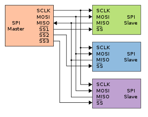
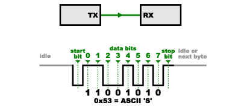
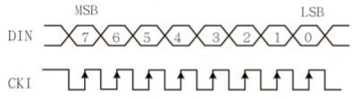
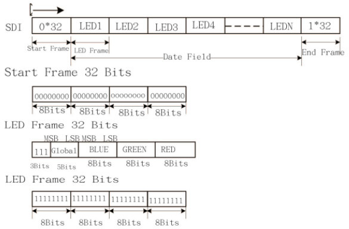
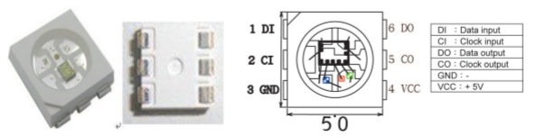
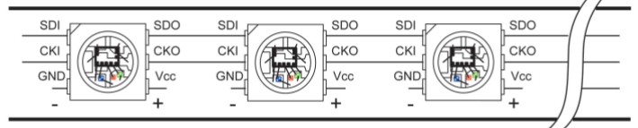

# SPI  



---

## Introductie

Serial Peripheral Interface (SPI) is een bus-interface die in de meeste gevallen bedoeld is om data uit te wisselen tussen een microcontroller en kleine randapparaten (small peripherals) zoals schuifregisters ,  sensoren, en SD cards. Deze bus gebruikt een afzonderlijke lijn voor clock en data. Er kunnen zich meerdere van deze randapparaten bevinden op dezelfde bus (dit in tegenstelling tot een asynchrone seriële
bus). Vanuit de microcontroller wordt het device geselecteerd waarmee er moet gecommuniceerd worden door gebruik te maken van selectielijnen.

## Waarom geen seriële verbinding?

Een normale seriële poort, die herkenbaar zijn door de aanwezigheid van een TX en een RX lijn, wordt asynchroon (niet synchroon dus)genoemd omdat er geen aanwezigheid van een clock signaal op een aparte lijn. Er is dus geen garantie dat beide devices op dezelfde snelheid werken. Er horen daar dus afspraken te gebeuren om de communicatie vlot te laten verlopen. Zelfs wanneer bij juiste afspraken, kan het toch nog gebeuren dat de communicatie niet naar behoren loopt. Daar de snelheidsinstelling van een seriële poort op een device afhankelijk is van de clock frequentie (meestal een kristal oscillator) van de processor, en daar identieke oscillatoren niet voorkomen, kan het gebeuren dat de data-overdracht toch nog fout loopt.

Dit wordt bij asynchrone seriële communicatie voor een deel opgelost door gebruik te maken van synchronistiepulsen (start- en stopbits). Het datapakket wordt ingekapseld tot een framepakket. Op die manier kan de ontvanger zich synchroniseren in de tijd op de de ontvangen datastroom. Tussen beide devices moeten echter nog altijd afspraken worden gemaakt omtrent de datasnelheid (baud rate, bps). Dit kan niet afgeleid worden uit de synchronisatiebits. Kleine verschillen in werksnelheid tussen de twee devices is niet echt een probleem, daar er om de byte (+ sync bits en evt pariteit) nieuwe syncbits worden gebruikt voor de volgende byte. Het aantal bits tussen de sync bits is heel beperkt (meestal tussen de 8 a 12 bits, afhankelijk van het aantal bits in het datapakket en de aanwezigheid van een parieteit en het aantal stopbits).



Controleer de juistheid van de informatie bij de vorige figuur. Wat is een nibble? Hint; waar zit de lsb?

Asynchrone seriële communicatie werkt goed, maar bevat veel overhead. Dit wil zeggen dat er op heel frequente basis moet gesynchroniseerd worden opdat de ontvanger op de juiste tijdstippen de bits moet inlezen zonder dat die er bij iedere bit op attent wordt gemaakt dat er zich een nieuwe bit aanbied. Daardoor is de hardware tamelijk complex om data te verzenden en te onvangen. De werking is kritisch omdat er heel wat parameters moeten worden afgesproken (vastgelegd)  tussen beide devices.  

## Een synchrone oplossing

SPI werkt op een andere manier. Hier wordt met een synchrone bus gewerkt. Data wordt dus synchroon met een klok verzonden. Het ritme waarmee de data wijzigt op de datalijn wordt aangegeven door een klok. De klok is een oscillerend signaal zodat een zendend en ontvangend device perfect weet wanneer een nieuwe bit (op de datalijn) moet worden verzonden, maar ook bij de ontvanger, wanneer een nieuwe bit aangeboden wordt. Het tijdstip dat een nieuwe bit stabiel op de datalijn aanwezig staat kan worden aagegeven door stijgende- of dalende flank van het kloksignaal. In datasheet wordt aangegeven welke flank er word gebruikt. Wanneer de ontvanger deze flank detecteert zal deze onmiddelijk de waarde op de datalijn inlezen, en zal bepalen of dit een nul of een één is afhankelijk van de waarde van de spanning op de datalijn. Doordat de data wordt verzonden op het ritme van de klok, zijn afspraken omtrent de datasnelheid tussen zender en ontvanger hier niet nodig. Natuurlijk ligt de minimum en maximum waarde van de klok binnen gespecifieerde grenzen en kan niet eindeloos hoger worden gemaakt.  


Een reden waarom SPI zo populair is komt doordat de ontvangende hardware heel eenvoudig kan worden uitgevoerd door de implementatie van een schuifregister. Dit is veel eenvoudiger en goedkoper dan een volledige instelbare UART.  

### Receiving data

Dit ziet er op het eerste zicht eenvoudig uit voor de verzendende data. Maar hoe zit dit in elkaar voor de ontvangende data als je bi-directioneel wil werken? Het terugsturen van data zit iets complexer in elkaar.  

Bij SPI zal maar 1 device de klok (normaal aangegeven door CLK of SCK staat voor Serial ClocK) genereren onafhankelijk in welke richting de data moet worden gestuurd. Het device die op de SPI-bus de klok zal genereren wordt de master genoemd terwijl alle andere devices als slaves worden aangegeven. Er is steeds één en slechts één master op de bus aanwezig. Meestal is dit de gebruikte microprocessor of microcontroller in de opstelling. Het is duidelijk dat er hier meerdere slaves zich op de bus kunnen bevinden.

Wanneer er data wordt verzonden van de master naar een slave, dan wekt de master een kloksignaal op. Op het ritme van dit kloksignaal wordt de data verzonden via de MOSI (Master Out / Slave In) lijn. Als een slave data moet verzenden naar de master, dan blijft de master het kloksignaal opwekken en zal de slave zijn data synchroniseren met die klok en de data verzenden via een derde lijn, namelijk de  MISO (Master In / Slave Out).


Let wel dat wanneer er binnen een zelfde actie bidirectioneel moet worden gewerkt dat de master de klok blijft genereren zodat de slave zijn te verzenden data hierop kan synchroniseren. Dit wil natuurlijk zeggen dat de slave zijn data op tijd moet klaar hebben want de master zal die data op specifieke klokpulsen verwachten. Een slave moet dus snel genoeg zijn. Ook de hoeveelheid data die er terug moet gestuurd worden moet op voorhand gekend zijn zodat de master voldoende lang zijn kloksignaal blijft genereren. Dit is heel verschillend bij asynchrone transmissie waar de hoeveelheid data niet moet gekend zijn. Er kan altijd in beide richtingen onafhankelijk van hoeveel data worden gestuurd. Hier kan dus de hoeveelheid data random zijn. Bij SPI is bij een READ actie dit niet het geval. Meestal is dit ook geen probleem, omdat wanneer de master een sensorwaarde wenst te weten, dan is op voorhand gekend uit hoeveel bytes die waarde zal bestaan. Een slave zal enkel zijn gegevens kunnen meedelen aan de master als de master dit vraagt. Dus op commando van de master (dit is een vorm van polling).  

Als bijvoorbeeld een commando *read data* naar een device wordt gezonden, dan weet je dat dit device data zal terug sturen met het antwoord. Je weet ook uit hoeveel bytes het antwoord zal bestaan. Als je echter in bepaalde omstandigheden niet zou weten uit hoeveel data het antwoord bestaat, dan zou er kunnen afgesproken worden met de slave dat bijvoorbeeld de eerste twee bytes zullen aangeven uit hoeveel databytes het antwoord bestaat.  

In principe is de SPI-bus  *full duplex* (hebben gescheiden send en receive lijnen), en er kan dus in bepaalde omstandigheden simultaan bidirectioneel gecommuniceerd worden (gelijktijdig zenden en ontvangen). Bijvoorbeeld: er zou aan een SPI-sensor een nieuwe waarde kunnen worden opgevraagd terwijl die sensor nog bezig is met het terugzenden van een vorige waarde. Datasheets van SPI-devices verklaren of dit mogelijk is.

### Slave Select (SS)

Er is nog een belangrijke lijn die moet verklaard worden. Dit is de SS-lijn en staat voor Slave Select. Deze lijn zal door de master worden geactiveerd wanneer met een specifieke slave wenst te communiceren. Het is ook een soort Wake-Up lijn voor een bepaalde slave. Bij gebruik van meerdere slaves op de SPI-bus zal de master hiermee ook de juiste slave selecteren. Niet geselecteerde slaves luisteren dan niet naar wat er als data op de bus gebeurt.  


De SS line wordt normaal hoog gehouden. Dit zorgt ervoor dat de slave gedisconnecteerd is van de SPI-bus. (Een dergelijke logica is gekend als actief laag *active low* , dit is heel frekwent voor bij enable- en reset lijnen.) Net voordat de master wenst data te sturen naar de slave wordt deze lijn laag gebracht (dus actief). Dit activeert de slave, De slave luistert nu naar alle data die er op de bus wordt geplaatst. Eventueel stuurt de slave ook data terug. Wanneer de master klaar is met de slave, en er geen data meer moet uitgewisseld worden, zal deze lijn opnieuw hoog worden gemaakt.

### Multiple Slaves

Er zijn twee manieren om meerdere slaves aan te sluiten op en SPI-bus.

* In normale werking zal iedere slave een aparte SS lijn hebben tussen de master en de slave zelf. Om te communiceren met een specifieke slave, zal de master die specifieke SS lijn naar slave actief laag maken, een kloksignaal opwekken en data uitwisselen met die slave. Alle andere SS-lijnen naar alle andere slaves moeten hoog (niet actief) gemaakt zijn gedurende het voorgaande proces. Dit wil zeggen dat bij gebruik van vele slaves er dus vele SS-lijnen nodig zullen zijn. Bij heel veel slaves zou een SS-decoder kunnen helpen. Hoe zou je zo'n decoder uitvoeren?


* Aan de andere kant, worden er devices als multiple slaves gebruikt die in een daisy-chained connectie worden gebruikt op de SPI-bus. Hierbij loopt de MOSI lijn van de master naar de eerste slave in het device. De MISO van deze slave is dan op zijn beurt verbonden met de MOSI van de tweede slave, en zo verder. Bij de laatste slave is dan de MISO uitgnag verbonden met de MISO ingang van de master (wordt wel heel regelmatig weggelaten, in de veronderstelling dat dit type device enkel te sturen is). Alle selectielijnen van alle slaves hangen hier aan elkaar. Om de verschillende slaves aan te spreken wordt dus data ingeschoven via de eerste slave tot bij de noodzakelijke slave. Eens alle data is verzonden vanuit de master kan de selectielijn inactief worden gemaakt. Een typisch voorbeeld van een dergelijke opstelling is terug te vinden bij een adresseerbare SPI Led-strip. Zoek eens naar informatie omtrent de superLed.


Er is dus data overloop (overflow) van de ene slave naar de andere. Als dus bepaalde data een specifieke slave moet bereiken, dan moet er genoeg data gestuurd worden opdat die op de specifieke slave kan aankomen. Het is ook duidelijk dat de eerst verzonden data de laatstse slave zal berieken als voor iedere slave data is verzonden.  

Dit type layout is typisch voor een ou output-only opstelling, zoals het aansturen van LEDs, waar er geen nood is aan het terug ontvangen van data door de master. In deze gevallen wordt meestal de master’s MISO line niet geconnecteerd. Is er in bepaalde gevallen wel nood aan terugkerende data, dan moet de daisy-chain verbinding gesloten worden door de de MISO van de master te verbinden met de laatste slave.  Let er wel op gedurende het inschuiven van de data er allemaal eenen zulen worden ingeschoven in de MISO van de Master. Er moet dus voldoende data worden ingeschoven om data terug te kunnen inlezen door de master.

---

## Voordelen SPI

* Het is sneller dan asynchrone seriële communicatie (hoge kloksnelheid mogelijk tot 12,5 Mhz)
* De hardware is eenvoudig een schuifregister
* Het protocol ondersteunt meerdere slaves

## Nadelen SPI

* Er zijn meer lijnen nodig dan een seriële communicatie
* De communicatie moet volgens vaste patronen gebeuren. Er kan niet zomaar data worden verstuurd.
* De master moet alle communicatie regelen. Slaves kunnen niet zelfstandig communiceren.  
* Er zijn meestal gescheiden SS lijnen nodig, voor iedere slave één.  

Er dient nog opgemerkt te worden dat er respect moet zijn op vlak van de spanningsniveaus. Wanneer een microcontroller op een voedingsspanning werkt van 5V, dan zal zijn SPI-bus ook met die spanningen werken. Dus ook de slaves werken best op deze spanning. Er zijn ook meer en meer processoren die met een voedingsspanning werken van 3,3V. Dus zal de bus hier met deze spanningen werken. Indien er een mix is van voedingsspanningen dient er op gelet te worden dat er zich geen conflicten voordoen. Zo'n conflict kan de hardware van devices beschadigen. Wees hier voorzichtig.

# Voorbeelden SPI in MBED voor Nucleo microcontroller

## Aansturen van een LEDstrip

Bestudeer de datasheet van deze LEDstrip : [https://cdn-shop.adafruit.com/datasheets/APA102.pdf]  









```cpp
//MBED_Course7_1_leds
/* mbed Microcontroller Library
 * Copyright (c) 2019 ARM Limited
 * SPDX-License-Identifier: Apache-2.0
 */
//SPI slave Ledstrip APA102
//https://cdn-shop.adafruit.com/datasheets/APA102.pdf 
#include "mbed.h"
#include "platform/mbed_thread.h"
// Blinking rate in milliseconds
#define BLINKING_RATE_MS                                                    100
// Initialise the digital pins
Serial pc(SERIAL_TX, SERIAL_RX); 
SPI spi1(D11,D12,D13);        //MOSI/MISO/SCK/CS  ... CS gebruiken we hier niet. Ook de Input data (MISO) wordt hardwarematig niet geconnecteerd
//Declaratie (klasse)variabelen
char teller = 0;
int main()
{
    pc.printf("0\r\n");
    
    spi1.format(8,3);
    spi1.frequency(512000);     //512kHz
 
    //stoppen
    spi1.write(0x00);
    spi1.write(0x00);
    spi1.write(0x00);
    spi1.write(0x00);
    
    thread_sleep_for(BLINKING_RATE_MS);
    
    while (true) {
        
        pc.printf("teller = %d \r\n", teller);
        //eerste LED
        spi1.write(0xff); 
        spi1.write(255-teller);     //Blue
        spi1.write(teller);         //Green
        spi1.write(0x00);           //Red
        //tweede LED
        spi1.write(0xff);           //3 bits MSB '1' + 5 bits helderheid (brightness) voor de drie kleuren
        spi1.write(255-teller);     //Blue
        spi1.write(0x00);           //Green
        spi1.write(teller);         //Red
        
        spi1.write(0xff); 
        spi1.write(0x00);
        spi1.write(255-teller);
        spi1.write(teller);
        
        spi1.write(0xff); 
        spi1.write(teller);
        spi1.write(255-teller);
        spi1.write(0x00); 
        
        spi1.write(0xff); 
        spi1.write(teller);
        spi1.write(0x00);
        spi1.write(255-teller); 
        
            //stoppen
        spi1.write(0x00);
        spi1.write(0x00);
        spi1.write(0x00);
        spi1.write(0x00);   
 
        thread_sleep_for(BLINKING_RATE_MS);
        teller++;
    }
}

```

Maak zelf een mooie sequentie van LEDs.  Als extra opdracht, stuur vanuit een App de afzonderlijke LEDs.

## Aansturen van een IO expander (Write / Read!!)

We zullen hier een IO-expander aansturen. Dit is een SPI slave module (IC : MCP23S09) met 8 I/O pinnen. De µC wordt ook hier als SPI-master gebruikt (enkel SPI-master kan een clock signaal genereren). Een I/O pin kan als input of als output worden gedefinieerd.

Data van master naar slave wordt doorgeklokt op ritme van de SPI-klok (WRITE cyclus).  

Indien er data van de slave naar de master moet worden verzonden (bij een READ-cyclus) zal de slave zijn data op het kloksignaal moeten synchroniseren die de master opzettelijk moet generenen!!

Bestudeer de datasheet van dit IC. [https://ww1.microchip.com/downloads/en/DeviceDoc/20002121C.pdf]  

Volgende code zorgt ervoor dat er data kan gestuurd worden en kan gelezen worden. Bestudeer dit voorbeeld waarbij er 2 dergelijke slaves worden gebruikt. Selectie van een slave wordt gerealiseerd door de CS (chip select) laag te brengen. Data en klok zijn dan voor deze slave bedoeld. Het is wel duidelijk dat maar één slave kan worden geselecteerd!!

```cpp
/* mbed Microcontroller Library
 * Copyright (c) 2019 ARM Limited
 * SPDX-License-Identifier: Apache-2.0
 */
//Dit is een opdracht met de IOexpander van Dirk Bulcaen
//SPI slave IC zijn MCP23S09
#include "mbed.h"
#include "platform/mbed_thread.h"


// Blinking rate in milliseconds
#define BLINKING_RATE_MS                                                    100

// Initialise the digital pins
Serial pc(SERIAL_TX, SERIAL_RX); 
SPI spi1(D11,D12,D13);        //MSI/MISO/SCK/(CS)

DigitalOut cs2(D8);         //Chipselect van MCP23S09 als byte output , dus met LEDS
DigitalOut cs1(D2);         //Chipselect van MCP23S09 als byte input , dus met switchen     
//DigitalOut led(LED1);
char teller = 0;
char lezen;

int main()
{
    cs2=1;                          //chipselect deactiveren
    cs1=1;                          //chipselect deactiveren
    spi1.format(8,3);               //standaard mode3 , heeft te maken met polariteit van data en klok en op welke flank er wordt gewerkt van de klok
    spi1.frequency(5000000);

    
    cs1=0;                           //chipselect van 1° IC (met SWITCHEN)
    spi1.write(0x40);                //Selecteer het adres van de chip (zie datasheet, ligt vast)
    spi1.write(0x00);                //Selecteer adres van IO register  
    spi1.write(0xff);                //om aan te geven dat GPIO pinnen inputs zijn (8switchen)
    cs1=1;                          //chipselect deactiveren
    thread_sleep_for(BLINKING_RATE_MS); //beetje wachten, spike vermijden
    cs1=0;                          //chipselect van 1° IC (met SWITCHEN)
    spi1.write(0x40);               //Selecteer het adres van de chip (zie datasheet, ligt vast)
    spi1.write(0x06);                //Selecteer adres van PULLUP register  
    spi1.write(0xff);               //om aan te geven dat alle GPIO pinnen pullups moeten bevatten (er staan er geen op de print)
    cs1=1;                          //chipselect deactiveren
    
    cs2=0;                          //chipselect van 2° IC (met LEDS)
    spi1.write(0x40);                //Selecteer het adres van de chip (zie datasheet, ligt vast)
    spi1.write(0x00);                //Selecteer adres van IO register  
    spi1.write(0x00);                //om aan te geven dat GPIO pinnen outputs zijn (8LEDS)
    cs2=1; 
    
    cs2=0;                          //chipselect activate 2°IC met LEDS
    spi1.write(0x40);                //Selecteer het adres van de chip (zie datasheet, ligt vast) R/W (LSB) = '0'
    spi1.write(0x09);                //Selecteer adres van GPIO register
    spi1.write(0xaa);                //data voor GPIO outputs
    cs2=1;                          //chipselect deactiveren
    
    thread_sleep_for(BLINKING_RATE_MS);
    thread_sleep_for(BLINKING_RATE_MS);
    thread_sleep_for(BLINKING_RATE_MS);
    thread_sleep_for(BLINKING_RATE_MS);
    thread_sleep_for(BLINKING_RATE_MS);
    
    while (true) {
        //led = !led;
        cs1=0;                      //chipselect activeren
        spi1.write(0x41);           //Selecteer het adres van de chip (zie datasheet, ligt vast) R/W (LSB) = '1'
        spi1.write(0x09);           //Selecteer adres van GPIO register
        lezen = spi1.write(0xff);   //maakt dus hier niet uit wat er wordt gezonden van data om 09 binnen te lezen
                                    //vorige regel: Slave kan geen klokpulsen genereren om data terug te sturen naar de master
                                    //vorige regel: Master moet die klokpulsen genereren. Dit doen we door nieuwe (willekeurige) data te sturen naar de slave.
                                    //vorige regel: Verzonden data is dus onbelangrijk enkel nood aan klokpulsen waarop slave data zal enten. Zo leest master de data
        lezen = 255 - lezen;
        cs1=1;                      //chipselect deactiveren
               
        pc.printf("De gelezen waarde is gelijk aan : %u \r\n", lezen); 
         
        cs2=0;                      //chipselect activeren
        spi1.write(0x40);           //Selecteer het adres van de chip (zie datasheet, ligt vast) R/W (LSB) = '0'
        spi1.write(0x09);           //Selecteer adres van GPIO register
        spi1.write(teller);
        teller--;
        cs2=1;                      //chipselect activeren
        thread_sleep_for(BLINKING_RATE_MS);
     
    }
}
```

 Verder bestaan er nog veel andere soorten SPI slave die kunnen worden gebruikt. Een SPI slave kan natuurlijk ook een sensor bevatten of kan desnoods ook een actuator zijn, of beide.
 Veel succes.
  